# 1. 사용자 수에 따른 규모 확장성

해당 장에서는 한 명의 사용자부터 시작해 몇백만 사용자를 지원하는 시스템을 설계하는 기초적인 규모 확장성과 관련된 지식들을 배울 것이다.
---

## 1.1 단일 서버

복잡한 시스템을 만들기 이전에 모든 컴포넌트가 단 한 대로 실행되는 간단한 시스템부터 설계할 수 있어야 한다.

다음 그림1은 단일 서버로 구성된 시스템이다.

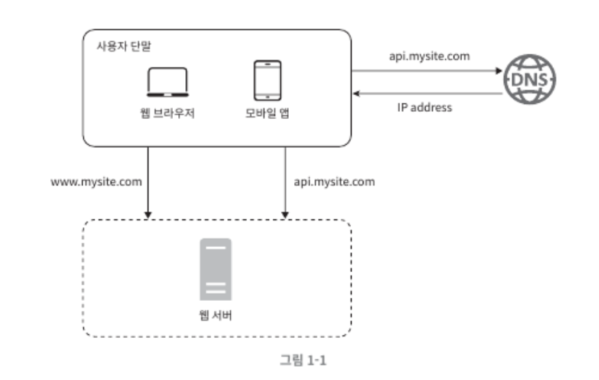
 [그림1]

1. DNS 를 통한 IP주소 확보 (DNS 이름 -> IP주소)
2. IP주소를 통한 HTTP 요청
3. HTML 페이지 혹은 JSON 형태의 응답 반환

## 1.2 데이터베이스

서버의 개념은 다양하다. 우리가 비즈니스 로직을 처리하는 `애플리케이션 서버`, 클라이언트와 서버 중간에 위치하여 라우팅의 역할을 하는 `프록시 서비`, 웹 페이지 배포를 위한 `웹 서버`, 데이터베이스의 연결을 돕는 `데이터베이스 서버` 등이 존재할 수 있다.

주로 다음과 같이 웹 계층, 데이터 계층으로 서버를 나누어 간단한 시스템을 구축한다.

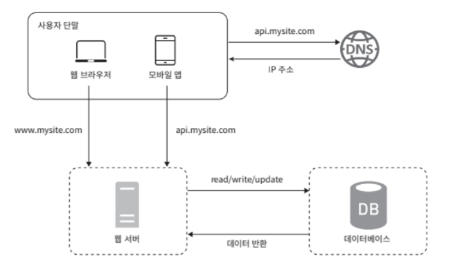
 [그림2]

### 데이터베이스의 종류

**관계형 데이터베이스**

- 관계형 데이터베잉스 관리 시스템 (RDBMS)라고 불린다.
- 테이블, 열, 컬럼으로 표현한다.
- MYSQL, ORACLE, PostgreSQL 등이 존재한다.
- SQL을 사용한다. 이를 이용하여 테이블마다의 데이터를 Join하여 합칠 수 있다.
- 대부분의 경우 관계형 데이터베이스를 사용한다.

**비 관계형 데이터베이스**

- NOSQL
- 네 부류의 
- CouchDB, Neo4j, Cassandra, HBase, Amazon DynamoDB 등이 존재한다.

> 다음의 경우에 비-관계형 데이터베이스를 사용한다.
> - Low Response latency
> - 비정형 데이터를 사용
> - 데이터를 직렬화하거나 역직렬화 할 수 있으면 된다.
> - 많은 양의 데이터를 저장하는 경우에 사용

 

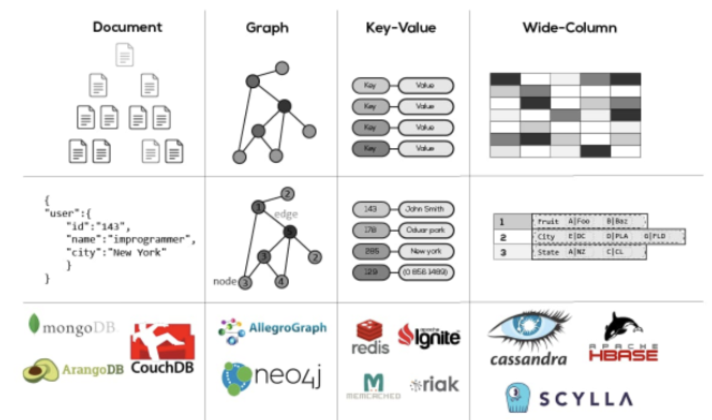
 [그림3]

## 1.3 수직적 규모 확장 vs 수평적 규모 확장

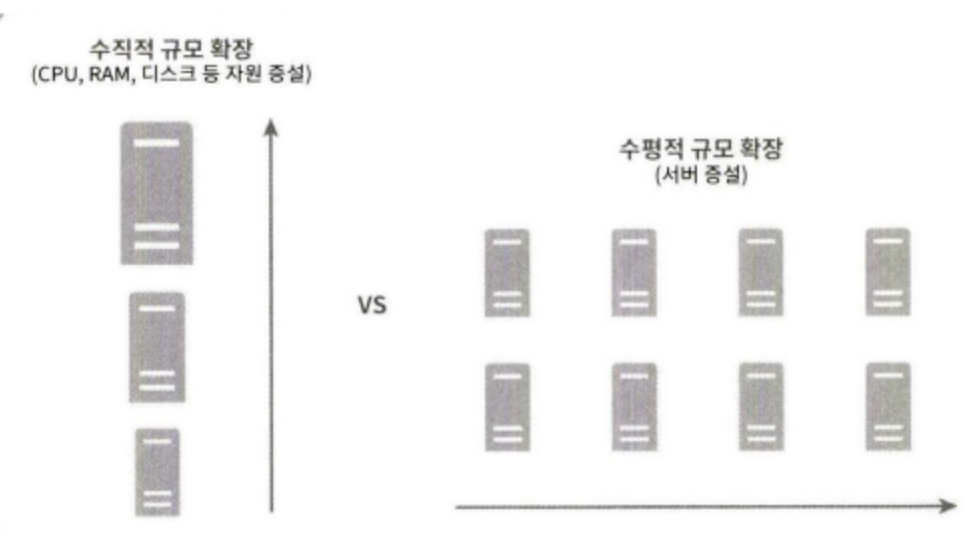
 [그림4]

### 수직적 규모 확장

- Scale Up이라고 부름.
- 고성능 자원 (CPU, RAM, 디스크 등)을 증설하는 방법

#### 장점
- 단순함

#### 단점
- 한 대의 서버에 CPU, RAM의 증설에 대한 한계의 존재
- 장애 복구 및 다중화 방안의 방안의 부재로 서버에 장애 발생 시 중단되는 문제 발생 (SPOF 문제)
- 

> SPOF
> 단일 장애점이라 불리며 시스템 구성 요수 중에서 동작하지 않으면 전체 시스템이 중단된다.
> 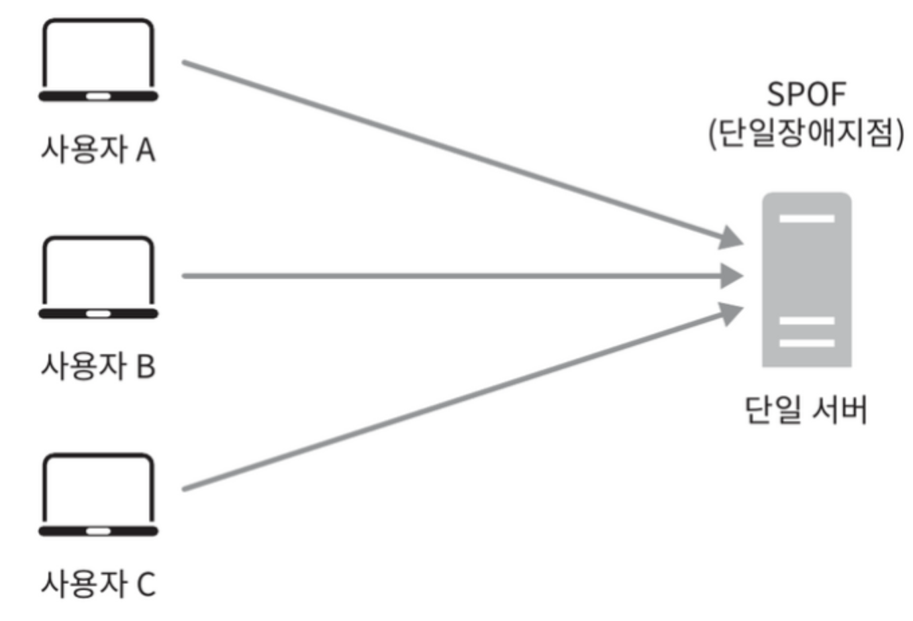

## 1.4 캐시

> 값비싼 연산 결과 또는 자주 참조되는 데이터를 메모리 안에 두고 최대한 빨리 처리될 수 있도록 하는 저장소

### 캐시 계층

데이터가 잠시 보관되는 계층으로 다음 그림 5와 같이 데이터베이스보다 웹 서버에 가까이 있으며 빠르게 데이터에 접근할 수 있다.

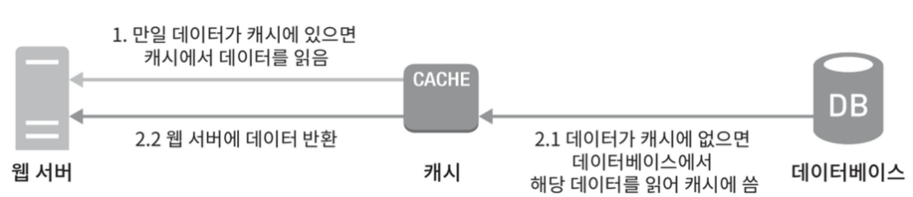
 
[그림5]

그림 5는 `읽기 주도형캐시 전략`이라 불리며 다음의 과정을 거친다.

1. 데이터가 캐시에 존재하는 지 확인한다. 데이터가 있는 경우 바로 클라이언트(웹 서버)에게 반환해 준다.
2. 캐시 계층에 데이터가 존재하지 않으면 데이터베이스에서 데이터를 일거와 캐시에 저장한다.
3. 캐시 계층에서 해당 데이터를 클라이언트에 반환한다.

다음의 장점을 가지고 있다.
- 성능 개선
- DB 부하 감소
- 캐시 계층 규모의 독립적인 확장

### 캐시 사용시 유의점

- CRUD 중 CUD와 같은 갱신은 적으나 `참조(R)`이 빈번한 경우에 사용
- 캐시는 휘발성 메모리에 데이터를 두기에 중요 데이터의 경우 `지속적 저장소(DB)`에 보관해야 한다.
- 캐시에 보관된 데이터에 대한 `만료`정책이 필요하다.
  - 만료 정책이 없는 경우: 데이터가 캐시에 계속 남아 추후에 할당된 메모리의 크기를 다 채울 수 있다.
  - 만료 기한이 짧은 경우: 데이터베이스를 너무 자주 읽게 된다.
  - 만료 기한이 긴 경우: 원본과 차이가 날 수 있다.
- `일관성` 유지에 대한 고려가 필요하다.
- 캐시 서버를 하나만 두는 경우에 `SPOF`의 문제가 발생할 수 있다. 이를 방지하기 위해 여러 지역에 여러 캐시 서버를 분산시켜야 한다.
- `캐시 메모리`의 크기를 적절하게 설정해야 한다.
- 캐시가 꽉 차버려 추가로 캐시데이터를 넣어야 하는 경우의 `데이터 방출`를 고려해야 한다. 다음과 같은 방식들을 서비스 특성에 맞게 설정할 수 있어야 한다.
  - LRU : 마지막으로 사용된 데이터를 먼저 내보내는 정책
  - LFU : 사용 빈도가 낮은 데이터를 먼저 내보내는 정책
  - FIFO : 가장 먼저 들어온 데이터를 먼저 내보내는 정책

### 콘텐츠 전송 네트워크 (CDN)

이미지, 비디오, CSS, JavaScript 파일 등의 정적 콘텐츠를 전송하는데 쓰이는 서버의 네트워크이다.

**CDN의 동작과정**

CDN의 경우 그림 6과 같이 동작한다.

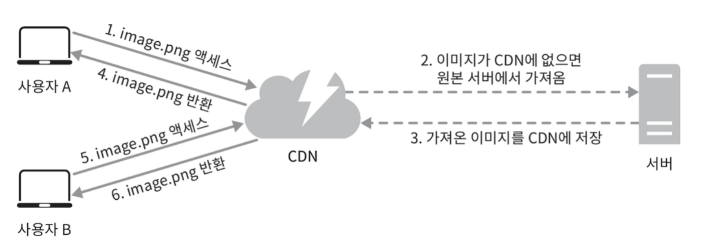

1. CDN 서버의 캐시에 존재하는 image.png에 엑세스한다.
2. CDN 서버에 없는 경우 CDN서버에서 원본 서버에 요청하여 파일을 가져온다.
3. 

### CDN 사용 시 고려 사항

- 비용 : 주로 제 3 사업자에 의해 운영되기에 자주 사용되지 않는 콘텐츠는 캐싱 대상에서 제외한다.
- 적절한 만료 시한 설정 : 시의성이 중요한 경우 적절한 만료 시점을 잘 정해야 한다.
- CDN 장애 대처 방안 : CDN 자체 서버가 죽은 경우 원본 서버로부터 직접 콘텐츠를 가져오는 등의 장애에 대한 방안을 마련해야 한다.
- 콘텐츠 무효화 방법 : 만료되지 않은 경우에도 CDN에서 제거하는 방안을 고려해야 한다. API를 통하거나 Object Versioning 등을 사용할 수 있따.

## 무상태 웹 계층

비즈니스 로직을 수행하는 웹 계층을 수평적으로 확장하기 위해서는 상태 정보(세션 정보)를 제거해야 한다.

### 상태 정보 의존적인 아키텍처

다음 그림은 서버가 클라이언트 정보를 가지고 있으며 사용자 별로 각기 다른 요청 별로 공유되도록 한다.

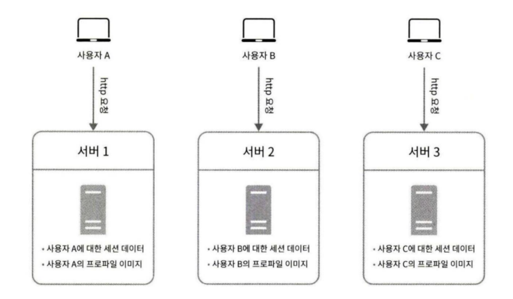
 
[그림7]

- 세션 정보 및 프로파일 이미지 같은 상태를 서버에 저장하기에 요청들 사이에서 상태가 공유된다.
- 같은 클라이언트로부터의 요청을 항상 같은 서버로 전송되어야 한다.

> 로드밸랜서에서 **고정 세션**이라는 기능을 제공하지만 이는 로드밸랜서에 부담을 준다.

### 무상태 아키텍처

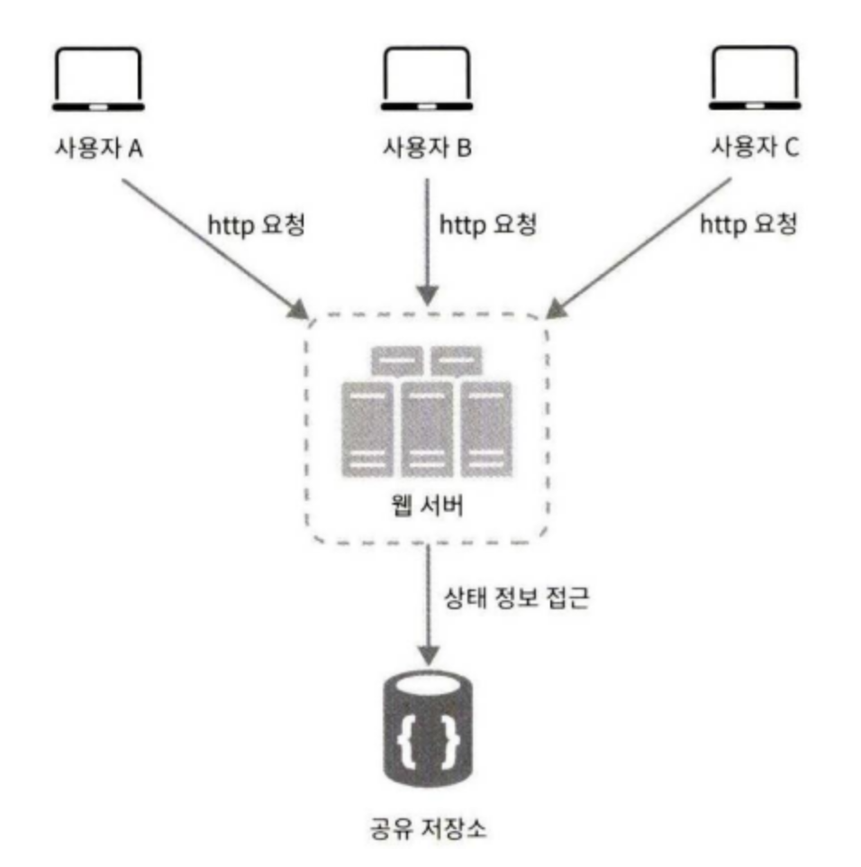
 
[그림 8]

- 상태 정보는 공유 저장소에 저장되어 있다.
- HTTP 요청은 어떤 웹 서버로도 전달 될 수 있다.
- 필요한 경우 공유 저장소에서 상태 정보를 가져온다.
- 상태 정보 의존적인 아키텍처보다 단순하고, 안정적이며, 규모 확장이 용이하다.

> 세션 데이터가 저장되는 시스템은 주로 지속성 데이터 보관소에 저장되도록 한다.
> - Memchached/Redis, NoSQL, RDBMS

## 데이터 센터
컴퓨팅 시스템 및 관련 하드웨어 장비를 저장하는 물리적 위치이다. 여기에는 서버, 데이터 스토리지 드라이브 및 네트워크 장비와 같이 IT 시스템에 필요한 컴퓨팅 인프라가 포함된다.

## 메시지 큐

메시지의 무손실을 보장하며, 비동기 통신을 지원하는 컴포넌트이다.

> 무손실 : 소비자가 꺼낼 때까지 보관된 메시지가 안전히 보관된다는 특성

### 메시지큐의 기본 아키텍처

위의 그림과 같은 구조로 다음의 순서대로 데이터가 흘러간다.

1. `생산자/발행자`라 불리는 입력 서비스에서 메시지를 생성해 메시지 큐에 발행(Publish)한다.
2. 큐와 연결되어 있는 `소비자/구독자`로 불리는 서비스/서버가 메시지를 받고 이에 알맞는 동작을 수행한다. 단, 해당 서버/서비스는 메시지 큐를 `구독`하고 있어야 한다.

이러한 아키텍처를 가진 메시지 큐를 가진 경우 다음의 이점을 취할 수 있다.

- 서버 간 결합이 느슨해져 규모 확장성이 보장된다.
- 비동기적인 처리가 가능하다.
  - 소비자의 다운여부와 무관하게 생산자는 메시지를 발행(Publish)할 수 있다.
  - 생산자의 다운여부와 무관하게 소비자는 메시지를 수신(Subscribe)할 수 있다. 

> ### 실제 사용 예시
> 이미지의 크로핑, 샤프닝, 블러링을 지원하는 사진 보정 애플리케이션의 경우 시간이 오래 걸리는 프로세스는 비동기적으로 처리하기 위해 MQ를 사용할 수 있다.
> 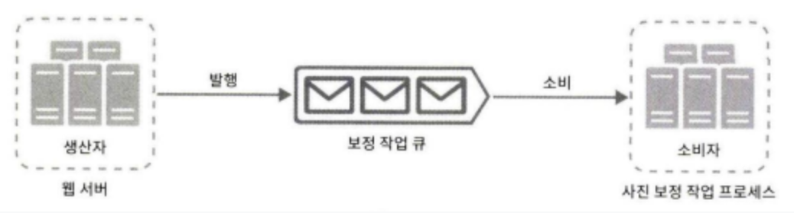

## 로그, 메트릭, 자동화

사업 규모가 커지는 경우 이러한 도구를 통해 데이터를 수집하고 처리하는 과정이 필수적이다.

- 로그 : 로그를 단일 서비스로 모아주는 도구로 활용하여 편리하게 에러 로그를 모니터링하는 것이 중요하다. 
- 메트릭 : 사업 현황에 관한 유용한 정보를 얻기 위해 수집한다. 다음의 메트릭들이 존재한다.
  - 호스트 단위 메트릭 : CPU, Memory, Disk I/O
  - 종합 메트릭 : DB 성능, 캐시 성능
  - 핵심 비즈니스 네트릭 : DAU, 수익, 재방문 수 등
- 자동화 : 시스템이 커지는 경우 CI/CD, 크롤링 등의 자동화 도구를 활용하여 개발 생산성을 향상시킬 수 있어야 한다.

## 데이터베이스의 규모 확장

위에서의 웹 계층의 `수직적 확장`과 `수평적 확장`등을 이용하여 규모를 확장할 수 있따.

### 수직적 확장

고성능의 자원을 증설하는 방법이다.

- 하드웨어적 한계로 인해 추후 서비스가 더 커지는 경우 감당하기 어려워질 수 있다.
- SPOF의 위험성이 잠재되어 있다.
- 비용이 많이 든다.

### 수평적 확장

데이터 베이스에서의 수평적 확장은 주로 `샤딩`이라고 부른다.

#### 샤딩

대규모 데이터베이스를 샤드(shard)라 부르는 작은 단위로 분할하는 등의 방향으로 성능을 향상 시킨다. 이런 경우 모든 샤드는 같은 스키마를 사용하지만 샤드에 보관되는 데이터 사이에는 중복이 없다.

다음 그림과 같이 user_id가 중복되지 않게 샤드별로 보관될 수 있다. 

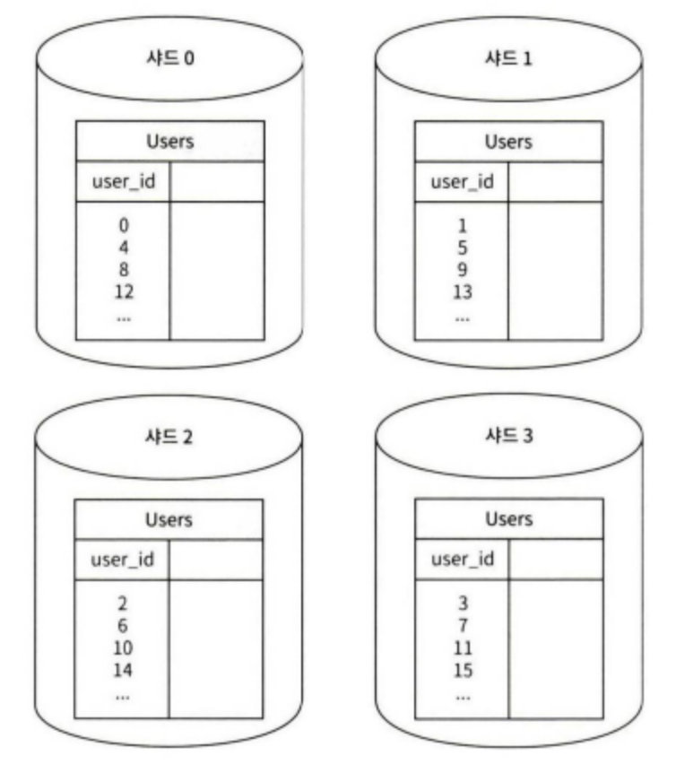

이렇게 보관되는 샤드를 정하기 위한 전략 구현 시에 고려해야는 것은 `샤딩 키`를 어떻게 정하느냐이다.

위의 그림의 경우 샤딩 키는 `user_id`라고 하고 샤딩 키를 통해 데이터가 존재해야할 샤드에 쿼리를 보내 CRUD를 처리하도록 효율을 높일 수 있다.

#### 도입 이후의 문제점

- 데이터의 재 샤딩 : 재샤딩이 필요한 경우는 다음과 같이 존재한다.
  - 하나의 샤드로는 더 이상 감당하기 어려운 경우
  - `샤드 소진`과 같이 샤드 간 데이터 분포가 균등하지 못해 다른 샤드의 공간이 빠르게 소진되는 경우
- 유명인사 문제 : 쿼리가 한 샤드에 집중되는 경우
- 조인과 비정규화 : 데이터가 여러 샤드에 걸친 경우

## 최종적인 아키텍처

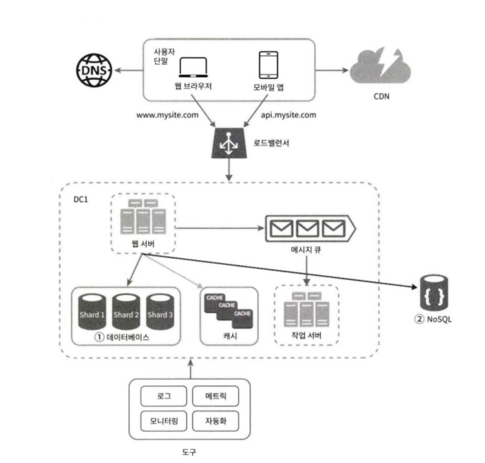