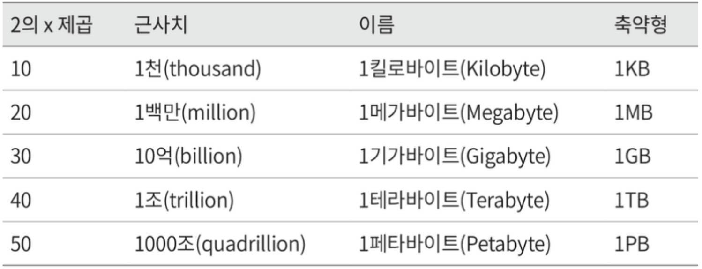
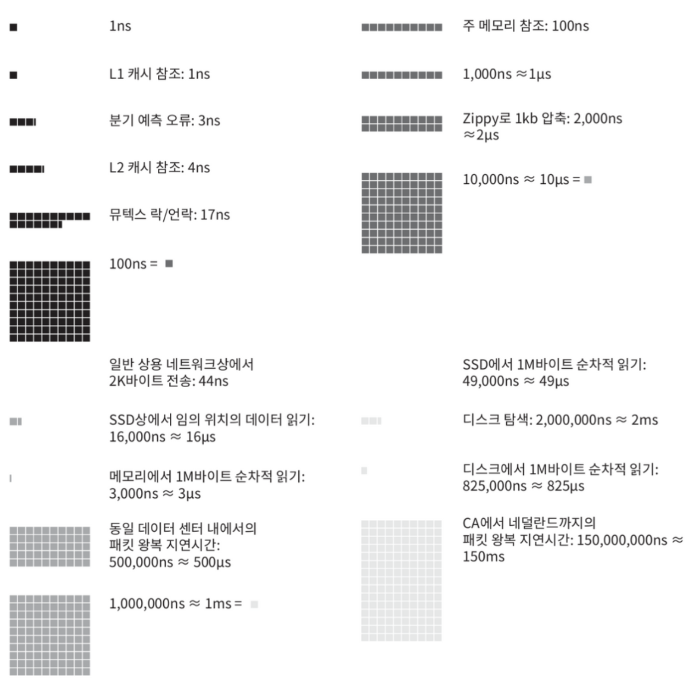
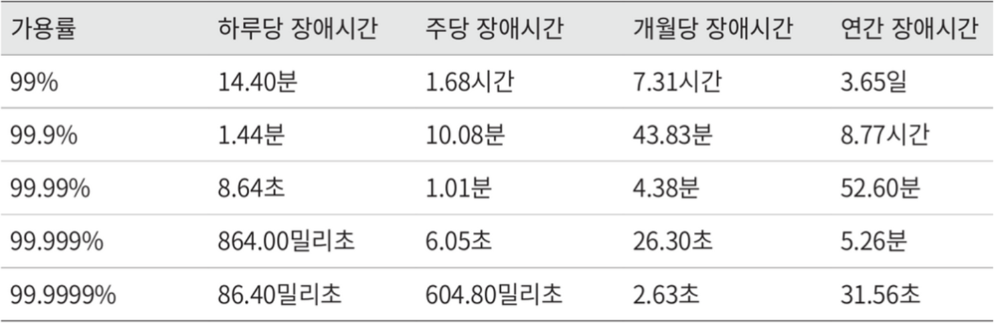

# 2. 개략적인 규모 측정

추정치를 계산하는 행위로 설계가 요구사항에 부합할 것인지 보기 위해 하는 행위이다.

## 2의 제곱수

데이터 볼륨의 단위를 2의 제곱수로 표현면 어떻게 되는지를 잘 파악해야 제대로 된 계산 결과를 얻을 수 있다.

ASCII 문자 하나가 차지하는 메모리 크기는 1바이트이고, 8비트로 구성된다.

위의 그림과 같은 그림으로 데이터 볼륜 단위들이 존재한다.

## 모든 프로그래머가 알아야 하는 응답지연 값

다음 그림처럼 컴퓨터에서 구현된 연산들의 응답지연 값들을 시각화한 수치가 있었다.

이러한 수치를 분석한 결과로 책의 저자는 다음의 결론을 발표한다.

- 메모리는 빠르지만 디스크는 아직도 느리다.
- 디스크 탐색은 가능한 한 피해야 한다.
- 단순 압축 알고리즘은 빠르다.
- 데이터를 인터넷을 전송하기 전에 가능한 압축해야 한다.
- 데이터 센터는 여러 지역에 분산되어 있고, 센터 간에 데이터를 주고 받는 데는 시간이 걸린다.

## 가용성에 관계된 수치들

> 가용성 : 시스템이 오랜 시간 동안 지속적으로 중단없이 운영될 수 있는 능력

이러한 고가용성은 주로 퍼센트로 표현되는데 대부분의 서비스는 99%에서 100%의 값을 가진 서비스들이 상용화되어 있다. 이러한 가용성은 SLA라는 합의에서 공식적으로 기술되어 있다.

> SLA : 서비스 사업자가 보편적으로 사용하는 용어로, 서비스 사업자와 고객 사이에 맺어진 합의를 의미한다.

## 기술면접을 위한 팁

개략적인 규모 추정의 경우 면접에서 문제를 풀어나가는 중요한 절차이다. 이를 대비하기 위해 다음과 같은 팁들을 책에서 제공해 준다.

- 근사치를 활용한 계산 : 99987/9.1 -> 100000/10 로 계산하는 것 과 같이 적절한 근사치를 통해 시간을 절약한다.
- 가정들은 저장, 작성 해 두어 나중에 살펴볼 수 있도록 한다.
- 단위를 붙여 표시하여 MB, KB를 헷갈려하는 모호함을 방지하도록 한다.
- QPS, 최대 QPS, 저장소 요구량, 캐시 요구량, 서버 수 등을 추정하는 연습을 한다.