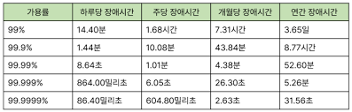

# 2장. 개략적인 규모 추정

## 2의 제곱수
- 2^10 -> 1킬로 바이트  
- 2^20 -> 1메가 바이트  
- 2^30 -> 1기가 바이트
- 2^40 -> 1테라 바이트
- 2^50 -> 1페타 바이트

## 모든 프로그래머가 알아야 하는 응답 지연 값

2020년 기준 대락적인 응답지연 값

**결론**
- 메모리는 빠르지만, 디스크는 여전히 느리다.
- 디스크 탐색은 가능한 피하자
- 단순한 압축 알고리즘은 빠르다.
- 데이터를 인터넷으로 보내기전에 가능하면 압축하라.
- 데이터 센터는 보통 여러 지역에 분산되어 있고, 센터들 간에 데이터를 주고 받는데 시간이 걸린다.

## 가용성에 관계된 수치들
>**SLA (Service Level Agreement)**  
서비스 사업자가 보편적으로 사용하는 용어로, 서비스 사업자와 고객 사이에 맺어진 합의를 의미

보통 관습적으로 9를 이용해 표시, 9가 많을수록 가용성이 좋은 서비스

# 팁
- 근사치를 활용한 계산
  - 복잡한 계산 하지 말고 근사치로 바꿔서 간단하게 계산하자. 계산 능력을 보는 것이 아니다.

- 가정들 적어두기
  - 까먹을수도 있으니까!

- 단위 붙이기
  - 숫자만 쓰지 말고 데이터, 시간 등 단위를 적어야 안 헷갈린다.

보통 QPS, 최대 QPS, 저장소 요구량, 캐시 요구량, 서버 수 등을 추정하는 것이 자주 나온다.