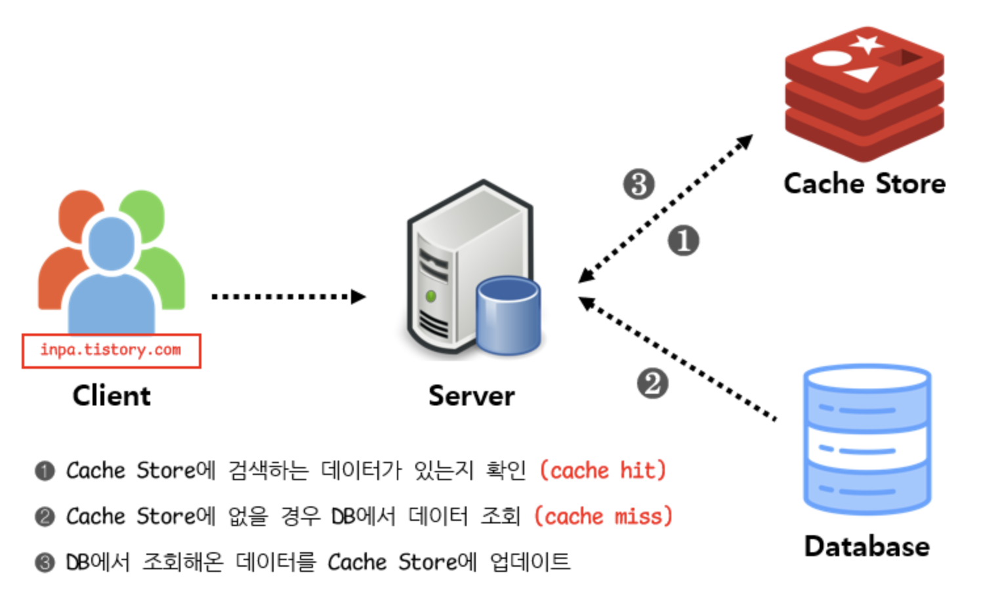
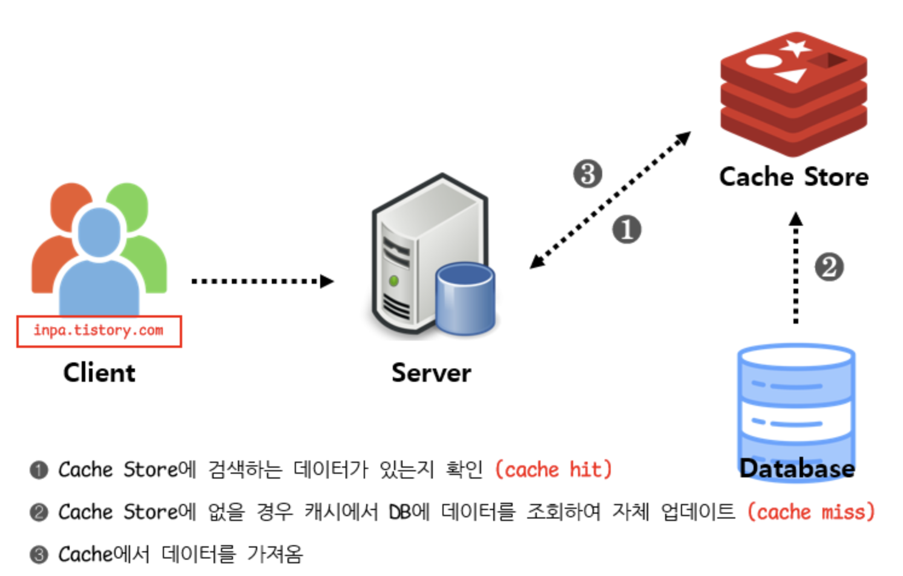
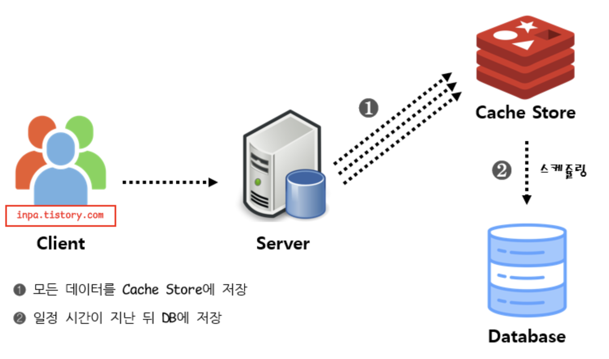
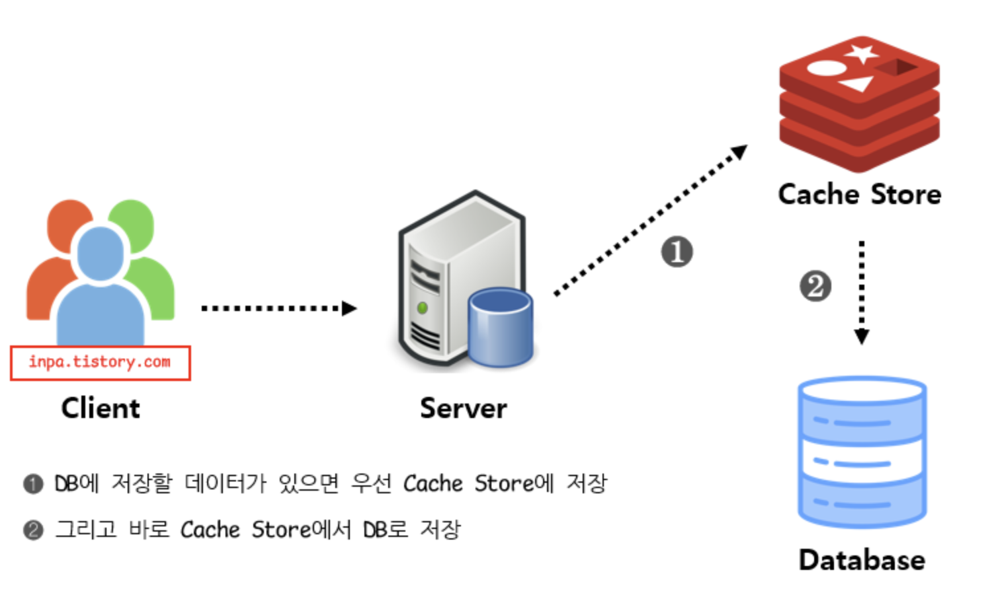
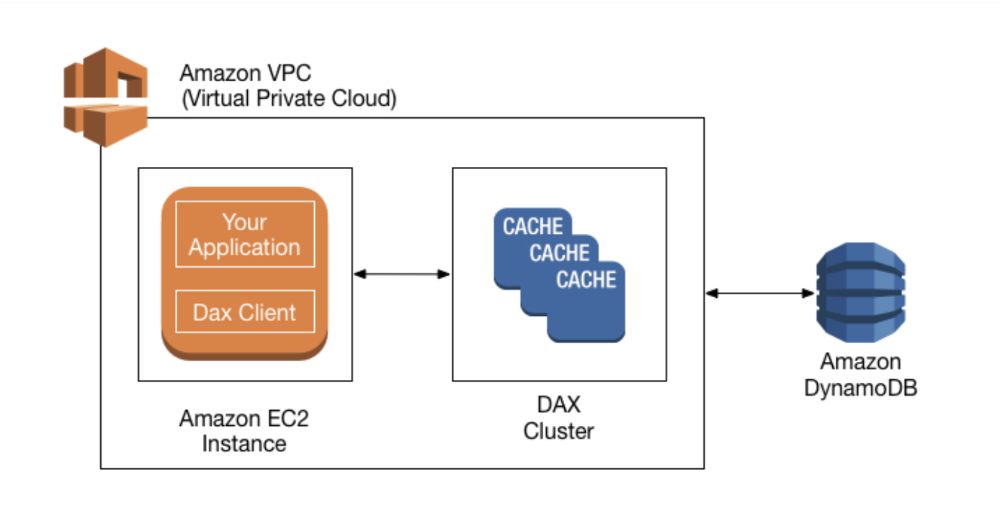
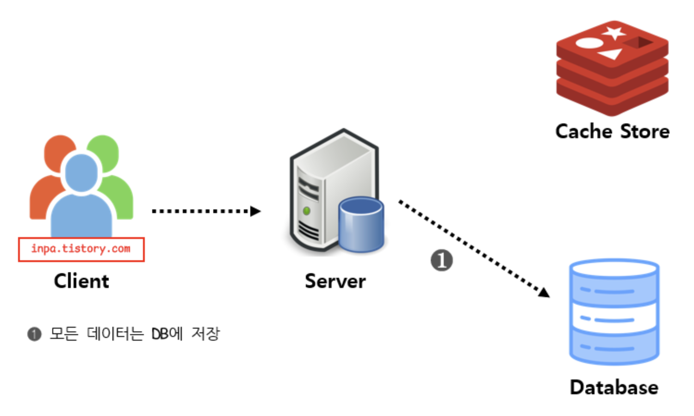
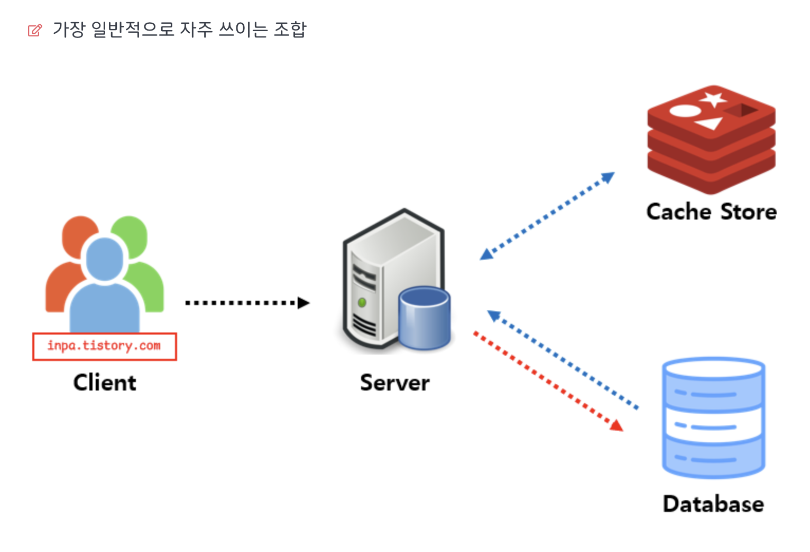
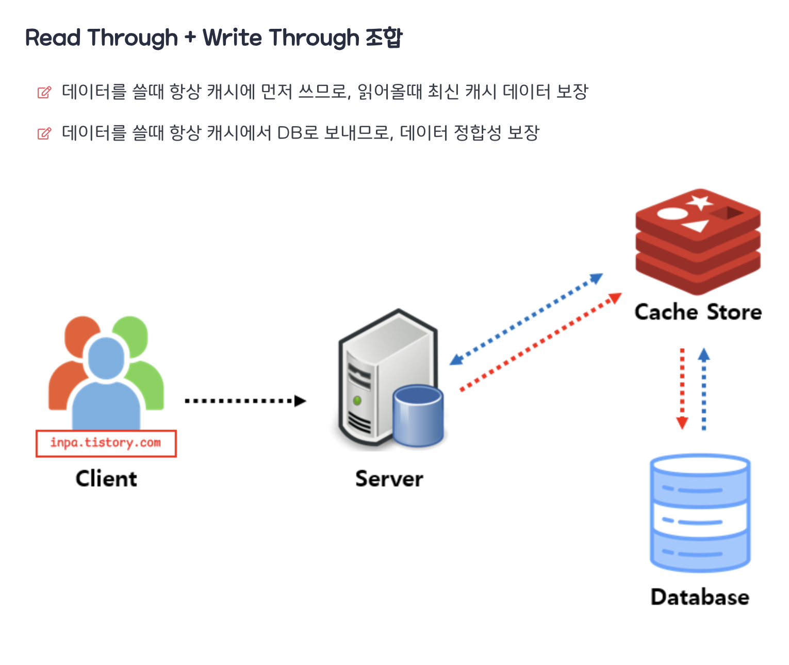

# SQS(Message queue)사례
## 채널톡 사례

- 순간적으로 많은 로그를 Dynamodb에 저장하려고하면 부하가 발생하여 정상적으로 저장이 안될 수 있다. -> SQS로 버퍼역할을 했다. 
- SQS는 무한히 많은 메세지를 저장할 수 있고 14일동안 보관 가능하여 publish 먼저 한 뒤 consume을 나중에 하더라도 문제가 되지 않았다.
- 개발팀에서 메인 api가 문제가 생겨 긴급하게 대응을 해야한다면 덜 중요한 log-writer은 더 여유롭게 대응할 수 있었다.
- SQS는 비정상적인 오류로 종료되더라도 안전하게 재시도 가능해서 EC2 Spot Instance로 동작해도 괜찮았다. 
 **Spot Instance: 가격이 비교적 저렴한 대신 경매하는 방식이라 갑자기 종료될 수 있다.**
## 직방 사례 (S3 & RDS & SQS 통한 고가용성 데이터 베이스 관리 및 운영)

- S3를 통해 사용자 및 부동산 중개 사무소등의 정보를 저장하고, RDS를 이용해 관계형 데이터 베이스를 쉽게 운영할 수 있다.
- 또한 SQS를 이용함으로써, 기존에 모든 트랜잭션을 데이터 베이스에 의존했지만, 구성요소를 독립적으로 실행해 데이터 베이스에 문제가 생겼을때도 모든 거래를 안전하게 처리할 수 있다.

# Redis 캐싱 전략
- 캐시를 이용하게 될 경우 반드시 데이터 정합성 문제가 발생
- 정합성이란 데이터가 캐시와 데이터베이스 두 곳에서 같은 데이터임에도 불구하고 정보값이 다른 현상
- Ex) 어떤 게시글의 좋아요 갯수가 10개로 저장되어 있는데 데이터베이스에는 7개로 저장되어있을 경우 정보 불일치가 발생
## Look Aside 패턴(읽기)
- 데이터를 찾을 때 우선 캐시에 저장된 데이터가 있는지 확인 없다면 DB에서 조회
- **반복적인 읽기가 많은 호출에 적합**
- 캐시와 DB가 분리되어 있기 때문에 장애 대비 구성이 잘 된다
- 하지만 캐시에 connection이 많으면 redis가 죽었을때 DB에 부하가 많이 생김

**이 방식은 캐시에 장애가 발생하더라도 DB에 요청을 전달함으로써 캐시 장애로 인한 서비스 문제는 대비할수 있지만, Cache Store와 Data Store(DB)간 정합성 유지 문제가 발생할 수 있으며, 초기 조회 시 무조건 Data Store를 호출 해야 하므로 단건 호출 빈도가 높은 서비스에 적합하지 않다. 대신 반복적으로 동일 쿼리를 수행하는 서비스에 적합한 아키텍처이다.**

## Read Through 패턴(읽기)
- 캐시에서만 데이터를 읽어오는 전략
- 데이터를 조회하는데 있어 전체적인 속도가 느림
- Redis가 죽을경우 서비스 이용에 차질이 생김
- 데이터 동기화가 항상 이루어져 정합성 문제에서는 벗어남
- 읽기가 많은 워크로드에 적합

**이 방식은 직접적인 데이터베이스 접근을 최소화하고 Read 에 대한 소모되는 자원을 최소화할 수 있다.
하지만 캐시에 문제가 발생하였을 경우 이는 바로 서비스 전체 중단으로 빠질 수 있다. 그렇기 때문에 redis과 같은 구성 요소를 Replication 또는 Cluster로 구성하여 가용성을 높여야 한다.**

## Write Back 패턴(쓰기)
- 데이터를 저장할때 바로 DB에 쿼리하지 않고 모아서 일정 배치 작업을 통해 DB에 반영
- 쓰기 쿼리 비용과 부하를 줄일 수 있음
- Write가 빈번하면서 Read를 하는데 많은 양의 Resource가 소모되는 서비스에 적합
- 데이터 정합성 확보
- **문제점1: 자주 사용되지 않는 불필요한 리소스 저장**
- **문제점2: 캐시에서 오류 발생 시 데이터 영구 소실**

**캐시에 데이터를 모았다가 한 번에 DB에 저장하기 때문에 DB 쓰기 횟수 비용과 부하를 줄일 수 있지만, 데이터를 옮기기 전에 캐시 장애가 발생하면 데이터 유실이 발생할 수 있다는 단점이 존재한다. 하지만 오히려 반대로 데이터베이스에 장애가 발생하더라도 지속적인 서비스를 제공할 수 있도록 보장하기도 한다.**

## Write Thgrough 패턴
- 데이터베이스와 Cache에 동시에 데이터를 저장하는 전략
- DB와 캐시가 항상 동기화 되어 있어, 캐시의 데이터는 항상 최신 상태로 유지
- 데이터 유실이 발생하면 안 되는 상황에 적합
- **문제점1: 자주 사용되지 않는 불필요한 리소스 저장.**
- **문제점2: 매 요청마다 두번의 Write가 발생하게 됨으로써 빈번한 생성, 수정이 발생하는 서비스에서는 성능 이슈 발생**

**항상 동기화가 되어 있어 항상 최신정보를 가지고 있다는 장점이 있다.
하지만 결국 저장할때마다 2단계 과정을 거쳐치기 때문에 상대적으로 느리며, 무조건 일단 Cache Store에 저장하기 때문에 캐시에 넣은 데이터를 저장만 하고 사용하지 않을 가능성이 있어서 리소스 낭비 가능성이 있다.**

## 고려할 점
**write throuth 패턴과 write back 패턴 둘 다 모두 자주 사용되지 않는 데이터가 저장되어 리소스 낭비가 발생되는 문제점을 안고 있기 때문에, 이를 해결하기 위해 TTL을 꼭 사용하여 사용되지 않는 데이터를 반드시 삭제해야 한다.**

**Write-Through 패턴과 Read-Through 패턴을 함께 사용하면, 캐시의 최신 데이터 유지와 더불어 정합성 이점을 얻을 수 있다.대표적인 예로 AWS의 DynamoDB Accelerator(DAX)가 있다.DAX 패턴을 통해 DynamoDB에 대한 읽기 및 쓰기를 효율적으로 수행할 수 있다.**

## Write Around 패턴
- Write Through 보다 훨씬 빠름
- 모든 데이터는 DB에 저장
- Cache miss가 발생할 때만 DB와 캐시에 데이터 저장
- **캐시와 DB 내의 데이터가 다를 수 있음**

**Write Around 패턴은 주로 Look aside, Read through와 결합해서 사용된다.데이터가 한 번 쓰여지고, 덜 자주 읽히거나 읽지 않는 상황에서 좋은 성능을 제공한다.**

## 캐시 읽기 + 쓰기 조합

**참조 링크**
- https://inpa.tistory.com/entry/REDIS-%F0%9F%93%9A-%EC%BA%90%EC%8B%9CCache-%EC%84%A4%EA%B3%84-%EC%A0%84%EB%9E%B5-%EC%A7%80%EC%B9%A8-%EC%B4%9D%EC%A0%95%EB%A6%AC
- https://channel.io/ko/blog/tech-backend-aws-sqs-introduction