# 12. 채팅 시스템 설계

채팅의 경우 사람들이 떠올리는 것은 제각각이기에 기능의 요구사항을 잘 파악할 필요가 있다.

## 1단계 문제 이해 및 설계 범위 확정

채팅 앱에서 고려해야할 기능의 범위는 다음의 종류들이 존재할 수 있다.

- 1:1 채팅이냐 그룹 채팅이냐
- 모바일 앱이냐 웹이냐
- 트래픽 규모(DAU)는 어느 정도되는가
- 그룹 채팅의 경우 인원 제한의 여부
- 첨부파일 지원 여부
- 접속 상태 표시 지원 여부
- 메시지 길이 제한
- 종단 간 암호화
- 채팅 이력 보관

이번 장에서는 다음의 기능을 가지는 채팅을 설계한다고 가정하여 설계한다.

- 응답지연이 낮은 일대일 채팅 기능
- 최대 100명까지 참여가능한 그룹 채팅 기능
- 사용자 접속상태 표시 기능
- 푸시 알림
- 한 계정으로 여러 단말 동시 접속 지원

## 2단계 개략적 설계안 제시 및 동의 구하기

### 기본 기능

우선적으로 채팅 서비스에서의 기본 기능은 다음과 같다.

- 클라이언트들로부터 메시지 수신
- 메시지 수신자 결정 및 전달
- 수신자가 접속하지 앟는 경우 접속 때까지 메시지 보관

다음과 같은 그림으로 표현될 수 있다.

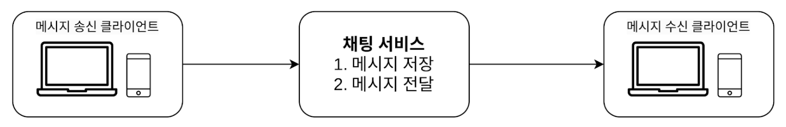

### 통신 프로토콜

채팅 서비스의 경우 어떤 통신 프로토콜을 사용할 것인지 또한 중요하다.

> **HTTP 프로토콜**
> HTTP는 웹에서 널리 사용되는 프로토콜로 초기 채팅서비스에 자주 사용하였다.  
> 실제로 이를 통해 keep-alive 헤더를 사용하여 TCP에서의 hand-shake 과정을 줄이며 효과를 보기도 하였다.
> 하지만 HTTP의 특성 상 서버에서 클라이언트로 메시지를 전송할 수 없는 단점을 해소할 수 없었다.

#### 폴링

클라이언트가 주기적으로 서버에게 새 메시지의 여부를 물어보는 방법이다.

다음의 문제점을 가진다.
- 자주 사용 시 비용의 문제
- 서버 자원이 불필요하게 낭비

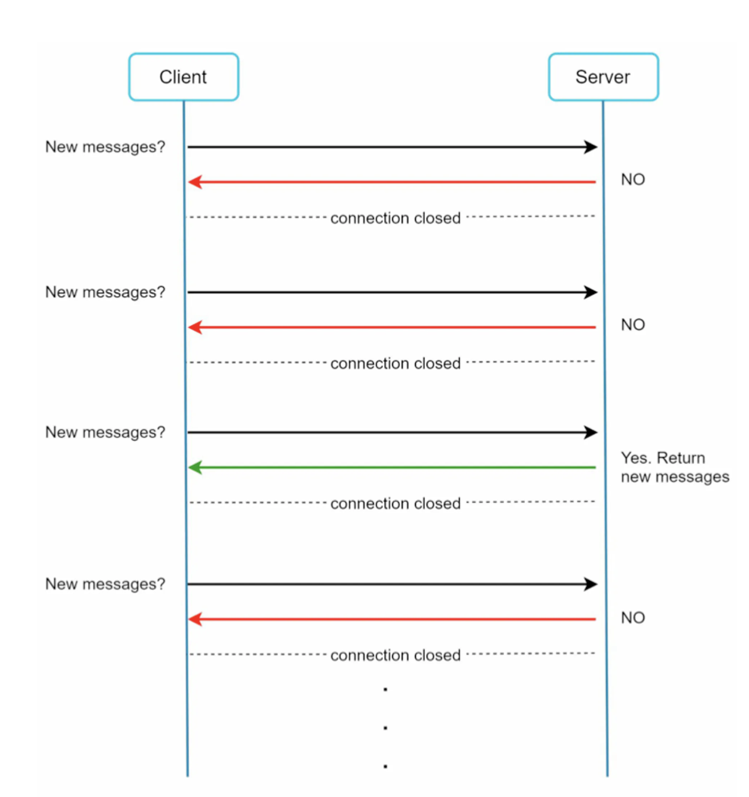

#### 롱 폴링

새 메시지가 반환되거나 타임아웃 될 때까지 연결을 유지한다.

다음의 문제점을 가진다.
- 채팅 서버가 여러개 인 경우 채팅하는 클라이언트가 **같은 채팅 서버에 존재하지 않을 수 있다.**
- 서버 입장에서 클라이언트의 **연결 해제 타이밍을 확인할 수 없다.**
- 타임아웃 시마다 주기적으로 서버에 다시 접속하기에 여전히 **비효율적**이다.

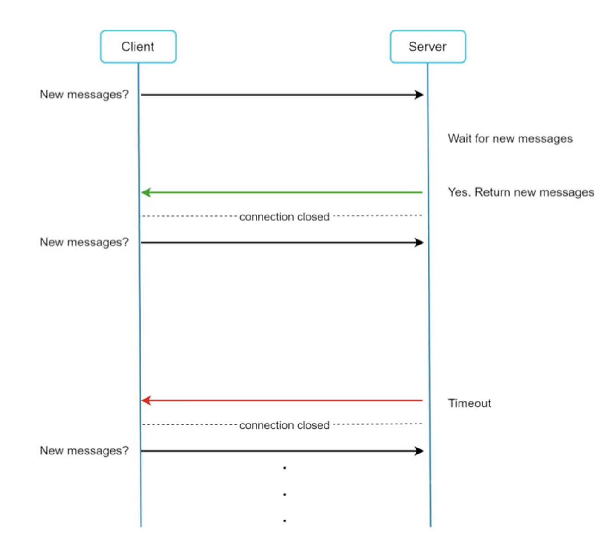

#### 웹 소켓

서버가 클라이언트에게 비동기 메시지를 보낼 때 널리 사용하는 기술로 다음 그림과 같이 동작한다.

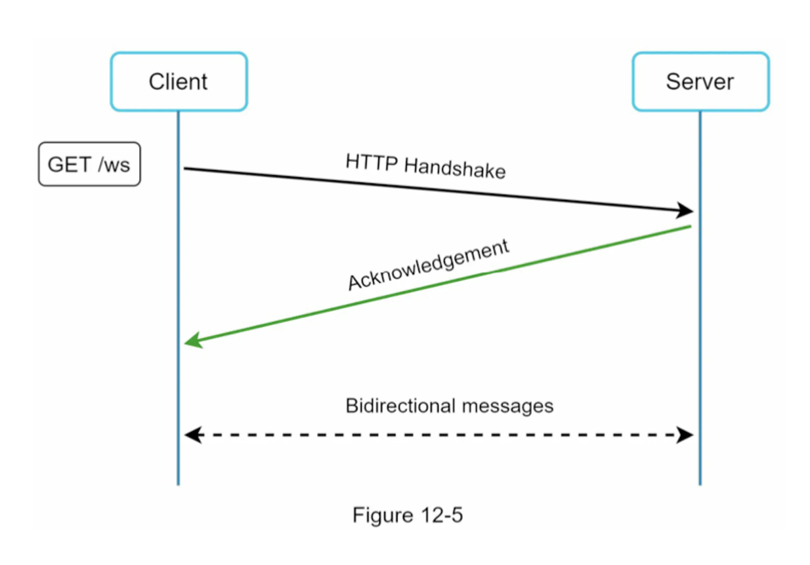

웹 소켓 연결의 경우 클라이언트가 시도하여 생성되면 한번 맺어지면 항구적이며 양방향으로 통신이 가능하게 한다.

그렇지만 항구적인 웹소켓 연결을 위해서 서버 측에서 연결 관리를 효율적으로 할 필요가 있다.

### 개략적인 설계안

채팅 시스템에서 사용하는 프로토콜로는 웹소켓, HTTP 두 개의 프로토콜을 지향한다.

이번 설계안에서 다룰 부분은 총 세 가지로 _무상태 서비스_, _상태유지 서비스_, _제3자 서비스 연동_이 존재한다.

#### 무상태 서비스

로그인, 회원가입, 사용자 프로파일 표시 등의 처리에서는 무상태 서비스로 전통적인 HTTP 요청/응답을 사용한다.

#### 상태 유지 서비스

상태 유지가 필요한 서비스로는 채팅 서비스가 유력하다. 채팅 서비스는 독립적인 네트워크 연결을 유지해야 한다.

#### 제 3자 서비스 연동

채팅 앱에서 주로 사용하는 제 3자 서비스는 _푸시 알림_ 이 졵매한다.

위의 세 가지 부분을 표현한 그림은 다음과 같다.

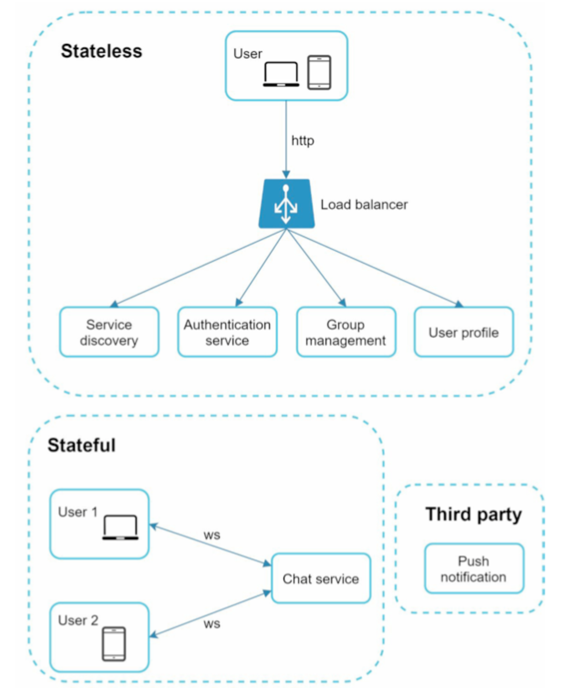

##### 규모 확장성

해당 서비스는 이론적으로 최신 클라우드 서버 한 대로도 충분히 구현은 가능하다. 하지만 이런 경우 중요하게 바라봐야 하는 부분은 **접속의 동시 허용**이다.

> 이번 서비스 시스템에서는 동접자가 1M이라고 가정한다.
> 접속당 10K의 서버 메모리가 필요하다고 보는 경우 10GB 메모리가 있어야 모든 동시 접속 연결을 처리할 수 있다.
> > 해당하는 경우 개략적인 수치로 프로그래밍 언어마다 달라질 수 있다.

##### 저장소

데이터 계층 또한 고려되야 한다.

채팅 서비스에서 중요한 부분으로 **어떤 데이터베이스의 사용**이 존재하는데 주로 RDB와 NoSQL의 차이를 바라본다.

채팅 서비스에서 중요하게 여길 부분은 **데이터 유형과 읽기/쓰기 연산 패턴**을 눈여겨봐야한다.

주로 다룰 데이터의 종류는 두 가지로 다음과 같이 나뉜다.

- 사용자 프로파일, 설정, 친구 목록과 같은 일반적인 데이터 : 해당 데이터는 안정성 보장을 위해 관계형 데이터베이스를 사용한다.
- 채팅 이력 : 키-값 저장소를  사용한다.

> **채팅 데이터의 읽기/쓰기 연산 패턴**
> - 채팅 이력 데이터는 실제로 매일 600억의 데이터가 생성될 정도로 많다. (페이스북 메신저, 왓츠앱)
> - 빈번하게 사용되는 데이터의 경우 최근에 주고 받은 데이터이다.
> - 건색 기능, 언급 메시지, 특정 메시지 혹은 기간으로 접근해야하는 경우도 있기에 데이터 계층에서 효율적인 기능이 제공되어야 한다.
> - 1:1 채팅의 경우 읽기/쓰기의 비율이 1:1이다.

> **키-값 저장소**
> 채팅이력의 정보는 실제로 redis, Cassandra, HBase 등의 키-값 저장소를 통해 구현되어 있다. 이유는 다음과 같다.
> - 데이터 접근 지연시간이 작다.
> - 수평적 규모 확장의 용이함.
> - 관계형 데이터 베이스는 롱 테일 데이터를 잘 처리하지 못한다. 실제로 인덱스가 커질 수록 random accewss를 처리하는 cost가 커진다.
> > **롱테일**
> > 발생 가능성이 낮은 다수의 사건들이 통계분포의 한쪽에 길게 분포돼 있는 현상을 의미한다.
> > 
> > In MySQL
> > 인덱스가 커지면, 인덱스 트리(B-tree 등)의 깊이가 깊어진다.. 깊이가 깊어질수록 특정 값을 찾기 위해 더 많은 노드를 방문해야 하므로 디스크 I/O가 증가한다.

### 데이터 모델 

데이터의 형태는 다음과 같다.

#### 1대1 채팅 메시지 테이블

|column|type|
|------|---|
|**message_id**|bigint|
|message_to|bigint|
|message_from|bigint|
|content|text|
|created_at|timestamp|

#### 그룹 채팅 메시지 테이블

|column|type|
|------|---|
|**channe_id**|bigint|
|**message_id**|bigint|
|message_to|bigint|
|content|text|
|created_at|timestamp|

#### Message Id

두 테이블의 기본키가 되는 `message_id`의 경우 다음의 특성도 가져야ㅑ 한다.

- 고유성
- 시간 순서와의 일치. 메시지 순서를 표현하기 위해 새로운 ID의 경우 이전 ID보다 큰 값

이를 충족하기 위해 다음 두가지 방법을 세 가지 방법을 사용하기도 한다.

1. auto_increment
2. 스노플레이크 64-bit 순서 번호 생성기
3. 지역적 순서 번호 생성기

> 지역적
> ID의 유일성은 같은 그룹 내에서만 보증하면 된다는 의미이다. 즉, 1대1 채팅 세션, 같은 채널 에서만 순서를 보증하면 된다는 의밈이다.

## 상세 설계

위의 기본적인 설계안에서 상세적으로 다룰 부분은 다음과 같다.

- 서비스 탐색
- 메시지 전달 흐름
- 사용자 접속 상태

### 서비스 탐색

서비스 탐색의 주 역할로 클라이언트에게 가장 적합한 채팅 서버를 추천하는 것이다. 이를 적절히 하기 위해 사용되는 기준으로 다음이 존재한다.

- 클라이언트의 위치
- 서버의 용량

> **아파치 주키퍼**
> 아파치 소프트웨어 재단 프로젝트 중의 한 소프트웨어 프로젝트로서 공개 분산형 구성 서비스, 동기 서비스 및 대용량 분산 시스템을 위한 네이밍 레지스트리를 제공한다. 실제 서비스 탐색 기능을 구현하는데 널리 쓰이는 오픈 소스 솔루션이기도 하다.
> 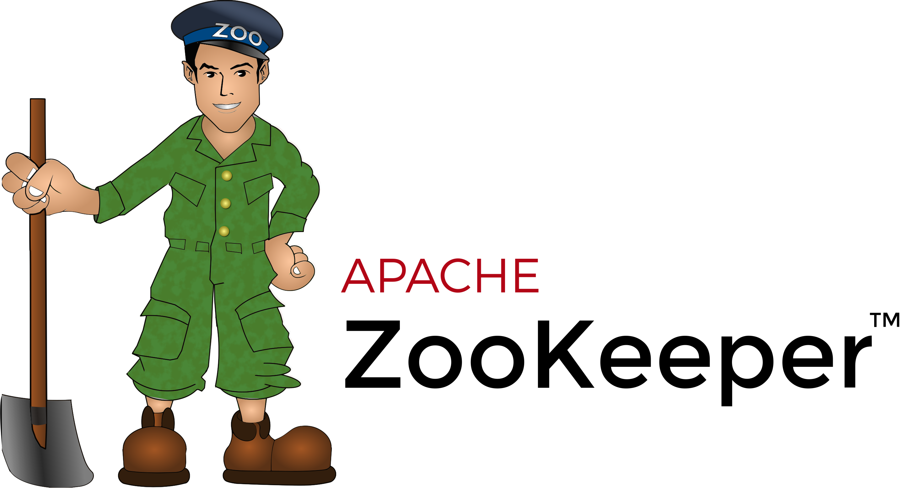

다음의 그림으로 구조를 표현할 수 있다.

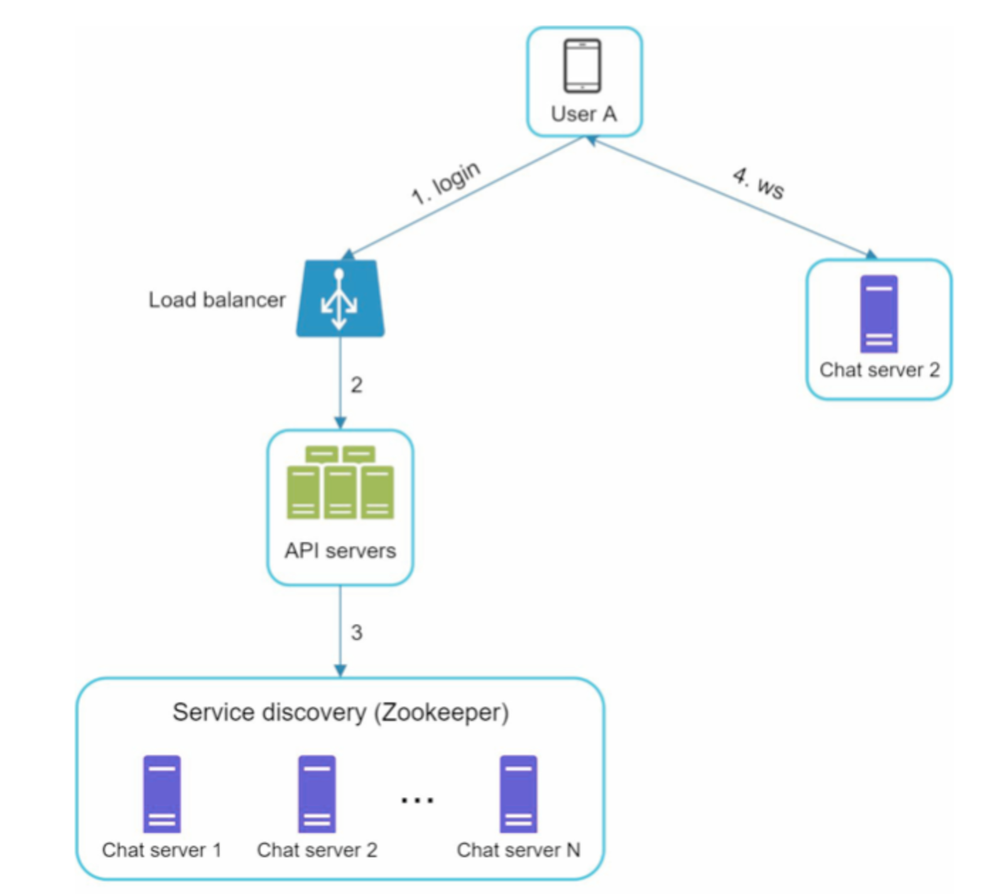

실제 흐름은 다음과 같다.

1. 사용자 A가 로그인 시도 후 서비스 탐색 기능이 동작하여 서비스할 최적의 채팅 서버를 찾는다.
2. 서버 2가 선택되어 사용자 A에게 반환되었다.
3. 사용자 A 는 채팅 서버 2와 웹소켓 연결을 맺는다.

### 메시지 흐름

해당 부분에서는 1대1 채팅과 여러 단물 사이의 메시지 동기화, 그룹 채팅 메시지의 흘므을 확인할 것이다.

#### 1대1 채팅에서의 흐름

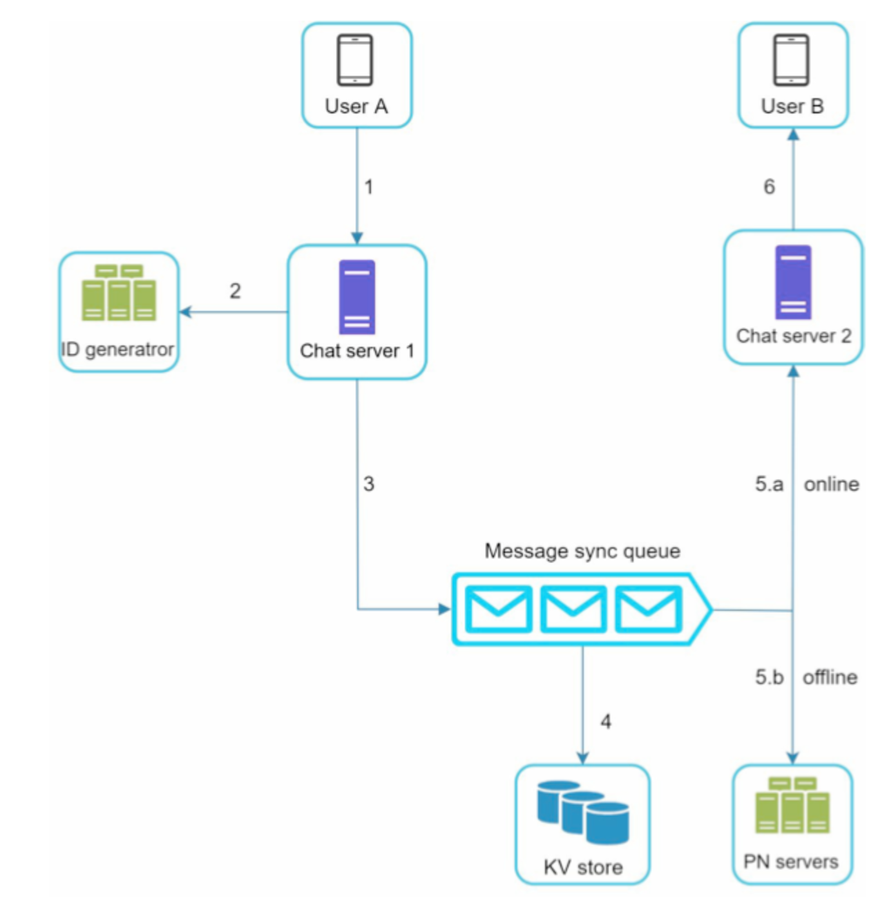

1. 사용자 A가 채팅 서버 1로 메시지 전송
2. 채팅 서버 1은 메시지 ID 생성 이후 **메시지 동기화 큐**로 전송
3. 메시지가 키-값 저장소에 보관
4. 접속죽인 경우 채팅 서버로, 접속 중이지 않은 경우 푸시 알림 서버로 전송한다.
5. 사용자 B에게 전송

#### 여러 단말 사이의 메시지 동기화

여러 단말을 사용하는 경우 메시지를 다음과 같은 방식으로 해당 단말에서 관측된 가장 최신 메시지 ID를 추적하도록 한다.

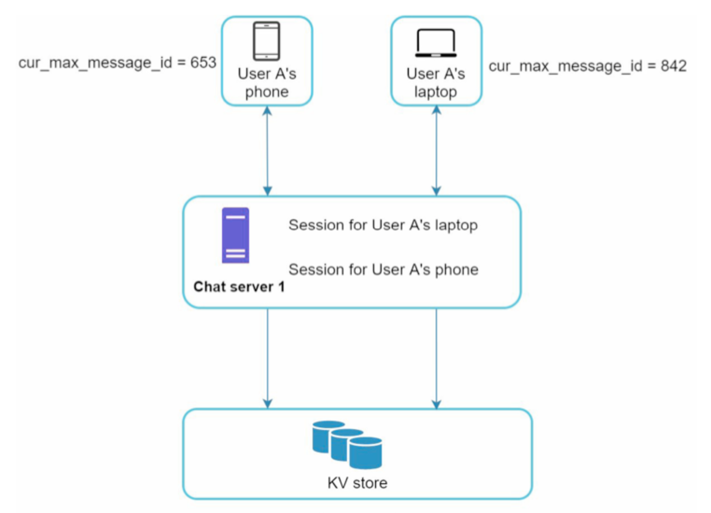

#### 소규모 그룹 채팅에서의 메시지 흐름

##### 사용자 A가 그룹 채팅방에 메시지를 보낸 경우

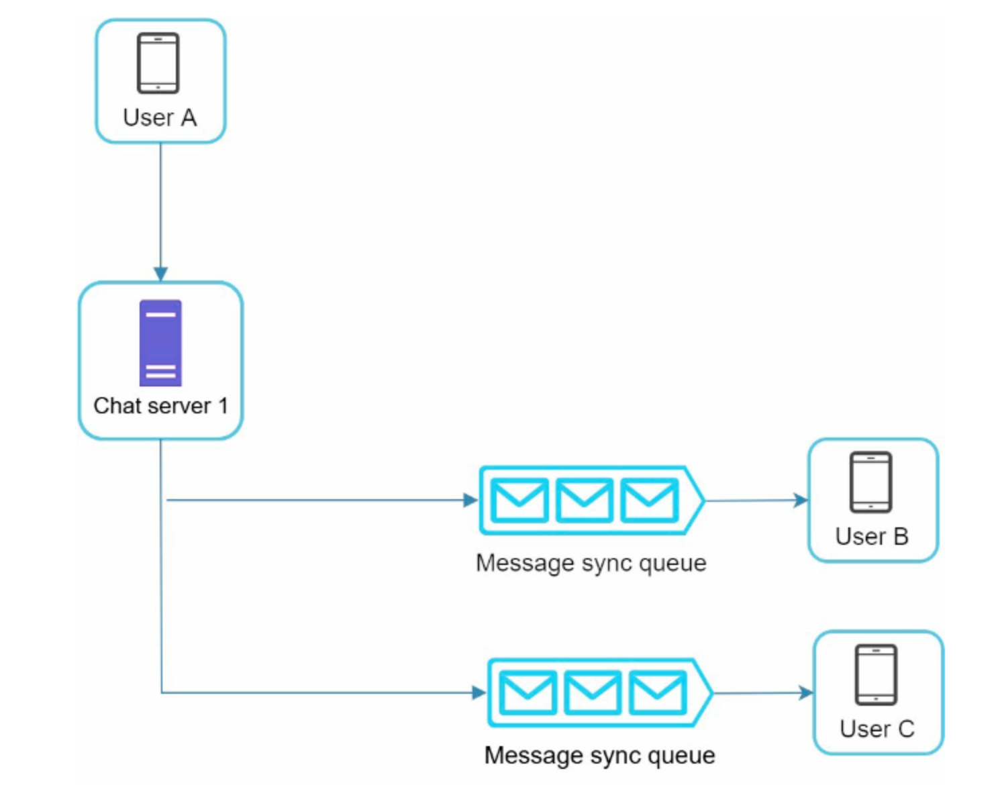

A가 전송한 메시지가 사용자 B와 C의 메시지 동기화 큐에 복사된다.

해당하는 설계안은 소규모 그룹 채팅에 적합하다. 그 이유는 다음과 같다.

- 메시지 동기화 플로위의 간단함
- 수신자별 메시지 복사의 비용 문제 발생 가능성 적음

##### 사용자 C가 여러 사용자로 부터 메시지를 수신하는 경우

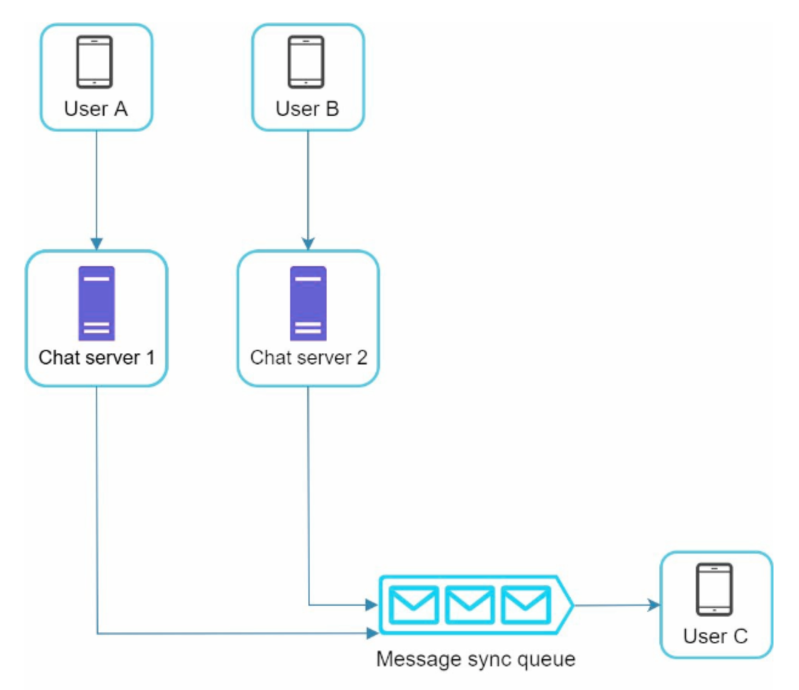

### 접속상태 표시

접속 상태 표시 또한 상당수 채팅 애플리케이션에서의 핵심 기능이다. 이것 또한 접속 상태 서버를 따로 두어 상태를 관리한다.

이러한 상태의 변화가 바뀌는 시나리오에 대해 살펴보자.

#### 사용자 로그인

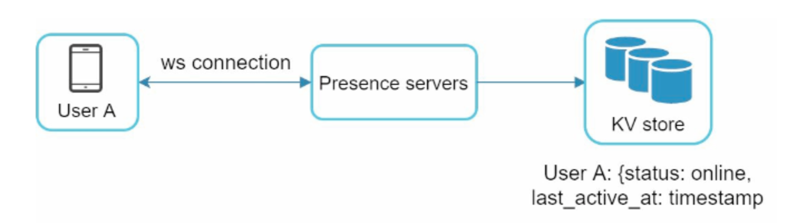

로그인을 통해 웹소켓 ㅇ녀결을 맺으면 접속상태 서버는 A의 상태와 `last_active_at` 타임 스탬프 값을 키-값 저장소에 보관한다.

#### 로그아웃

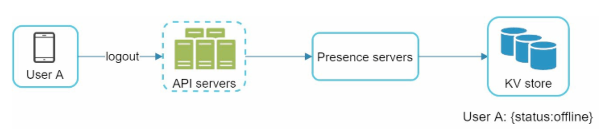

사용자의 상태가 online에서 offline으로 변경된다.

#### 접속 장애

인터넷의 연결이 끊기는 경우는 우리가 접속 장애로 판단한다. 해당 경우 웹소켓 같은 지속성을 가진 연결 또한 끊긴다. 다음의 경우가 존재할 수 있다.

- 엘레베이터 안
- 터널을 지나가는 상황
- 와이파이 연결 시점

해당 경우 다음의 그림처럼 해결할 수 있다.

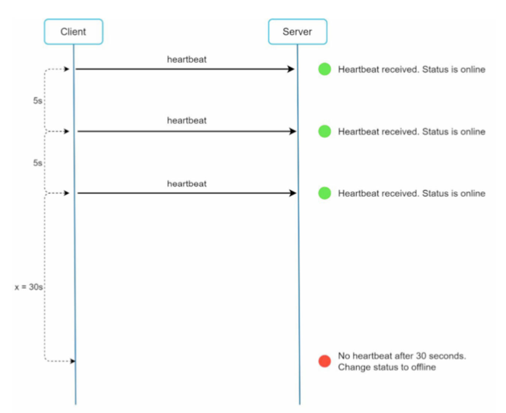

위 그림 처럼 heartbeat event를 주기적으로 클라이언트가 접속상태 서버로 전송하도록 처리한다.

#### 상태 정보의 전송

다른 유저들이 해당 사용자의 상태 변화를 알기 위한 장법으로 **발행-구독 모델**을 사용한다.

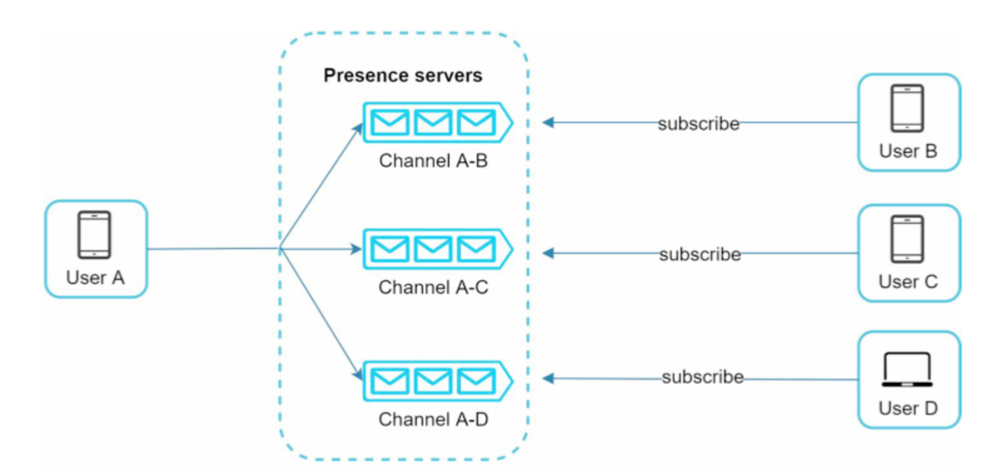

위 그림처럼 각 채널을 두어 해당 채널을 구독한 다른 유저들에게 상태정보를 전달할 수 있도록 한다.

하지만 다음의 문제가 존재한다.
- 100000 사용자가 한 그룹 내에 존재 시 상태변화 1건당 100000개의 이벤트 메시지가 발생한다.

이를 해소하기 위해 다음의 방법이 존재한다.

- 그룹 채팅에 입장하는 순간에만 상태 정보를 읽을 수 있도록 즉, 구독한 메시지를 받을 수 있도록 한다. 즉, 클라이언트가 수동으로 하도록 유도하는 것이다.

## 추가 논의 사항

- 사진이나 비디오 등의 미디어 지원 : 압축 방식, 썸네일 생성 등에 대해 고려
- 캐시 : 이미 읽은 정보는 클라이언트 저장소에서 처리하도록
- 종단 간 암호화 : 텔레그램과 같은 메신저를 통해 송수신자 외에 아무도 보지 못하게 한다.
- 로딩 속도 개선 : 지역적으로 분산된 네트워크를 구축하여 앱 로딩 속도를 개선할 수 있다.
- 오류 처리 : 메시지 재전송, 채팅 서버 오류가 발생할 수 있는데 이를 안정적으로 처리하도록 한다.

