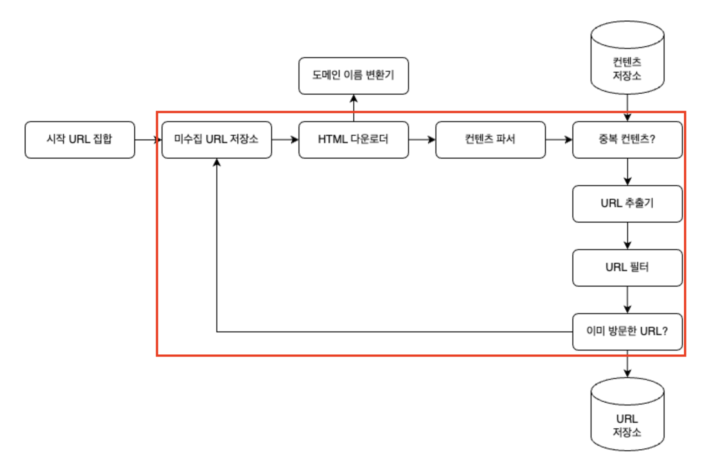
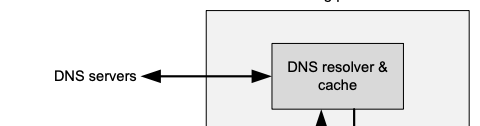
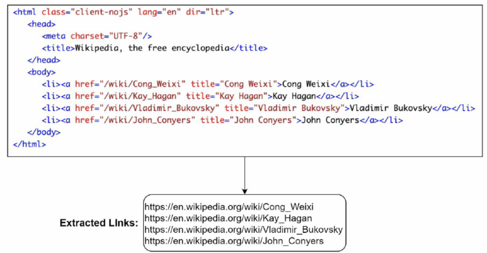
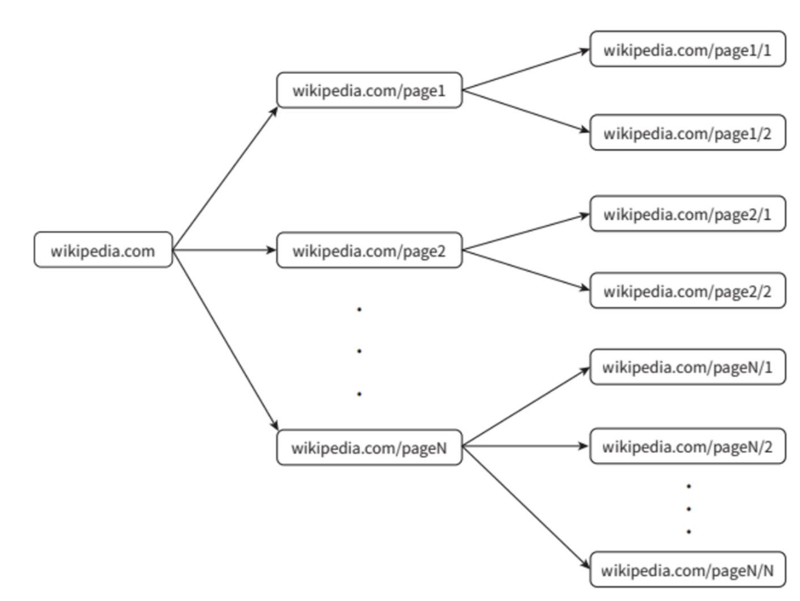
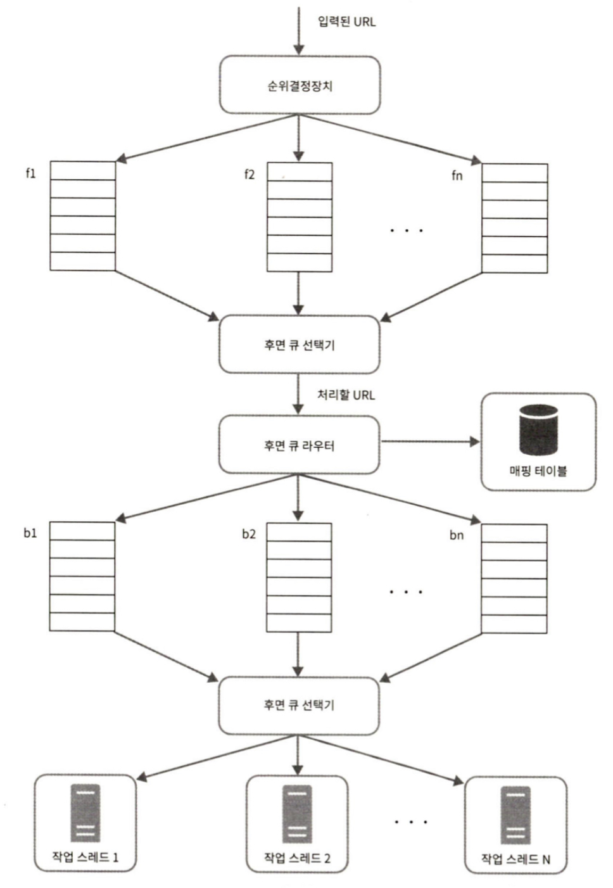
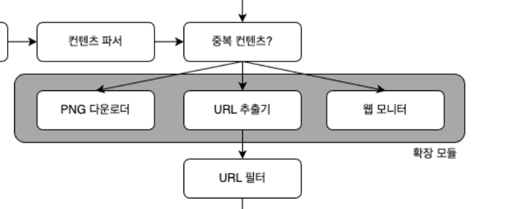

# 9. 웹 크롤러 설계

## 웹 크롤러

몇 개 웹 페이지에서 시작하여 링크를 따라가면서 새로운 콘텐츠를 수집한다.

- 로봇, 스파이더라 불린다.
- 웹에 새로 생성 혹은 갱신된 콘텐츠(웹 페이지, 이미지, 비디오, PDF)를 찾는 목적

### 사용 예시

- **검색 엔진 인덱싱** : 웹 페이지를 모아 검색 엔진을 위한 로컬 인덱스 생성 
  - Googlebot
- **웹 아카이빙** : 장기보관을 윟 웹에서 종보를 모으는 절차
  - 미국 국회 도서관, EU 웹 아카이브
- **웹 마이닝** : 웹의 폭발적 성장으로 인해 유명해졌으며 이를 통해 유용한 지식들을 인터넷을 통해 도출
  - 주주 총회 자료, 연차 보고서 다운을 통한 기업의 핵심 사업 방향 확인
- **웹 모니터링** : 웹 사이트 및 서비스를 확인하는 것
  - 저작권, 상표권 등의 침해 사례 모니터링

> **복잡도**
> 데이터의 규모에 따라 달라지며 이는 웹 크롤러 설계 단계에서 필수적으로 이루어지며 이를 통해 팀 구성이 달라질 수 있다.

## 1. 문제 이해 및 설계 범위 확정

> **웹 크롤러 기본 알고리즘**
> 1. URL 집합이 입력으로 주어지는 경우 해당 URL이 가리키는 모든 웹 페이지 다운로드
> 2. 다운받은 웹 페이지에서 URL 추출
> 3. 추출된 URL 다운 시 URl 목록에 추가 후 위 과정 반복

위의 기본 알고리즘이 존재하지만 실제로 대규모 확장성을 갖는 웹 크롤러를 설계 시에는 간단하지 않다. 이를 위해서 설계 진행 전 **요구사항 파악**, **설계 범위 좁히기**가 필수적으로 이루어져야 한다.

### 주요 크롤러 속성

- 규모 확장성 : 수십억 개의 페이지가 존재하기에 **병행성**을 활용할 수 있어야 한다.
- 안정성 : 비정상적인 입력, 환경에 대응가능해야 한다. (Wrong HTML, 500, 404 Page)
- 예절 : 너무 많은 Request의 방지 (실제 429 Status Code가 뜰 수도 있음)
- 확장성 : 새로운 형태의 콘텐츠 지원이 쉬운 구조

### 개략적 규모 추정

설계 범위를 확정하기 위해 필요한 과정으로 실제 프로젝트에서 PM, 팀장급들과의 논의에서 이러한 합의는 필수적이다.

웹 크롤러 단계에서의 규모 추정은 다음의 요소들이 이루어진다.

- 웹 페이지 다운 빈도 및 수
- QPS(Query Per Second)
- 최대 QPS
- 웹 페이지의 크기
- 저장 단위 및 cost

> 실제 요구사항 및 규모 추정 과정은 [대규모 시스템 설꼐 기초 p.143~144]를 참고

## 2. 개략적 설계안 제시 및 동의 구하기

1단계가 끝나 요구사항이 명확해지고 규모 추정이 완려되었다면 설계를 진행해야한다.

웹 크롤러 기본 알고리즘를 준수하며 작업을 이러나가는 다이어 그램이다. 해당 부분에서 실제 각 컴포넌트들의 기능에 대해 깊게 알아볼 필요가 있다.

### 시작 URL 집합

시작 URL은 웹 크롤러가 크롤링을 시작하는 출발점이다.

- 직관적인 방법 : 해당 도메인 이름이 붙은 모든 페이지의 URL을 시작 URL로 사용한다.
- 전체 웹 크롤링 : 가능한 한 많은 링크를 탐색할 수 있도록 URL 선택
    - 전체 URL 공간을 작은 부분집합으로 나누는 전략
    - 주제별로 다른 시작 URL 사용 : URL공간 쇼핑, 스포츠, 건강 등등의 주제별로 세분화

### 미수집 URL 저장소

> **크롤링 상태**
> 현대의 웹 크롤러는 크롤링 상태를 **다운로드할 URL**, **다운로드된 URL** 두 가지로 나누어 관리한다.

미수집 URL 저장소는 다운로드가 되지 않은 즉, 다운로드할 URL의 크롤링 상태를 가진 것들을 관리하는 컴포넌트이다.

- FIFO의 형태를 띈 큐로 구성

### HTML 다운로더

미수집 URL 저장소에 저장되어 있는 URL를 다운로드하는 컴포넌트

### 도메인 이름 변환기

웹 페이지를 다운받기 위해 IP주소ㄹ로 변환시키는 과정을 다음의 그림과 같이 수행한다.

### 콘텐츠 파서

웹 페이지 다운 이후 파싱과 검증 절차를 수행하는 컴포넌트이다.

**파싱과 검증의 필요성**
파싱과 검증의 과정은 이상한 웹 페이지의 경우 _문제를 일으키_ 거나 _저장공간만 낭비_ 하기에 해당 과정이 필요하다.

> 크롤링 서버 안인 HTML 다운 과정, URL 수집 과정안에서 구현될 수 있으나 **독립적인 컴포넌트로 생성된 이유**는 크롤링 과정의 **느려짐**이 발생할 수 있기 때문이다.

### 중복 콘텐츠 여부
[웹 중복성 검사 연구 자료](https://searchengineland.com/study-29-of-sites-face-duplicate-content-issues-80-arent-using-schema-org-microdata-232870)를 살펴보면 29% 가량의 웹 페이지 콘텐츠가 중복임을 확인할 수 있다.

중복 콘텐츠 여부 검사를 통해 이미 시스템에 저장된 콘텐츠인지를 확인하여 데이터 중복을 줄이고 처리 과정에서의 소요 시간을 줄일 수 있다.

비교를 위해 다음의 방법을 사용할 수 있다.

- 두 HTML 단순 비교 : 두 문서의 문자열을 비교하는 것으로 간단하지만 비교 대상 문서가 수천, 수억개의 경우 느리고 비효율적이다.
- [웹 페이지 해시값 비교](https://www.scirp.org/reference/referencespapers?referenceid=2631084) (하이퍼 링크 통한 연구자료 확인)

### 콘텐츠 저장소

HTML 문서를 보관하는 시스템으로 구현하기 위해서 저장될 데이터 유형, 크기, 접근 빈도, 유효 기간 등을 종합적으로 고려해야 한다.

주로 사용되는 저장소는 디스크, 메모리가 있다.
- 데이터의 양이 너무 많은 경우 접근을 자주하지 않는 대부분의 콘텐츠를 **디스크**에 저장
- 인기 있어 접근이 자주 일어나는 콘텐츠의 경우 **메모리**

### URL 추출기

HTML 페이지를 파싱하여 링ㅇ크들을 골라내는 역할을 수행한다.

해당 그림은 URL추출 사례로 상대 경로로 구성된 URL에 `https://en.wikipedio.org`를 붙여 절대 경로로 변환한다.

### URL 필터

적절하지 않은 URL을 크롤링 대상에서 배제하는 역할을 한다.

다음의 URL들이 존재한다.
- 특정 콘텐츠 타입이나 파일 확장자를 갖는 URL
- 접속 시 오류가 발생하는 URL
- 접근 제외 목록에 포함된 URL

### 이미 방문한 URL

이미 방문한 URl을 추적하지 않도록 하기 위한 컴포넌트로 다음의 효과를 얻을 수 있다.

- 서버 부하 감소
- 무한 루프 방지

해당 단계를 구현하기 위해 **블룸 필터**나 **해시 테이블** 등의 자료구조가 사용된다.

### URL 저장소

이미 방문한 URL 저장소를 보관하는 저장소이다.

### 작업 흐름 정리

위의 컴포넌트를 종합적으로 정리하여 정리한 작업 흐름은 다음과 같다.

1. 시작 URL들을 미수집 URL 저장소에 저장
2. HTML 다운로더가 미수집 URL 저장소에서 URL 목록 가져오기
3. 도메인 이름 변환기를 통해 IP주소를 확인 후 접속하여 웹 페이지 다운
4. 콘텐츠 파서에서 다운된 HTML 페이지를 파싱 후 올바른 형식의 페이지인지 검증
5. 파싱 및 검증이 끝난 후 콘텐츠 저장소를 통해 중복 컨텐츠 여부 확인한다. 저장소에 없는 콘텐츠의 경우 저장소에 저장한 후 URL 추출기로 전달
6. HTML페이지에서 존재하는 URL들을 수집한 후 URL 필터로 전달한.
7. 필터링을 통해 크롤링 대상에 적합하지 않는 URL을 제외한다.
8. 이미 처리한 URL의 존재 여부를 확인하기 위해 URL저장소에 보관된 URL을 확인한 후 이미 있는 경우 URL을 버린다.
9. 저장소에 없는 URL의 경우 URL 수집 저장소에 저장한 후 미수집 URL 저장소에 전달한다.

## 상세 설계

해당 부분에서는 중요 컴포넌트 및 그 구현 기술에 대해 다룬다.

### DFS/BFS

> 웹은 유향 크래프와 같다. 페이지-노드, 하이퍼링크(URL)-edge로 크롤링 프로세스는 이 그래프를 탐색하는 과정이다. 그렇기에 그래프 탐색 알고리즘인 DFS, BFS를 주로 사용한다.

#### DFS

**깊이 우선 탐색법**으로 그래프가 큰 경우 어느 정도의 깊이로 가게 될 지 가늠하기 어렵기에 크롤링에서 잘 사용되지 않는다.

#### BFS

**너비 우선 탐색법**으로 FIFO 큐를 사용하는 알고리즘이다.

웹 크롤러에서 BFS는 한쪽으로는 탐색할 URL을 집어넣고, 다른 한쪽으로는 꺼내기만 한다.

해당 구현법에서 크롤링에 한해 두 가지의 문제점이 존재한다.

- **URL간 우선순위의 부재** : 모든 웹 페이지가 같은 수준의 중요성을 가지지 않기에 페이지 순위, 트래픽 양, 업데이트 빈도 등에 따라 처리 우선순위의 구별이 필요하다.
- **예의 없는 크롤러** : 한 페이지에서 나오는 링크의 경우 같은 서버에서 제공되는데 같은 서버에 속한 많은 링크를 다운 받는 과정을 병렬로 처리 시 해당 서버는 과부하에 걸린다.

> 
>
>위 그림의 경우 `wikipedia` 서버에 수많은 병렬적인 요청들이 들어가게 되고 이로 인해 wikipedia 서버에서 과부하가 일어날 수 있다. 크롤링하는 입장에서는 429 HTTP Status Code를 확인할 수 있다.

### 미수집 URL 저장소

미수집 URL 저장소는 다운로드할 URL을 보관하는 장소이다.

이러한 저장소를 잘 구현하여 위에서의 문제점인 우선순위, 예의 없는 크롤러를 해결할 수 있다. 

#### 예의 있는 크롤러 구현

> **예의**
> 수집 대상 서버로 짧은 시간 안에 너무 많은 요청을 보내는 것으로 때로는 Dos 공격으로 간주 된다.

가장 중요한 원칙은 **한 번에 한 페이지만 요청**하는 것이다.

이를 위한 컴포넌트 구성은 다음과 같다.

- 큐 라우터 : 같은 호스트에 속한 URL을 같은 큐로 가도록 한다.
- 매핑 테이블 : 호스트 이름과 큐 사이의 관계를 보관한다.
- FIFO 큐 : 같은 호스트에 속한 URL은 같은 큐에서 보관한다.
- 큐 선택기 : 큐를 순회하여 큐에서 나온 URL을 작업 스레드에 전달한다.
- 작업 스레드 : URL을 다운로드하는 작업을 수행한다.

#### 우선순위

유용성에 따라 URL의 우선순위를 나누기 위해 페이지 랭크, 트래픽 양, 갱신 빈도 등을 사용할 수 있다.

이를 위한 컴포넌트 구성은 다음과 같다.

- 순위 결정 장치 : URL의 우선순위를 계산한다.
- 큐 : 우선순위 별로 큐를 할당한다.
- 큐 선택기 : 순위가 높은 큐에서 더 자주 꺼내도록 설계한다.

위의 두 컴포넌트를 포함한 전체 설계는 다음 그림과 같다.

#### 신선도

웹 페이지는 수시로 추가, 갱신, 삭제가 되기에 이러한 상태를 반영하기 위해 주기적으로 재수집할 필요성이 있다.

다음과 같은 방안들이 존재한다.

- 웹 페이지의 변경 이력 활용
- 중요 페이지의 경우 자주 재수집

> #### 저장 위치
> 
> 이러한 URL의 수는 수억 개에 달하기에 모든 URL을 메모리에 저장하는 것은 안정성, 규모 확장성 측면에서 올바르지 않다. 또한, 디스크에 저장하는 것은 병목이 느껴질 수 있다.
>
> 대부분의 URL은 디스크에 두지만 IO 비용을 줄이기 위해 자주 접근하는 것은 메모리에 저장하기 위해서 큐로 보관한다.

### HTML 다운로더

> Robots.txt
> 로봇 제외 프로토콜로 불리며 웹 사이트가 크롤러와 소통하는 표준적인 방법
> 해당 파일에 크롤러가 수집해도 되는 페이지 목럭이 들어 있고 나열된 규칙 또한 존재한다.

HTML 다운로더는 HTTP 프로토콜을 통해 웹 페이지를 내려 받는다.

#### 성능 최적화

HTML 다운로더를 설계할 때는 성능최적화 또한 중요 사안이다. 이를 위해서 다음의 기법들을 사용할 수 있다.

1. **분산 크롤링**  
크롤링 작업을 여러 서버에 분산하고 각 서버는 여러 스레드를 돌려 다운로드 작업을 처리한다.

2. **도메인 이름 변환 결과 캐시**  
도메인 이름 변환기는 동기적 특성을 가지고 있어서 크롤러 성능에 있어 병목이 발생한다. (실제 DNS 요청은 10~200ms가 소요된다.)  이러한 도메인 이름과 IP 주소 사이의 관계를 **캐시에 보관**하고 **cron job**을 통해 주기적으로 갱신하는 방향으로 하여 성능을 높일 수 있다.

3. 지역성  
크롤 서버, 캐시, 큐, 저장소 등의 컴포넌트를 지역성을 활용해 분산하도록 한다.   이를 통해 페이지 다운로드 시간을 줄일 수 있다.

4. 짧은 타임아웃  
응답이 느리거나 없는 경우가 조내하기에 이를 계속 기다리기 보다 최대 얼마나 기다릴지를 미리 정한다.

#### 안정성

안정성 또한 다운로드 설계시 중ㅇ한 부분이기에 다음과 같은 방안들을 제시한다.

- 안정 해시 : 서버들에 부하를 분산할 때 적용하는 기술로 이를 통해 다운로더 서버를 쉽게 추가 및 삭제가 가능하다.
- 크롤링 상태 및 수집 데이터 저장 : 장애 발생 시 쉽게 복구하기 위해 크롤링 상태와 수집된 데이터를 DB와 같은 지속적 저장장치에 기록하도록 한다.
- 예외 처리 : 에러는 흔한 일이다. 이러한 에러로 중단되지 않고 지속적으로 작업되도록 처리한다.
- 데이터 검증

#### 확장성

새로운 형태의 콘텐츠는 무궁무진하기에 이를 지원할 수 있도록 고려하여 설계해야 한다.

위와 같은 확장 모듈을 둘 수 있도록 한다.

#### 문제 있는 콘텐츠 감지 및 회피

유해하거나 의미 없는 콘텐츠를 감지하고 차단하는 방법은 다음이 있다.

1. 중복 콘텐츠  
해시나 체크섬 등을 통해 중복 콘텐츠를탐색한다.

2. 거미 덫  
거미 덫은 무한 루프에 빠뜨리도록 설계한 웹 페이지이다.  
이를 회피하기 위한 방법 중 하나로 수작업으로 이를 확인하기도 하고 자동으로 피해가는 알고리즘을 개발하기도 한다.

3. 데이터 노이즈  
광고, 스크립트 코드, 스팸 URL 등의 가치가 없는 콘텐츠들은 제외할 수 있도록 한다.

## 추가 논의 사항

다음과 같은 사항들 또한 추가로 논의하면 좋다.

- 서버 측 렌더링
- 원치 않는 페이지 필터링
- 데이터베이스 다중화 및 샤딩
- 수평적 규모 확장성
- 가용성, 일관성, 안정성
- 데이터 분석 솔루션

## 참고자료

http://infolab.stanford.edu/~olston/publications/crawling_survey.pdf
https://searchengineland.com/study-29-of-sites-face-duplicate-content-issues-80-arent-using-schema-org-microdata-232870
https://ics.uci.edu/~lopes/teaching/cs221W12/slides/Lecture05.pdf