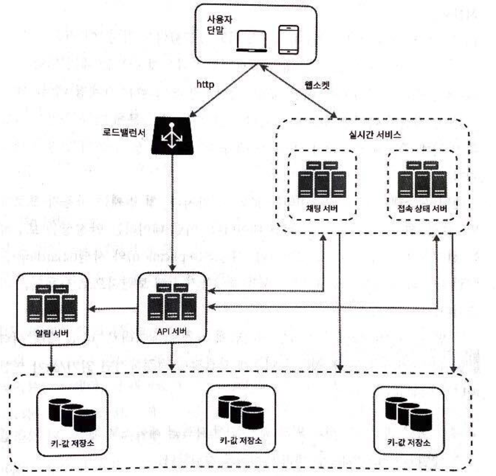

# 채팅 시스템 설계

## 1단계 : 문제 이해 및 설계 범위 확정

- 1:1 or 그룹 채팅
- 모바일 or 웹
- 트래픽 규모
- 그룹 채팅 인원 제한
- 주요 기능 및 세부 사항
- 메시지 길이 제한
- 종단 간 암호화 여부
- 채팅 이력 보관 기간

## 2단계 : 개략적 설계안 제시 및 동의 구하기

- 폴링
  - 주기적으로 새 메시지가 있는지 서버에 확인
  - 서버 자원이 불필요하게 낭비된다는 단점
- 롱 폴링
  - 폴링의 비효율성을 개선한 방안
  - 새 메시지가 반화되거나 타임아웃 될 때까지 연결 유지
  - 새 메시지 받으면 기존 연결 종료 후 서버에 새로운 요청을 보내 모든 절차 다시 시작
  - 단점
    - 송신 클라이언트와 수신 클라이언트가 같은 서버에 접속하지 않을 수 있음
    - 서버 입장에서 클라이언트의 연결 여부를 알 좋은 방법 없음
    - 여전히 비효율적
- 웹소켓
  - 서버가 클라이언트에게 비동기 메시지를 보낼 때 가장 널리 사용하는 기술
    - 처음에는 HTTP 연결, 특정 핸드셰이크 절차를 거치면 웹소켓 연결로 업그레이드
  - HTTP 프로토콜은 송신 클라이언트에게 괜찮은 프로토콜이지만, 웹소켓은 양방향 메시지 전송까지 가능함
    - 메시지를 보낼 때나 받을 때 동일한 프로토콜 사용 가능
    - 설계, 구현이 단순하고 직관적
    - 웹소켓 연결은 항구적으로 유지되어야 하기 때문에 서버 측에서 연결 관리를 효율적으로 해야 함

### 개략적 설계안

- 무상태 서비스
  - 로그인, 회원가입, 사용자 프로필 표시 등을 처리하는 전통적인 요청/응답 서비스
  - 로드밸런서 뒤에 위치
    - 로드밸런서는 요청을 그 경로에 맞는 서비스로 전달
- 상태 유지 서빗스
  - 채팅 서비스
    - 클라이언트가 채팅 서버와 독립적인 네트워크 연결을 유지해야 함
    - 클라이언트는 보통 다른 서버로 연결을 변경하지 않음
- 제 3자 서비스 연동
  - 푸시 알림
    - 가장 중요한 제 3자 서비스
- 규모 확장성

> - 채팅 서버
>   - 클라이언트 사이 메시지 중계
> - 접속 상태 서버
>   - 사용자 접속 여부 관리
> - API 서버
>   - 로그인, 회원가입, 프로필 변경 등 그 외 나머지 전부
> - 알림 서버
>   - 푸시 알림
> - 키-값 저장소
>   - 채팅 이력 보관

### 저장소

- 프로필, 설정, 친구 목록 등 일반적인 데이트
  - 관계형 데이터베이스
- 채팅 이력
  - 양이 매우 많음
  - 가장 빈번하게 사용되는 것은 최근 주고받은 메시지
  - 언급, 검색, 점프 등 무작위 접근도 있음
  - 읽기 : 쓰기 = 1 : 1
 >
 > - 키-값 저장소
 >   - 수평적 규모확장 용이
 >   - latency가 낮음
 >   - 많은 안정적인 채팅 시스템이 키-값 저장소 채택함
 >   -

### 데이터 모델

- 1:1 채팅 메시지 테이블
  - message_id
    - 메시지 순서 정리하는 역할도 담당
  - message_from
  - message_to
  - content
  - created_at
    - 얘로 순서 정할 수는 없음
    - 서로 다른 두 메시지가 동시에 만들어질 수도 있음
- 그룹채팅 메시지 테이블
  - (channel_id, message_id)
  - message_to
  - content
  - created_at
>
> - message_id
>   - RDBMS가 아니기 때문에 auto_increament 사용 불가
>     - 스노플레이크 같은 64-bit 순서 번호 생성기 이용
>     - 지역적 순서 번호 생성기 이용
>       - 같은 그룹 안에서만 보증

## 3단계 : 상세 설계

### 서비스 탐색

- 클라이언트에게 가장 적합한 채팅 서버 추천
  - 클라이언트의 위치
  - 서버의 용량
  > Apache Zookeeper

## 4단계 : 마무리

- 추가적으로 논의할 수 있는 내용
  - 사진, 비디오 등의 미디어를 지원하도록 채팅 앱 확장
  - 종단 간 암호화
  - 캐시
  - 로딩 속도 개선
  - 오류 처리
