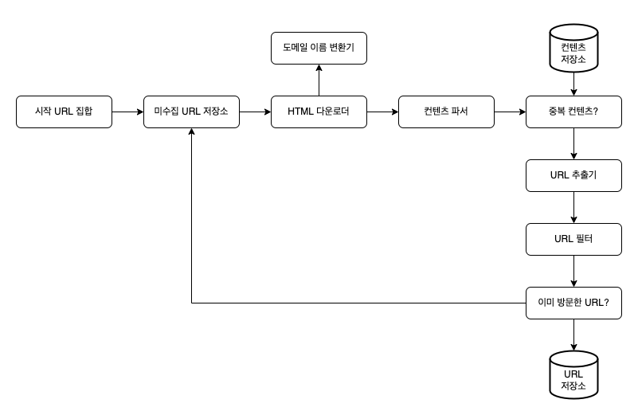
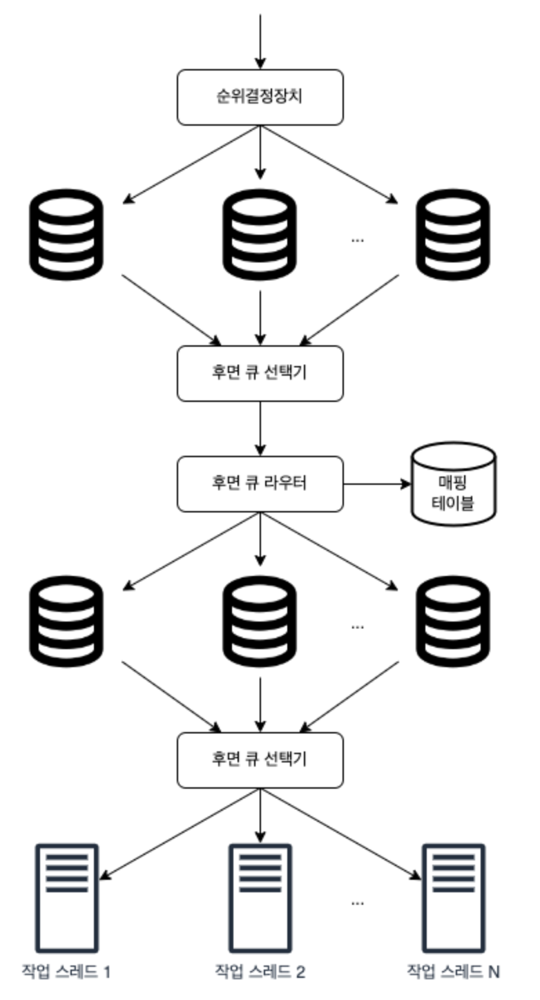

# 웹 크롤러 설계

- 크롤러의 활용
  - 검색 엔진 인덱싱
  - 웹 아카이빙
  - 웹 마이닝
  - 웹 모니터링
  -

## 1단계 : 문제 이해 및 설계 범위 확정

- 기본 알고리즘

 1. 입력으로 주어진 URL 집합에서, 해당 URL들이 가리키는 모든 웹 페이지 다운
 2. 다운 받은 웹 페이지에서 URL 추출
 3. 추출된 URL들을 다운로드할 URL 목록에 추가하고 위의 과정을 처음부터 반복

> **현실은 이렇게 단순하게만 동작하지 않음**
>
> - 고려사항
>   - 용도?
>   - 수집할 양?
>   - 신규 / 수정 페이지 고려?
>   - 저장?
>   - 중복?
>   - ...

- 좋은 웹 크롤러가 만족시켜야 할 속성
  - 규모 확장성
    - parallelism
  - 안정성 [robustness]
  - 예절
    - 짧은 시간 동안 너무 많은 요청을 보내면 안됨
  - 확장성
    - 새로운 형태 등

## 2단계 : 개략적 설계안 제시 및 동의 구하기

- 설계안

### 시작 URL 집합

- 웹 크롤러가 크롤링을 시작하는 출발점
- 시작 URL로 무엇을 쓸 것이냐에 대한 정답은 없음
  - 의도는 명확해야 함

### 미수집 URL 저장소

- 크롤링 상태
  - 다운로드할 URL
    - 미수집 URL 저장소 [URL frontier]
      - 다운로드할 URL을 저장 관리하는 컴포넌트
      - FIFO Queue
  - 다운로드된 URL

### HTML 다운로더

- 인터넷에서 웹 페이지를 다운로드하는 컴포넌트

### 도메인 이름 변환기

- URL을 IP 주소로 변환

### 콘텐츠 파서

- 웹 페이지 다운로드
  - parsing
  - validation

> 크롤링 서버 안에 콘텐츠 파서를 구현하면 크롤링 과정이 느려짐
> -> 독립된 컴포넌트로 구성

### 중복 콘텐츠

- 웹 페이지 콘텐츠의 29% 가량은 중복임
- 중복 문제 해결을 위한 자료 구조를 도임하여 데이터 처리에 소요되는 시간 줄임
  - 웹 페이지의 해시 값 비교

### 콘텐츠 저장소

- HTML 문서를 보관하는 시스템
- 저장할 데이터의 유형, 크기, 접근 빈도, 유효 기간 등을 종합적으로 고려해야 함

### URL 추출기

- HTML 페이지를 파싱하여 링크들을 골라냄

### URL 필터

- 크롤링 대상에서 배제
  - 특정한 콘텐츠 타입이나 파일 확장자를 갖는 URL
  - 오류가 발생하는 URL
  - 접근 제외 목록에 포함된 URL

### 이미 방문한 URL

- 추적을 통해 같은 URL을 여러 번 처리하는 일을 방지할 수 있음
  - bloom filter, hash table이 널리 쓰임

### URL 저장소

- 이미 방문한 URL을 보관하는 저장소

---

## 3단계 : 상세 설계

### DFS or BFS?

페이지 : node
URL : edge

- 일반적으로 BFS 사용
  - 깊이를 가늠할 수 없기 때문에 DFS는 위험도가 있음
  - 하지만 한 페이지에서 나오는 URL의 상당수는 같은 서버
    - 수많은 요청으로 서버의 과부하 유발할 수 있음
    - page rank, 트래픽, 업데이트 빈도 등 여러 척도를 통해 우선순위 구별해야 함

### 미수집 URL 저장소

- 이 저장소를 잘 구현하면 politeness, URL 사이 우선순위와 freshness를 구별하는 크롤러를 구현할 수 있음

#### Politeness

- 동일 웹 사이트에 대해서는 한 번에 한 페이지만 요청해야 함
  - 웹사이트의 호스트명과 다운로드를 수행하는 작업 스레드 사이의 관계를 유지하면 됨
 >
 > - Queue Router
 >   - 같은 호스트에 속한 URL은 언제나 같은 큐로 가도록 보장
 > - Mapping Table
 >   - 호스트 이름과 큐 사이의 관계를 보관하는 테이블
 > - FIFO Queue
 >   - 같은 호스트에 속한 URL은 언제나 같은 큐에 보관됨
 > - Queue Selector
 >   - 큐들을 순회하면서 큐에서 URL을 꺼내 해당 큐에서 나온 URL 다운
 > - Worker Thread
 >   - 전달된 URL을 다운로드
 >   - 작업 사이 일정한 지연시간 둘 수 있음

#### 우선순위

- 유용성에 따른 URL 사이의 우선순위
  - PageRank
  - 트래픽 양
  - 갱신 빈도
  - ...

- 순위결정장치 [Prioritizer]
  - URL을 입력으로 받아 우선순위 계산
  - Queue (f1, ... , fn)
    - 우선순위별로 큐가 하나씩 할당됨
    - 우선순위가 높을 수록 선택될 확률 올라감
  - Queue Selector
    - 임의 큐에서 처리할 URL 꺼내는 역할
    - 순위가 높은 큐에서 더 자주 꺼내도록 설계되어 있음

#### 신선도

- 웹 페이지는 수시로 추가, 삭제, 변경됨
  - 이미 다운로드 한 페이지도 주기적으로 재수집할 필요 있음
  - 최적화 전략
    - 웹 페이지의 변경 이력 활용
    - 우선순위 활용하여 중요한 페이지를 더 자주 수집

#### 성능 최적화

- 분산 크롤링
  - 크롤링 작업을 여러 서버에 분산하고, 각 서버는 여러 스레드를 돌려 다운로드 작업 처리
  - URL 공간을 작은 단위로 분할하여 각 서버는 그중 일부의 다운로드 담당
- 도메인 이름 변환 결과 캐시
  - DNS 요청을 보내고 결과를 받는 작업의 `동기적 특성` 으로 인한 병목
  - 캐시에 보관하고, cron job 등으로 주기적으로 갱신함으로써 성능 개선
- 지역성
  - 크롤렁 서버를 크롤링 대상 서버와 지역적으로 가깝도록 서버를 지역별로 분산
- 짧은 타임아웃
  - 일정 시간동안 서버가 응답하지 않으면 해당 페이지 다운로드 중단하고 다음 페이지
- 안정성
  - 안정 해시
    - 다운로더 서버들에 부하를 분산할 때 적용 가능한 기술
    - 다운로더 서버 쉽게 추가 및 삭제 가능
- 크롤링 상태 및 수집 데이터 저장
  - 장애 발생 시 복구를 위함
- 예외 처리
- 데이터 검증

#### 문제 있는 콘텐츠 감지 및 회피

- 중복 콘텐츠
- 거미 덫
  - 크롤러를 무한 루프에 빠뜨리도록 설계한 웹 페이지
    - URL의 최대 길이를 제한함으로써 회피
    - 하지만 모든 종류의 덫을 피할 만능 해결책은 없음
- 데이터 노이즈
  - 광고, 스크립트 코드, 스팸 URL 등
  -

## 마무리

- 고려하면 좋을 사항
  - Server-side Rendering
  - 원치 않는 페이지 필터링
  - 데이터베이스 다중화 및 샤딩
  - 수평적 규모 확장성
