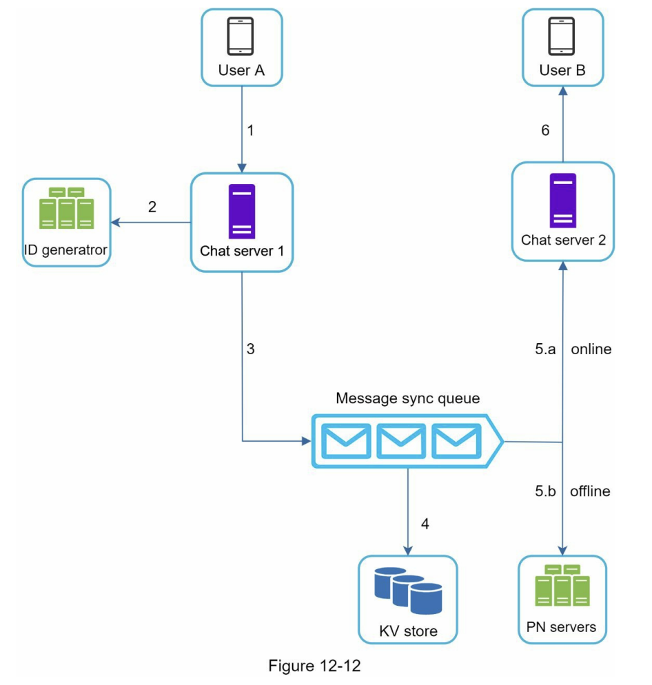
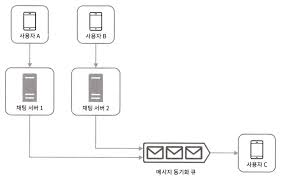

# 12장. 채팅 시스템 설계

## 1단계 문제 이해 및 설계 범위 확정
역시 면접관에게 적절한 질문을 통해 문제를 명확히 이해하는 것이 중요하다.

## 2단계 개략적 설계안 제시 및 동의 구하기

채팅을 구현하는데 있어 메세지를 가져오는 방법은 다양하게 있다.

- 폴링  
클라이언트가 주기적으로 서버에 새로운 메세지가 있는지 물어보는 방법이다. 새로운 메세지가 없는 경우 리소스 낭비로 이어지며, 요청이 많아질수록 비용이 올라가는 단점이 있다.

- 롱폴링  
폴링의 단점을 보완하고자 나온 기법이다. 폴링과 동일하게 클라이언트가 물어보는 것은 똑같지만, 새로운 메세지가 들어오거나 타임아웃 때까지 연결을 유지하는 방식이다. 

- 웹소켓  
첫 연결은 HTTP 연결로 시작한다. 그러나 첫 핸드 셰이크 이후에는 웹 소켓 연결로 업그레이드되어 이후에는 비동기적으로 메세지를 전송할 수 있다. 

#### 저장소
1:1 채팅 앱의경우 읽기 쓰기 비율은 대략 1:1 정도이다.  
책에서 제시하는 설계안은 이러한 메세지 데이터 저장소로 키-값 저장소룰 추천한다. 이유는 다음과 같다.
- 수평적 규모확장이 쉽다.
- 키-값 저장소는 데이터 접근 지연시간이 낮다.
- 관계형 디비는 데이터가 많아질수록 인덱스가 커져 무작위 접근을 처리하는 비용이 늘어난다.

메세지 ID는 **고유해야 하며** **메세지 순서**를 알 수 있어야 한다. 따라서 쓸 수 있는 방법은 스노플레이크 같은 전역적 순서 번호 생성기를 이용 혹은 지역적 순서 번호 생성기를 이용하는 것이다.

## 3단계 상세 설계
### 서비스 탐색
서비스 탐색의 주요 역할은 클라에게 가장 적합한 채팅 서버를 추천하는 것으로, 클라의 위치, 서버 용량 등 다양한 조건을 고려하여 채팅 서버를 고르게 된다.  

### 메세지 흐름

#### 소규모 그룹 채팅에서의 메세지 흐름

각 사용자마다 구독하고 있는 메세지 큐가 달라서 새로운 메세지 확인 시 자신의 큐만 확인하면 된다. 그러나 이는 소규모 그룹에 적당하다. -> 각 메세지 큐에 새로운 메세지 데이터를 복사하는 비용이 증가하기 때문

### 접속 상태 표시

사용자가 웹소켓을 연결하면 접속상태 서버가 사용자의 로그인 상태를 키-값 저장소에 저장한다. 이를 사용하여 접속 상태를 온라인으로 바꾼다.

#### 접속 장애
이처럼 사용자의 접속 여부를 표시할 때 고려할 사항은 접속 장애가 일어나는 상황이다. 빠르게 연결이 끊겼다가 다시 연결되는 경우가 반복된다면, 이를 실시간으로 계속해서 접속 상태를 바꾸는 것은 비효율적이다.

따라서 박동(heartbeat) 검사를 통해 이를 해결한다. 주기적으로 heartbeat 신호를 보내고 일정 시간 박동 신호를 받지 못하면 해당 사용자를 오프라인 처리 하는 것이다.

#### 상태 정보 전송
사용자의 상태 정보를 다른 사용자가 알게 하는 방법은 보통 pub/sub 구조를 사용한다. 각 친구 관계 간 채널을 하나씩 두어 해당 채널들에 상태를 넣어두는 것이다. 이는 그룹 크기가 작을 때 효과적이지만 그룹 크기가 커질수록 변화를 알리려는 비용이나 시간이 많이 들게 된다.

따라서 이러한 성능 문제를 해결하려면 접속 상태를 수동으로 갱신하게 하거나, 그룹 채팅에 입장하는 순간만 상태 정보를 읽게 하는 방법 등이 있다.
