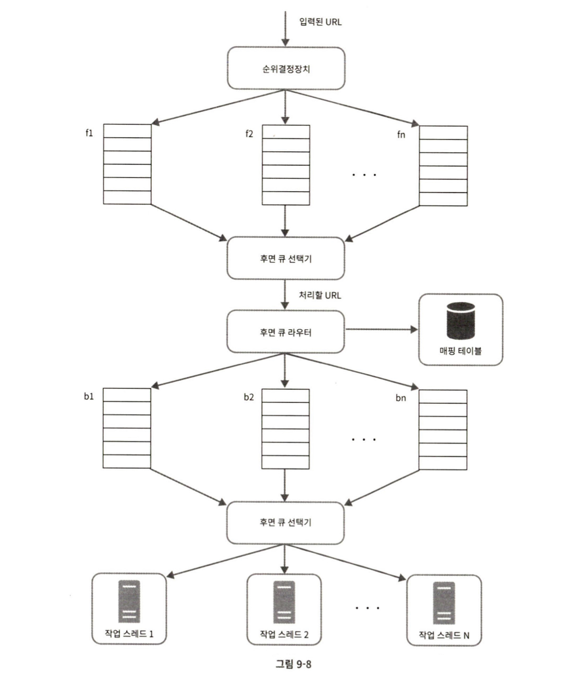

# 9장 웹 크롤러 설계

## 웹 크롤러란?
로봇 또는 스파이더라고도 불리며, 검색 엔진에 널리 쓰이는 기술로 웹에 새로 올라오거나 갱신된 컨텐츠를 찾아내는 것이 주된 목적이다.

웹 크롤러는 다양하게 사용된다.  

- 검색 엔진 인덱싱
- 웹 아카이빙
- 웹 마이닝
- 웹 모니터링  

 
이제부터 단계별로 웹 크롤러 설계에 대해 알아보자.

## 1단계 문제 이해 및 설계 범위 확정
웹 크롤러의 알고리즘은 다음과 같다.
1. URL 집합이 입력으로 주어지면, 해당 URL들이 가리키는 모든 웹 페이지를 다운로드한다.
2. 다운받은 웹 페이지에서 URL들을 추출한다.
3. 추출된 URL들은 다운로드할 URL 목록에 추가하고 위의 과정을 처음부터 반복한다.

좋은 웹 크롤러가 만족시켜야 할 속성의 예로는 다음이 있을 수 있다.

- 규모 확장성
- 안정성
- 예절
- 확장성

## 2단계 개략적인 설계안 제시 및 동의 구하기

- 시작 URL 집합
  - 크롤링할 URL을 모아두는 곳
- 미수집 URL 저장소
  - 아직 수집하지 않은 URL 모아두는 곳 (FIFO 구조) 보통 다운로드할 URL, 다운로드된 URL로 나누어 저장
- HTML 다운로더
  - 웹 페이지 다운로더, 미수집 URL 저장소가 제공
- 콘텐츠 파서
  - 웹 페이지 다운 후 파싱과 검증 절차 수행
- 중복 콘텐츠인가?
  - 중복 여부 체크 해시 값 비교 방법이 효과적
- 콘텐츠 저장소
  - HTML 문서 저장 다양한 고려사항을 정하여 저장소 선택
- URL 추출기
  - HTML 페이지를 파싱하여 링크 추출
- URL 필터
  - 특정한 콘텐츠 타입이나 파일 확장자, 오류 발생 URL 등을 배제하는 역할을 함
- 이미 방문한 URL?
  - 미수집 URL 저장소 내 다운로드된 URL 등을 활용하여 이미 방문한 URL 배제
- URL 저장소
  - 이미 방문한 URL 모아두는 곳

## 3단계 상세 설계

### DFS VS BFS
보통 DFS는 사용하지 않는다. 그래프의 깊이가 얼마나 깊을 지 알 수 없기 때문이다.

따라서 BFS를 주로 사용하며, 이 때 같은 호스트 내에 속하는 웹 페이지 다운을 위해 한 서버에 수많은 요청을 보낼 수 있다. 이러한 경우 예의 없는 크롤러로 간주되므로 유의해야 한다. 이를 해결하는 방법으로 미수집 URL 저장소를 적절히 잘 활용하면 예의를 갖춘 크롤러를 구현할 수 있다.

또한 BFS 알고리즘은 URL 간에 우선순위를 두지 않는데, 이는 처리 순서에 있어 모든 페이지를 공평하게 대우한다는 뜻이다. 그러나 페이지마다 갖고 있는 정보나 수준이 다를 수 있으므로 이를 잘 고려하여 우선순위를 구별하는 것이 좋다.

#### 크롤러 설계하기

- 큐 라우터: 같은 호스트에 속한 URL은 언제나 같은 큐로 가도록 보장하는 역할
- 매핑 테이블: 호스트 이름과 큐 사이의 관계를 보관하는 테이블
- FIFO 큐: 같은 호스트에 속한 URL은 같은 큐에 보관
- 큐 선택기: 큐에서 URL을 꺼내 해당 큐에서 나온 URL을 다운하도록 작업 스레드에 전달하는 역할
- 작업 스레드: URL 다운 역할
- 순위결정장치: URL을 입력받아 우선순위를 계산
- 전면 큐: 우선순위 결정 과정 처리 (그림에서 위쪽 큐 선택기가 전면 선택기인 듯)
- 후면 큐: 크롤러가 예의 바르게 동작하도록 보증

작업 흐름을 정리하면,
1. 입력된 URL의 순위 계산
2. 순위 별 할당 된 큐에 넣음
3. 전면 큐 선택기에서 우선 순위가 높을수록 더 많이 해당 큐를 선택하며 큐를 선택하여 URL 꺼내옴
4. 후면 큐 라우터에서 매핑 테이블을 참고하여 호스트 정보와 큐 관계 파악 후 해당 큐에 URL 전달
5. 후면 큐 선택기에서 다운할 URL을 꺼내와 작업 스레드에 전달
6. 작업 스레드에서 전달 받은 URL 다운로드

다음과 같이 진행된다.

#### 신선도
웹 페이지 정보들은 수시로 바뀐다. 이를 위해 재수집할 필요도 있는데, 이 때 활용할 수 있는 방안으로는
- 웹 페이지의 번경 이력 활용
- 우선순위 활용하여, 중요 페이지 더 자주 수집

등이 있다.

#### Robots.txt
로봇 제외 프로토콜이라고도 부르며, 크롤러가 수집해도 되는 페이지 목록이 들어있다. 따라서 웹 사이트를 긁어가기 전에 해당 파일을 확인하여 규칙을 미리 확인해야 한다.

#### 성능 최적화
HTML 다운로더에 사용할 수 있는 최적화 기법들
- 분산 크롤링
  - 크롤링 작업을 여러 서버에 분산하여 수행하는 방법
- 도메인 이름 변환 결과 캐시
  - 도메인 이름 변환기에서 받은 IP 주소와 도메인 사이의 관계를 캐싱하여 조회 속도를 높인다.
- 지역성
  - 크롤링 작업을 수행하는 서버를 지역별로 분산하는 방법
- 짧은 타임아웃
  - 웹 서버가 응답하지 않거나 느릴수도 있기 때문에 기다릴 시간을 미리 정해둔다.
- 안정성
  - 안정 해시
    - 다운로더 서버를 쉽게 확장하고 삭제할 수 있는 기술
  - 크롤링 상태 및 수집 데이터 저장
    - 크롤링 상태와 수집된 데이터를 주기적으로 기록해두는 것이 좋다.
  - 예외 처리
    - 예외 처리를 잘 해놓아야 한다~

- 문제 있는 컨텐츠 감지 및 회피
  - 중복 컨텐츠
    - 해시나 체크섬을 사용하면 중복 컨텐츠를 감지할 수 있다.
  - 거미 덫
    - 크롤러를 무한 루프에 빠지도록 설계한 웹 페이지로 무한히 깊은 디렉토리를 가지는 링크가 예시로 있다. 이러한 덫은 URL 최대 길이를 제한하여 회피할 수 있다.
  - 데이터 노이즈
    - 가치가 없는 컨텐츠를 걸러내야 한다.