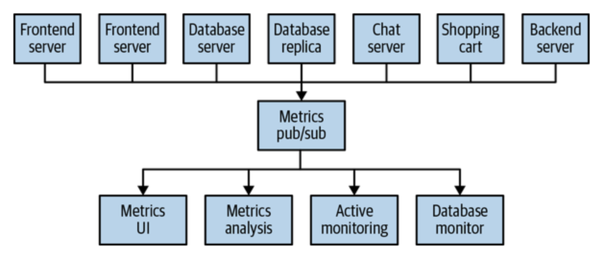
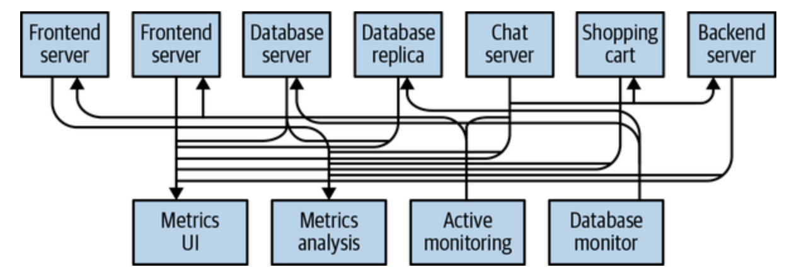
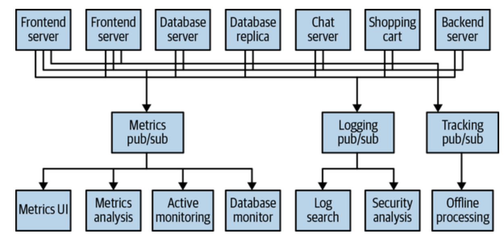
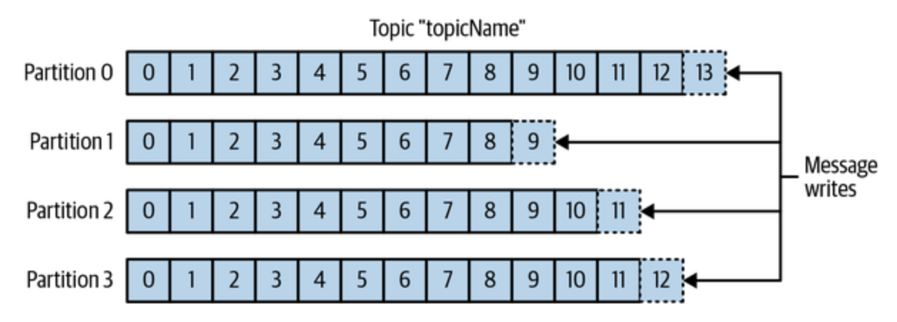
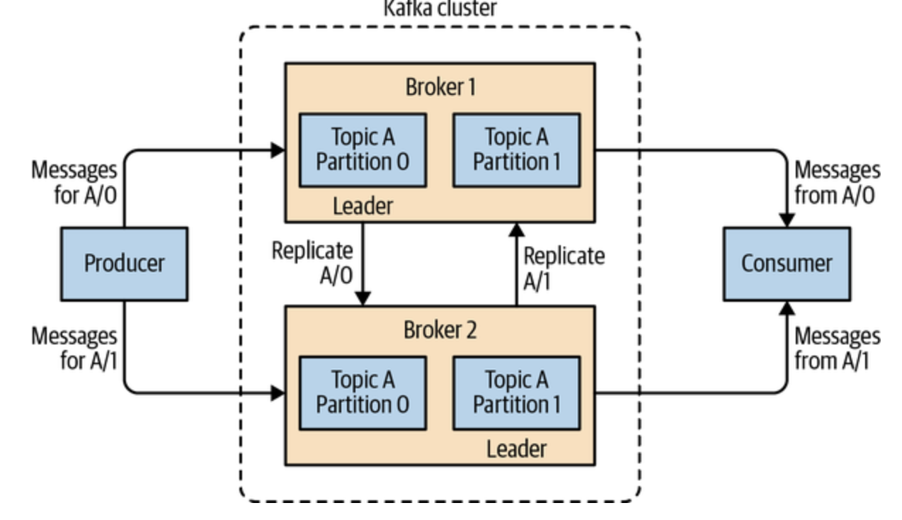
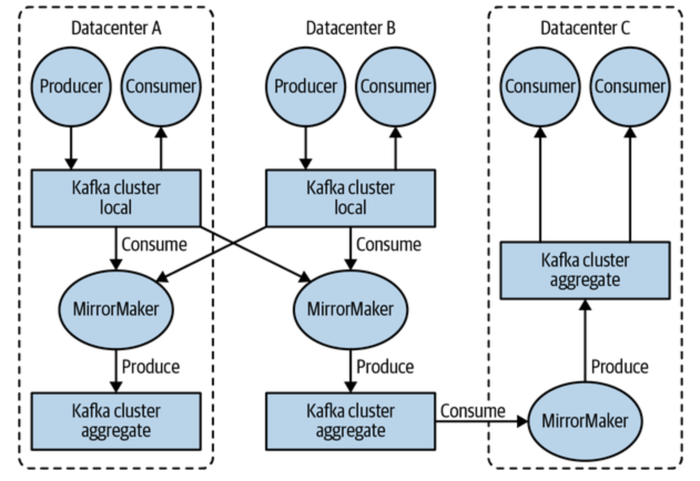

# 1. 카프카 시작하기

> 과학자들이 서로 동의하지 않는 상황이 벌어진다면, 그것은 데이터가 불충분하기 때문이다. 그리고 어떠한 데이터를 얻을 것인지를 합의하고 데이터를 얻을 수 있다면 문제는 해결된다. 내가 옳든 상대방이 옳든, 아니면 둘 다 틀리든 말이다. 그제서야 우리는 그 다음으로 진행해 갈 수 있다.

## 1.1 발행/구독 메시지 전달

**특징** : 발행자가 데이터를 전송할 대 직접 수신자로 보내지 않는다는 

### 1.1.1 초기의 발행/구독 시스템

발행/구독 패턴을 따르는 사례들은 대부분 가운데 간단한 메시지 큐나 프로세스 간 통신 채널을 놓는 방식으로 시작한다. 이러한 서비스는 여러 서버가 추가되는 발전 과정을 따르며 다음과 같은 아키텍처로 구성되게 된다.

[그림 1]
  

위에서 발행/구독 아키텍처에서 발행된 메시지를 전달받고 중계해주는 중간 지점 역할을 하는 브로커의 역할을 수행하는 서버가 존재한다.

해당하는 발행/구독 시스템을 통해 다음의 이득을 취할 수 있다.

- 컴포넌트 별 직접 연결을 방지
- 아키텍처 복잡성의 감소

> **실제 발행자 구독자의 직접 연결된 사례**
> 
> 
[그림 2]

### 1.1.2 개별 메시지 큐 시스템

위의 그림들에서는 지표값에 대한 내용만 존재하지만 로그 메시지,사용자 추적 정보 등에 대한 내용들 또한 발행자와 구독자를 분리할 수 있다.

 [그림 3] 

이러한 구조를 가진 서비스의 비즈니스가 확장됨에 따라 데이터를 발행하고 구독할 수 있는 중앙 집중화된 시스템이 필요하다.

## 카프카 기본 내용

위에서의 발행/구독 시스템 중 하나로 **분산 커밋 로그** 혹은 **분산 스트리밍 플랫폼**이라고도 불린다.

카프카에 저장된 데이터는 다음의 특징을 가지고 있다.

- 순서를 유지한 데이터
- 지속성 있게 보관
- 읽기의 가능
- 확장시 성능의 향상
- 실패에 대해 데이터 보장 : 시스템 안에서 실패 발생을 대비해 데이터를 분산시켜 저장

### 메시지와 배치

데이터의 기본 단위 : **메시지**

카프카의 입장에서 메시지는 단순한 바이트의 배열로 데이터에서 특정 형식이나 의미가 없다.

#### 메시지

키라고 불리는 메타데이터를 포함한다.

키는 메시지를 저장할 파티션을 결정하기 위해서 사용된다.

> 간단한 키 사용 방법
> _key값 통해 해시값 / 파티션 수_ 를 통해 나오는 나머지 값에 해당하는 파티션에 메시지를 저장  
> 같은 키값을 가진 메시지는 항상 같은 파티션에 저장하는 효과

#### 배치

배치란 그저 같은토픽의 파티션에서 씅여지는 메시지들의 집합을 믜미함다.

이를 이용한 특징은 다음과 같다.

- 네트워크 상에서 신호가 오가는 오버헤드의 감소
- 지연과 처리량 사이의 trade-off 발생

> 배치 사용으로 인한 Trade off
> - 배치 크기가 커질수록 시간당 처리되는 메시지의 증가
> - 메시지가 전달되는 시간의 증가
> > 이를 위해 데이터 전송 및 저장 과정에서 압축을 사용하기도 한.

### 스키마

메시지는 단순한 바이트 배열일 뿐이지만 일정 구조, 스키마를 부여하는 것이 좋다.

다음과 같은 스키마가 존재한다.

- JSON
- XML
- AVRO

이러한 스키가 결정 시 호환성, 타입 처리 기능 등을 고려해야 하는 과정이 필요하고 이를 위해 AVRO를 권장한다.

> AVRO
> - 조밀한 직렬화 형식의 제공
> - 메시지 본체와 스키마의 분리
> - 스키마 변경에 따른 호환성
> - 강력한 타이핑 제공

### 토픽과 파치션

#### 토픽

테이터베이스의 테이블이나 파일시스템의 폴더와 비슷한 단위로 메시지는 토픽 단위로 저장된다.

#### 파티션

토픽은 또 다시 여러 개의 파티션으로 나뉘며 커밋 로그의 관점에서 하나의 로그에 해당한다.

다음과 같은 구조로 토픽과 파티션을 이해할 수 있다.

### 프로듀서와 컨슈머

#### 프로듀서

새로운 메시지를 생성하며 기존의 발행/구독 시스템에서의 *발행자*로 이해할 수 있다.

#### 컨슈머

메시지를 읽으며 기존의 발행/구독 시스템에서의 *발행자*로 이해할 수 있다.

다음 그림으로 이해할 수 있다.

### 브로커와 클러스터

#### 브로커

하나의 카프카 서버로 프로듀서로 부터 메시지를 전달받아 디스크 저장소에 쓰고 컨슈머에게 발행된 메시지를 전달해준다.

#### 클러스터

카프카 브로커는 클러스터의 일부로서 작동하며 하나의 클러스터 안에 여러 개의 브로커가 포함될 수 있다. 그 중 하나의 브로커가 컨트롤러의 역할을 하며 이를 **파티션 리더**라고 부른다.

### 다중 클러스터

다수의 클러스터를 운용하는 방식으로 다음과 같은 장점이 존재한다.

- 데이터 유형별 분리
- 보안 요구사항을 충족시키기 위한 격리
- 재해 복구를 대비한 다중 데이터 센터

다음 그림과 같은 다중 클러스터 구성 아키텍처가 존재할 수 있다.

## 카프카의 가치

### 다중 프로듀서

여러 프로듀서를 처리할 수 있다. 이를 통해 데이터를 수집하고 일관성을 유지하는 시스템에 적격이다.

### 다중 컨슈머

하나의 메시지를 하나의 클라이언트에서만 소비할 수 있도록 된 기존의 큐 시스템과 다르게 상호 간섭 없이 메시지 스트림을 읽을 수 있다.

### 디스크 기반 보존

메시지를 지속적으로 저장하여 유실의 위험에서 벗어날 수 있다.

### 확장성

유연한 확장성을 가지기에 어떠한 크기의 데이터도 쉽게 처리가 가능하다.

이 외에도 고성능의 특징을 지니고 플랫폼 기능을 지녀 개발자들이 자주하는 작업을 쉽게 수행할 수 있도록 해주기도 한다.