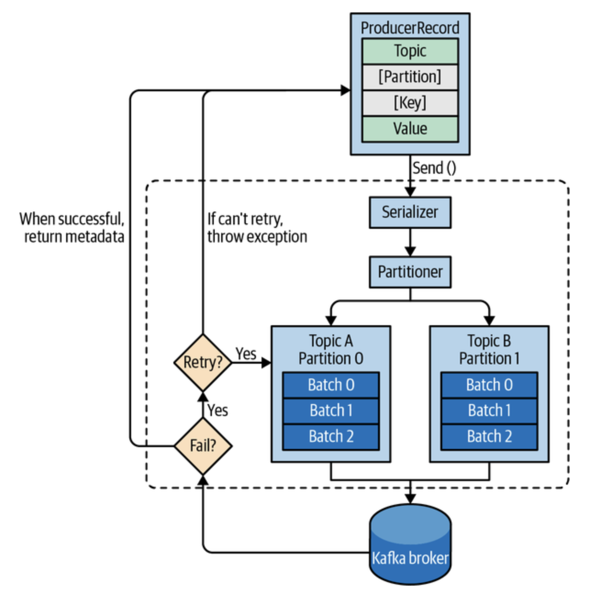
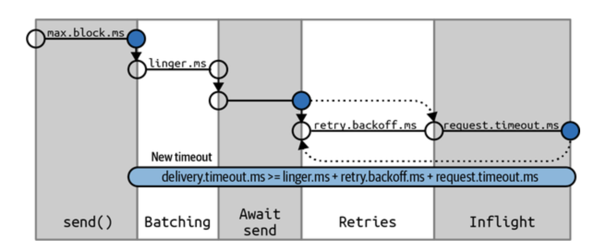
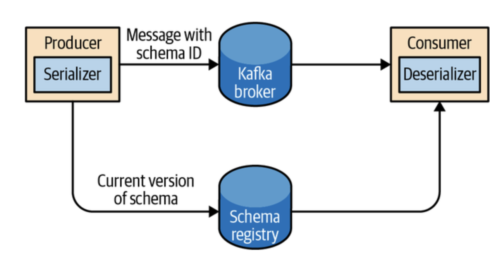

# 3. 카프카 프로듀서 : 카프카에 메시지 쓰기

다음과 같은 내용들을 주로 다룬다.

- 카프카 프로듀서 주요 요소
- `KafkaProducer`과 `ProducerRecord` 객체의 생성 방식
- 레코드 전송 방법
- 에러처리 방법
- 카프카 작동 제어 위한 중요 설정 옵션
- 파티셔너 및 시리얼라이저 종류

## 3.1 프로듀서

애플리케이션이 카프카에 메시지를 작성해야하는 경우 이를 대신해주는 컴포넌트이다.

제공되는 프로듀서 API를 이용하여 카프카에 메시지를 작성할 수 있다.   API 사용 시 고려 사항은 다음과 같다.

- 처리율
- 지연 시간

위의 정보들과 같은 요구 조건에 따라 API 사용 방식 및 설정이 상이해진다.

[그림 1]

[그림 1]은 카프카에 데이터를 전송 시에 수행되는 주요 단계들이다.

1. ProducerRecord 객체 생성 : 토픽과 밸류는 필수사항이지만 파티션과 키 지정은 선택 사항
2. 시리얼라이저를 통한 바이트 배열로의 직렬화
3. 파티션으로의 전송 : 1에서 파티션을 명시적으로 지정하지 않은 경우 파티셔너로 전송한 후 파티셔너에서 `ProducerRecord` 객체의 키 값을 통해 파티션을 결정한다.
4. 이후 레코드를 같은 레코드 배치에 추가한다.
5. 별도의 스레드가 레코드 배치를 적절한 브로커에게 전송한다.

## 3.2 카프카 프로듀서의 생성

카프카 프로듀서 객체 생성 시에 다음의 필수 속성값을 가진다.

- `bootstrap.servers` : 카프카 클러스터와 첫 연결을 위한 host:port 목록
- `key.serializer` : 카프카에 쓸 레코드의 key를 직렬화하기 위해 사용하는 시리얼라이저 클래스의 이름
- `value.serializer` : 카프카에 쓸 레코드의 value를 직렬화하기 위해 사용하는 시리얼라이저 클래스의 이름

다음은 실제 필수 요소만 지정하고 다른 요소들에 대해서는 기본 설정값을 사용하는 프로듀서 설정 코드이.

<pre><code>
Properties kafkaProps = new Properties(); // 1
kafkaProps.put("bootstrap.servers", "broker1:9092,broker2:9092");

kafkaProps.put("key.serializer", "org.apache.kafka.common.serialization.StringSerializer"); // 2
kafkaProps.put("value.serializer", "org.apache.kafka.common.serialization.StringSerializer");

kafkaProducer<String, String> producer = new KafakaProducer<String, String>(kafkaProps); // 3
</code></pre>

1. Propertis 객체 생성
2. 메시지의 키/밸류 값으로 String 타입을 사용하기에 카프카에서 제공되는 StringSerializer의 사용 지정
3. 키 밸류에 대해 String 타입을 지정한 후 Properties 객체를 넘겨주어 새로운 프로듀서를 생성

### 메시지 전송 방법

1. **파이어 앤 포겟(Fire and forget)** : 메시ㅣㅈ를 서버에 전송만 하고 성공 혹은 실패 여부를 관여하지 않는다. 결국 에러 혹은 타임아웃으로 인해 유실되는 메시지가 존재할 수 있다.

2. **동기적 전송** : 기술적으로 언제나 비동기적으로 작동되는 카프카 프로듀서이지만 메시지 전송 전 `get()` 메서드를 호출해 작업의 성공 여부를 확인할 수 있다.

3. **비동기적 전송** : 콜백 함수와 함께 `send()`메서드를 호출해 카프카 브로커로부터 응답을 받는 시점에 콜백 함수를 호출할 수 있다.

## 3.3 카프카로 메시지 전달하기

### 기본적인 메시지 전송 방법

<pre><code>
ProducerRecord<String, String> record =
    new ProducerRecord<>("CustomerCountry", "Precision Products",
        "France"); // 1
try {
    producer.send(record); // 2
} catch (Exception e) {
    e.printStackTrace(); // 3
}
</code></pre>

1. ProducerRecord 객체를 생성한다. 토픽 이름가 키, 밸류 값을 사용하며 사용 시에 지정한 `key.serializer`, `value.serializer`과 타입이 일치해야 한다.
2. `send()` 메서드를 통해 메시지를 전송한다. 위 방법의 경우 메스드 전송 후 자바 Future 객체를 리턴하지만 리턴값을 무시하기에 메시지 전송의 성공 여부를 알 수 없다.
3. 메시지 전송 전에 에러가 발생할 수 있기에 예외처리를 한다. 
  - `SerializationException`
  - `TimeoutException`
  - `InerruptException`

### 동기적 메시지 전송

해당 방법은 위의 방법에서 브로커가 쓰기 요청에 대한 **에러 응답** 또는 **재전송에 의해 발생되는 예외**를 받아 처리할 수 있다.

동기적인 방법의 Trade off의 중심은 **성능**이다.

브로커는 쓰기 요청에 대한 응답이 **2ms~ second단위**로 지연될 수 있다. 이러한 메시지를 동기적으로 전송하는 경우 전송을 요청하게 되는 프로듀서의 스레드는 처리의 완료까지 대기해야 한다. 즉, 성능이 낮아지는 것이다.

> 실제 현업, 애플리케이션에서는 성능의 이슈로 이러한 방식을 잘 사용하지 않지만 예제 코드에서는 흔히 등장한다.

<pre><code>
ProducerRecord<String, String> record =
    new ProducerRecord<>("CustomerCountry", "Precision Products", "France");
try {
    producer.send(record).get(); // 1
} catch (Exception e) {
    e.printStackTrace(); // 2
}
</code></pre>

1. 응담의 대기를 위해 `send()` 메서드의 리턴값인 `Future` 객체의 리턴값의 메서드인 `get()`을 사용하여 실패한 `send()` 요청에 대한 상황에 예외처리를 한다.
2. 1에서 발생한 에러에 대해 예외처리를 진행한다.

> **재시도 가능 에러**
> 메시지를 다시 전송하여 해결 될 수 있는 에러를 의미한다.  
> 주로 연결 에러, 해당 파티션의 리더가 아닌 경우의 에러 등으로 재전송 횟수가 소진되고서도 에러가 해결되지 않는 경우에 한해 존재한다.  

### 비동기적 메시지 전송

카프카의 응답이 대부분 필요 없고 에러만 처리하는 경우를 위해서 콜백을 사용한 비동기적인 메시지 전송을 할 수 있다.

<pre><code>
private class DemoProducerCallback implements Callback { // 1
    @Override
    public void onCompletion(RecordMetadata recordMetadata, Exception e) {
        if (e != null) {
            e.printStackTrace(); // 2
        }
    }
}

ProducerRecord<String, String> record =
    new ProducerRecord<>("CustomerCountry", "Biomedical Materials", "USA"); // 3
producer.send(record, new DemoProducerCallback()); // 4
</code></pre>

1. Callback 인터페이스를 implement한다.
2. 카프카가 에러리턴 시에 에러처리를 하는 함수이다.
3. ProducerRecord 객체의 생성
4. 레코드 전송 시에 callback함수를 함께 매개변수로 하여 전송한다.

## 3.4 프로듀서 설정

수많은 수의 설정값 중 메모리 사용량, 성능, 신뢰성 등에 영향을 미치는 요소들을 살펴본다. 실제 [공식문서](https://kafka.apache.org/documentation/)를 살펴보면 더 많은 설정값들을 확인할 수 있다.

### client.id
애플리케이션을 구분하기 위한 논리적 식별값
### acks
얼마나 많은 레플리카들이 해당 레코드를 받아야하는지에 대해 결정하는 값

### 메시지 전달 시간

`send()` 메소드를 호출 후 카프카가 성공적으로 응답을 내려줄 때까지 클라이언트가 기다리는 시간

다음 그림 2는 프로듀서 내부의 데이터의 흐름 및 설정값 사이의 상호작용을 보여준다.

[그림 2]

설정값들에 대해서는 다음이 존재한다.

- max.block.ms : 프로듀서가 얼마나 오랫동안 블록되는지를 결정
- delivery.timeout.ms : 레코드 전송 준비가 완료딘 시점에서 응답을 받거나 전송을 포기하게 되는 모든 시점까지의 제한시간을 결정
- request.timeout.ms : 쓰기 요청 후 전송을 포기하기까지 대기하는 시간을 결정
- retries, retry.ackoff.ms : 일시적인 에러에서 재전송 횟수와 재시도 간격을 겨렁

### linger.ms

현재 배치를 전송하기 전까지 대기하는 시간으로 이를 증가시키면 지연시간이 조금 증가하는 대신 처리율이 증가한다. 

### buffer.memory

프로듀서가 메시지를 전송하기 전 메시지를 대기시킬 버퍼의 크기를 결정한다.

### compression.type

기본적인 메시지는 압축되지 않지만 효율을 위해 압축 알고리즘을 사용할 수 있다. `snappy`, `gzip`, `lz4`, `zstd`와 같은 압축 알고리즘들 중 하나를 매개변수로 선택하여 처리할 수 있다.

### batch.size

같은 파티션에 다수의 레코드를 전송하는 경우 이러한 배치에 사용될 메모리의 양을 결정한다.

해당 값이 지나치게 작은 경우 자주 메시지를 전송하여 오버헤드가 발생할 수 있다.

### max.in.flight.request.per.connection

프로듀서가 응답을 받지 못한 상태에서 전송할 수 있는 최대 메시지의 수이다.

### max.request.size

프로듀서가 전송하는 쓰기 요청의 크기를 결정한다. 해당 값은 메시지의 최대 크기를 제한하며 한 번의 요청에 보낼 수 있는 메시지의 최대 개수 또한 제한한다.

### receive.buffer.bytes, send.buffer.bytes

데이터를 읽고 쓰는 경우의 소켓이 사용하는 TCP 송수신 버퍼의 크기를 결정한다.

### enable.idempotence

**정확히 한 번**의 의미구조를 지원하기 위해 사용된다.

> **정확히 한 번**
> 브로커가 동일한 번호를 가진 레코드를 2개 이상 받을 경우 하나만 저장하도록 하는 것을 의미한다.

## 3.5 시리얼라이저

프로듀서 설정 시 반드시 시리얼라이저를 지정해야한다. `StringSerializer`, `IntegerSerializer`, `ByteArraySerializer` 등이 있지만 모든 데이터를 직렬화 하기 위한 나름의 시리얼라이저 작성 방법에 대해 알고 있을 필요가 있다.

### 커스텀 시리얼라이저

범용 직렬화 라이브러리를 사용해야하는 이유에 대해 설명하기 커스텀 시리얼라이저를 이해할 필요가 있다.

<pre><code>
import org.apache.kafka.common.errors.SerializationException;

import java.nio.ByteBuffer;
import java.util.Map;

public class CustomerSerializer implements Serializer<Customer> {

    @Override
    public void configure(Map configs, boolean isKey) {
        // nothing to configure
    }

    @Override
    /**
    We are serializing Customer as:
    4 byte int representing customerId
    4 byte int representing length of customerName in UTF-8 bytes (0 if
        name is Null)
    N bytes representing customerName in UTF-8
    **/
    public byte[] serialize(String topic, Customer data) {
        try {
            byte[] serializedName;
            int stringSize;
            if (data == null)
                return null;
            else {
                if (data.getName() != null) {
                    serializedName = data.getName().getBytes("UTF-8");
                    stringSize = serializedName.length;
                } else {
                    serializedName = new byte[0];
                    stringSize = 0;
                }
            }

            ByteBuffer buffer = ByteBuffer.allocate(4 + 4 + stringSize);
            buffer.putInt(data.getID());
            buffer.putInt(stringSize);
            buffer.put(serializedName);

            return buffer.array();
        } catch (Exception e) {
            throw new SerializationException(
                "Error when serializing Customer to byte[] " + e);
        }
    }

    @Override
    public void close() {
        // nothing to close
    }
}
</code></pre>

위 코드의 취약점은 다음과 같다.

- 고객이 많아지는 경우 custerID 타입을 Long으로 변경해야한다.
- Customer에 필드 추가 시에 기존 형식과 새 형식 사이의 호환성의 문제
- Customer 데이터가 변경되는 경우 이를 사용하는 모든 코드의 수정

### 아파치 에이브로 사용 직렬화

#### 아파치 에이브로

아파치 에이브로는 언어 중립적인 데이터 직렬화 형식이다.
에이브로 데이터는 언어에 독립적은 스키아 형태로 기술되며 이는 보통 JSON 형식으로 정의된다.

#### 아파치 에이브로의 적합성

애플리케이션이 메시지를 새로운 스키마로 전환하여도 기존 스키마와의 호환성을 유지하는 한 계속해서 데이터의 처리가 가능하다.

다음의 예시를 살펴보자.

**이전 스키마**
<pre><code>
{"namespace": "customerManagement.avro",
 "type": "record",
 "name": "Customer",
 "fields": [
     {"name": "id", "type": "int"},
     {"name": "name",  "type": "string"},
     {"name": "faxNumber", "type": ["null", "string"], "default": "null"} 1
 ]
}
</code></pre>

**갱신된 스키마**
<pre><code>
{"namespace": "customerManagement.avro",
 "type": "record",
 "name": "Customer",
 "fields": [
     {"name": "id", "type": "int"},
     {"name": "name",  "type": "string"},
     {"name": "email", "type": ["null", "string"], "default": "null"}
 ]
}
</code></pre>

위와 같이 변경된 스키마에서 에이브로를 사용시에 다음의 이점을 취할 수 있다.

- 데이터를 읽는 쪽 애플리케이션을 전부 변경하지 않아도 예외가 발생하지 않는다.
- 기존 데이터를 새 스키마에 맞추어 업데이트할 필요가 없다.

#### 주의사항

하지만 이용시 다음 두 가지를 조심해야 한다.

- 이전과 이후 스키마가 호환되어야 한다.
- 역직렬화시 스키마에 접근이 가능해야 한다.

### 에이브로 레코드의 사용

#### 스키마 레지스트리

에이브로는 레코드를 읽을 때 스키마 전체를 필요로 하기에 스키라를 저장해둘 필요가 존재한다. 이를 위해 스키마 레지스트리라 불리는 아키텍처 패턴을 필요로 한다.

해당하는 아키텍처를 사용하기 위해서는 여러 오픈소수 구현체 중 하나를 사용하면 된다.

> 컨플루언트에서 개발한 스키마 레지스트리가 존재하며 다음의 [깃허브](https://github.com/confluentinc/schema-registry)
에 존재하니 참고하면 좋을 것 같다. 추가적으로 [문서](https://docs.confluent.io/platform/current/schema-registry/index.html) 또한 제공한다.

#### 에이브로 레코드의 직렬화와 역직렬화 처리 흐름

스키마 레지스트리를 사용하는 핵심 아이디어는 카프카에 데이터를 작성하기 위해 사용되는 **모든 스키마를 저장한다**는 것이다.

다음 그림을 통해 실제 흐름을 이해할 수 있다.

[그림 3]

해당 그림에서 중요한 점은 스키마를 레지스트리에 저장하고 가져오는 모든 작업은 시리얼라이저와 디시리얼라이저 내부에서 수행된다. 그렇기에 카프카에 데이터를 쓰는 코드는 다른 시리얼라이저와 동일하게 사용하면 된다.

#### 실제 코드

<pre><code>
Properties props = new Properties();

props.put("bootstrap.servers", "localhost:9092");
props.put("key.serializer",
   "io.confluent.kafka.serializers.KafkaAvroSerializer");
props.put("value.serializer",
   "io.confluent.kafka.serializers.KafkaAvroSerializer"); // 1
props.put("schema.registry.url", schemaUrl); // 2

String topic = "customerContacts";

Producer<String, Customer> producer = new KafkaProducer<>(props); // 3

// We keep producing new events until someone ctrl-c
while (true) {
    Customer customer = CustomerGenerator.getNext(); // 4
    System.out.println("Generated customer " +
        customer.toString());
    ProducerRecord<String, Customer> record =
        new ProducerRecord<>(topic, customer.getName(), customer); // 5
    producer.send(record); // 6
}
</code></pre>

1. 에이브로를 사용해 객체를 직렬화 하기 위해서 `KafkaAvroSerializer`를 사용한다.
2. `schema.registry.url`은 프로듀서가 시리얼라이저에 넘겨주는 값으로 스키마를 저장해 놓는 위치를 지정한다.
3. `Customer`은 프로듀서에 사용할 레코드의 밸류 타입을 의마한다.
4. 에이브로 시리얼라이저는 POJO 객체가 아닌 에이브로 객체만을 직렬화할 수 있기에 `Customer`은 에이브로의 코드 생성 기능을 사용해 에이브로 특화 객체로 변환해야 한다.
5. `ProducerRecord`를 생성하고 `Customer` 객체를 인수로 전달한다.
6. 객체를 전송하면 다른 부분들은 `KafkaAvroSerializer`에서 알아서 처리해준다.

#### 제너릭 에이브로 객체의 사용

key-vlaue의 맵 형태로 사용하는 형태로 이 또한 다음과 같이 스키마를 지정하면 된다.
<pre><code>
Properties props = new Properties();
props.put("bootstrap.servers", "localhost:9092");
props.put("key.serializer",
   "io.confluent.kafka.serializers.KafkaAvroSerializer");
props.put("value.serializer",
   "io.confluent.kafka.serializers.KafkaAvroSerializer");
props.put("schema.registry.url", url);

String schemaString =
    "{\"namespace\": \"customerManagement.avro\",
     "\"type\": \"record\", " + 
     "\"name\": \"Customer\"," +
     "\"fields\": [" +
      "{\"name\": \"id\", \"type\": \"int\"}," +
      "{\"name\": \"name\", \"type\": \"string\"}," +
      "{\"name\": \"email\", \"type\": " + "[\"null\",\"string\"], " +
       "\"default\":\"null\" }" +
    "]}";
Producer<String, GenericRecord> producer =
   new KafkaProducer<String, GenericRecord>(props);

Schema.Parser parser = new Schema.Parser();
Schema schema = parser.parse(schemaString);

for (int nCustomers = 0; nCustomers < customers; nCustomers++) {
    String name = "exampleCustomer" + nCustomers;
    String email = "example " + nCustomers + "@example.com";

    GenericRecord customer = new GenericData.Record(schema);
    customer.put("id", nCustomers);
    customer.put("name", name);
    customer.put("email", email);

    ProducerRecord<String, GenericRecord> data =
        new ProducerRecord<>("customerContacts", name, customer);
    producer.send(data);
}
</code></pre>

## 3.6 파티션

> ### 키
> 카프카 메시지는 키-밸류 순서쌍으로 구성되어 있는다. 해당하는 키의 역할은 다음과 같.
> - 그 자체로 메시지에 함께 저장되는 추가적인 정보
> - 하나의 토픽에 속한 여러 개의 파티션 중 메시지가 저장될 파티션을 결정짓는 기준점
>
> > 해당하는 키의 기본값은 null이기도 하다.

위의 키의 정보를 통해 확인할 수 있는 것은 키는 메시지가 저장될 파티션의 위치를 결정하는 것이다.

### 기본 파티셔너

동일한 키값은 해사한 결과가 동일하기에 항상 동일한 파티션에 저장된다. 키가 null로 지정되어 있다면 round robin 알고리즘을 통해 파티션별로 저장되는 메시지 개수의 균형을 맞춘다.

간단하지만 특정 범위의 키를 가진 레코드가 대부분인 데이터의 경우 한 파티션에만 공간을 차지하여 처리가 느려질 수도 있다.

### 커스텀 파티셔너의 구현

위의 단점을 해결하기 위한 커스텀 파티셔너의 예시 코드이다.

<pre><code>
import org.apache.kafka.clients.producer.Partitioner;
import org.apache.kafka.common.Cluster;
import org.apache.kafka.common.PartitionInfo;
import org.apache.kafka.common.record.InvalidRecordException;
import org.apache.kafka.common.utils.Utils;

public class BananaPartitioner implements Partitioner {

    public void configure(Map<String, ?> configs) {}

    public int partition(String topic, Object key, byte[] keyBytes,
                         Object value, byte[] valueBytes,
                         Cluster cluster) {
        List<PartitionInfo> partitions = cluster.partitionsForTopic(topic);
        int numPartitions = partitions.size();

        if ((keyBytes == null) || (!(key instanceOf String)))
            throw new InvalidRecordException("We expect all messages " +
                "to have customer name as key");

        if (((String) key).equals("Banana"))
            return numPartitions - 1; // Banana will always go to last partition

        // Other records will get hashed to the rest of the partitions
        return Math.abs(Utils.murmur2(keyBytes)) % (numPartitions - 1);
    }

    public void close() {}
}
</code></pre>

## 3.7 헤더

키/밸류값을 건드리지 않고 추가 메타데이터를 넣을 때 사용된다.

주된 용도는 메시지의 전달 내역을 기록하는 것으로 데이터가 생성된 곳의 정보를 헤더에 저장하여 메시지를 라우팅하거나 출처를 추적할 수 있다.

<pre><code>
ProducerRecord<String, String> record =
    new ProducerRecord<>("CustomerCountry", "Precision Products", "France");

record.headers().add("privacy-level","YOLO".getBytes(StandardCharsets.UTF_8));
</code></pre>

## 3.8 인터셉터

카프카를 사용하는 클라이언트의 코드를 고치지 않으면서 작동을 변경하는 경우에 사용한다.

- `ProducerRecord<K, V> onSend(ProducerRecored<K, V> recored)` : 직렬화되기 직전에 호출되어 보내질 레코드에 담김 정보를 보고 수정할 수 있다.
- `void onAcknowledgement(RecordMetadata metadata, Exception exception)` : 카프카 브로커가 보낸 응답을 받았을 대 호출되는 것으로 그 안에 담긴 정보를 읽을 수 있다.

### 사용 사례

- 모니터링
- 정보 추적
- 표준 헤더 삽입

## 3.9 쿼터, 스로틀링

### 쿼터 

쓰기/읽기 속도를 제한하는 기능으로 다음 종류에 대해 한도를 설정할 수 있다.

- 쓰기 쿼터
- 읽기 쿼터
- 요청 쿼터

카프카의 설정 파일에 정의된 쿼터값은 고정되어 있기에 이를 변경하기 위해서는 설정 파일을 변경한 뒤 모든 브로커를 재시작해야한다. 이러한 불편한 방법을 해소하기 위해 클라이언트에 쿼터를 적용 시에는 `kafka-cofig.sh` 또는 `AdminClient API`를 통해 동적 설정 기능을 사용한다.

<pre><code>
bin/kafka-configs  --bootstrap-server localhost:9092 --alter \
--add-config 'producer_byte_rate=1024' --entity-name clientC --entity-type clients // 1

bin/kafka-configs  --bootstrap-server localhost:9092 --alter \
--add-config 'producer_byte_rate=1024,consumer_byte_rate=2048' --entity-name user1 --entity-type users // 2

bin/kafka-configs  --bootstrap-server localhost:9092 --alter \
--add-config 'consumer_byte_rate=2048' --entity-type users 3

</code></pre>

1. 클라이언트의 쓰기 속도를 초당 1024 바이트로 제한한다.
2. usrl의 쓰기 속도를 초당 1024 바이트로, 읽기 속도를 2048바이트로 지정한다.
3. 모든 사용자의 읽기 속도를 2048바이트로ㅗ 제한하되, 기본 설정값을 덮고 있는 사용자에 대해서는 예외로 한다.

