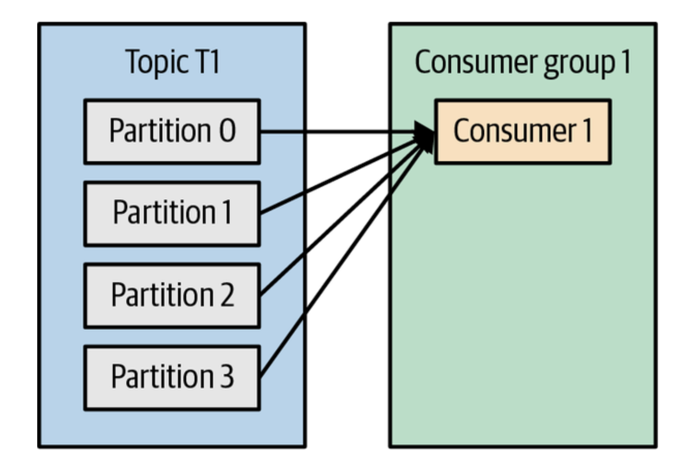
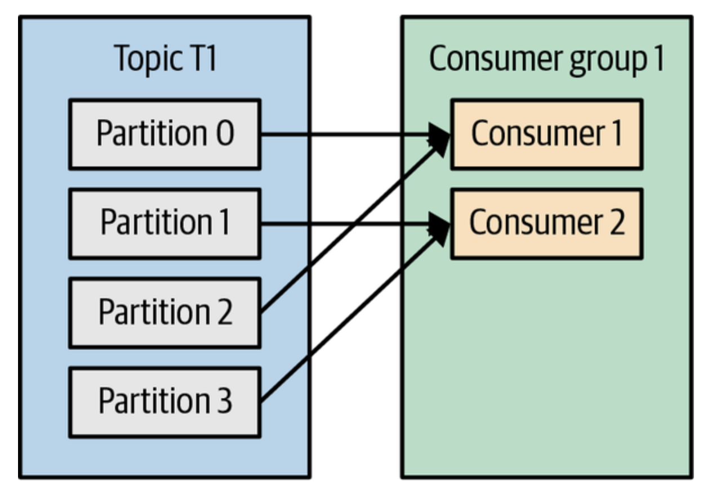
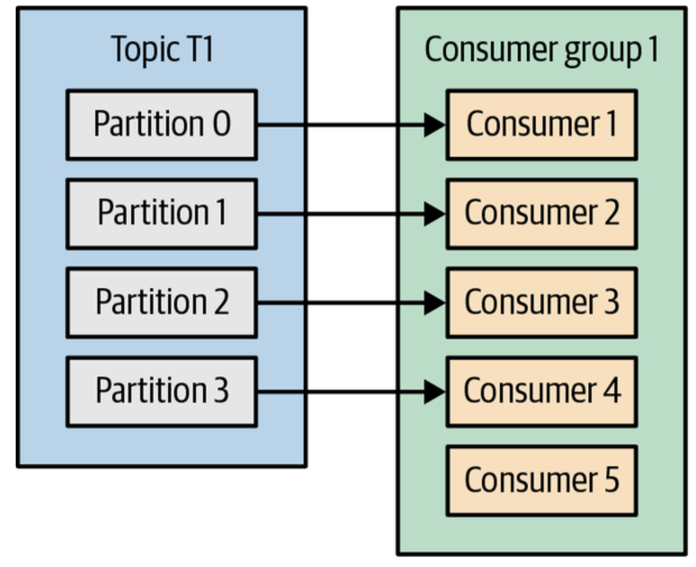
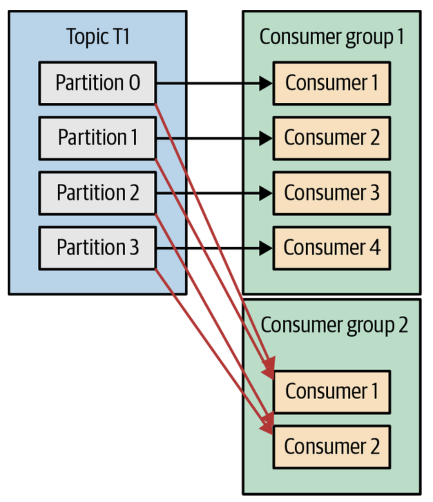
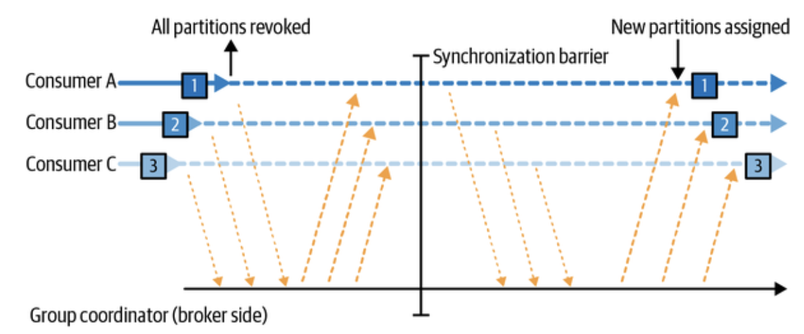
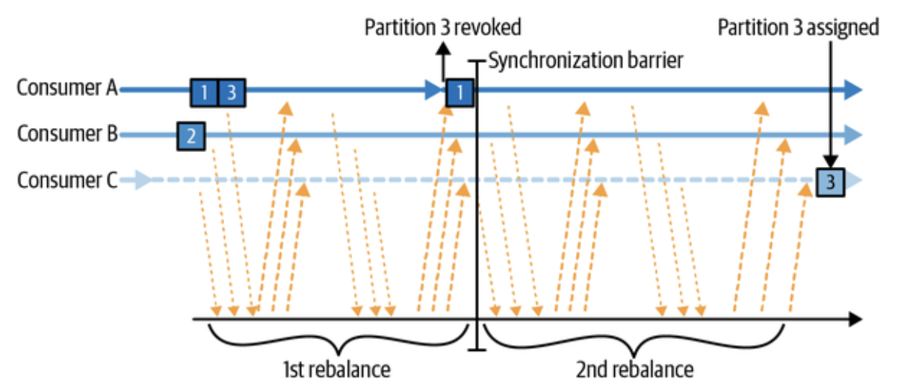
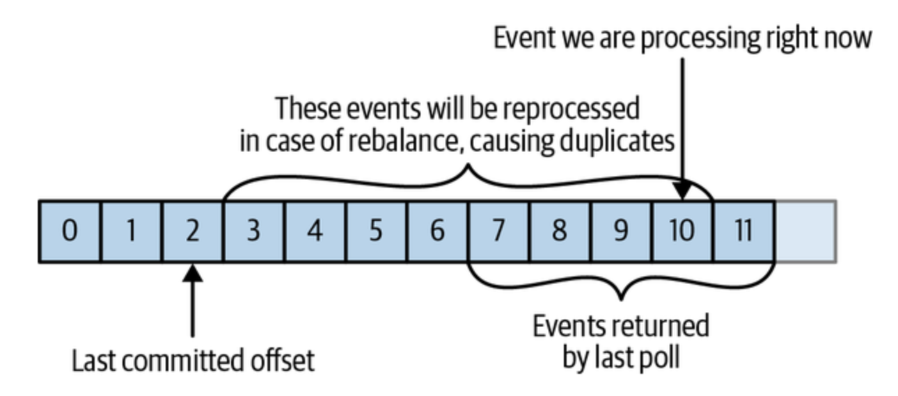
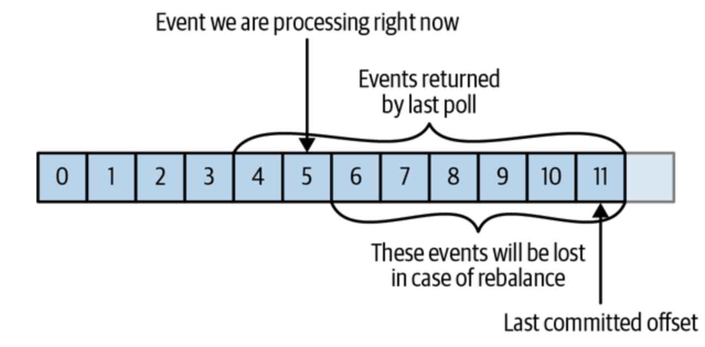

# 4. 카프카 컨슈머: 카프카에서 데이터 읽기

## 카프카 컨슈머

카프카에서 데이터를 읽는 애플리케이션은 토픽을 구독하고 이러한 토픽들로부터 메시지를 받기 위해 `KafkaConsumer`를 이용한.

### 컨슈머와 그룹

위 두그림을 살펴보면 컨슈머 그룹 내에 한 개의 컨슈머와 두 개의 컨슈머 그룹으로 구성된 것을 확인할 수 있다.

이러한 컨슈머 그룹과 그 내에 컨슈머를 배치하여 데이터를 읽는 작업의 확장이 가능하다.

하지만, 위와 같이 컨슈머가 파티션보다 더 많은 경우에는 유휴 컨슈머가 존재하기에 효율적으로 컨슈머 그룹을 구성하는 것이 좋다.

> 두 개의 컨슈머 그룹
> 
>
> 위 그림의 경우 두 그룹 모두 모든 메시지를 수신할 수 있다.

### 컨슈머 그룹과 파티션 리밸런스

새로운 컨슈머를 컨슈머 그룹에 추가하면 다른 컨슈머가 일고 있던 파티션으로부터 메시지를 읽게되는데 이러한 컨슈머에 파티션을 재할당하는 과정이 필요하. 이를 수행하는 작업을 **리팰런스**라고 한다.

이를 통해 얻는 이점은 다음과 같다.
- 높은 가용성
- 규모 가변성

이러한 리밸런스 전략은 다음 두 가지가 존재한다.

#### 조급한 리밸런스

해당 전략을 통해 리밸런스가 실행되는 경우 모든 컨슈머는 읽기 작업을 멈추고 모든 파티션에 대한 소유권을 포기한다. 이후 다시 컨슈머 그룹에 참여해 새로운 파티션을 할당받는다.

#### 협력적 리밸런스

컨슈머에게 할당되어 있던 파티션만을 다른 컨슈머에게 재할당하는 것을 의미한다. 재할당되지 않은 파티션에서 레코드를 읽어서 처리하던 컨슈머들은 작업에 방해받지 않고 하던 일을 계속할 수 있다.

다음의 단계를 거쳐 수행된다.
1. 컨슈머 그룹 리더가 다른 컨슈머들에게 할당된 파티션 중 일부가 재할당될 것이라고 통보한다.
2. 통보받은 컨슈머들은 해당 파티션에서 데이터를 읽어오는 작업을 멈추고 해당 파티션에 대한 소유를 포기한다.
3. 컨슈머 그룹은 포기된 파티션들을 새로 할당한다.

해당하는 과정은 조급한 리밸런스와 다르게 전체 작업이 중단되는 사태는 발생하지 않는다. 하지만 리밸린성 작업에 상당 시간이 걸릴 수 있다.

#### 정적 그룹 멤버쉽

기본적으로 컨슈머가 갖는 컨슈머 그룹의 멤버로써 자격은 일시적이다. 컨슈머가 컨슈머 그룹을 떠나는 순간 컨슈머에 할당되어 있던 파티션은 해제되고, 다시 참여하면 새로운 멤버 ID가 발급되며 새로운 파티션들이 할당된다.

정적 그룹 멤버쉽의 경우 이러한 경우를 방지하여 컨슈머의 상태를 캐시해 둔다. 이를 통해 컨슈머가 종료되었다가 다시 켜졌을 때 동일한 파티션을 연결할 수 있게 해준다.

#### 카프카 컨슈머 생성

다음 코드를 통해 생성할 수 있다.

<pre><code>
Properties props = new Properties();
props.put("bootstrap.servers", "broker1:9092,broker2:9092");
props.put("group.id", "CountryCounter");
props.put("key.deserializer",
    "org.apache.kafka.common.serialization.StringDeserializer");
props.put("value.deserializer",
    "org.apache.kafka.common.serialization.StringDeserializer");

KafkaConsumer<String, String> consumer =
    new KafkaConsumer<String, String>(props);
</code></pre>

## 토픽 구독

컨슈머는 1개 이상의 토픽을 구독한다. 코드는 다음과 같다.

`consumer.subscribe(Collections.singletonList("customerCountries"));`

모든 테스트 토픽을 구독하는 방법은 다음과 같다.

`consumer.subscribe(Pattern.compile("test.*"));`

## 폴링 루프

컨슈머 API의 핵심은 서버에 추가 데이터가 들어왔는지 폴링하는 것이다. 주요 코드는 다음과 같다.

<pre><code>
Duration timeout = Duration.ofMillis(100);

while (true) { // 1
    ConsumerRecords<String, String> records = consumer.poll(timeout); // 2

    for (ConsumerRecord<String, String> record : records) { // 3
        System.out.printf("topic = %s, partition = %d, offset = %d, " +
                        "customer = %s, country = %s\n",
        record.topic(), record.partition(), record.offset(),
                record.key(), record.value());
        int updatedCount = 1;
        if (custCountryMap.containsKey(record.value())) {
            updatedCount = custCountryMap.get(record.value()) + 1;
        }
        custCountryMap.put(record.value(), updatedCount);

        JSONObject json = new JSONObject(custCountryMap);
        System.out.println(json.toString()); // 4
    }
}
</code></pre>

1. 무한루프로 계속해서 폴링한다.
2. 컨슈머 버퍼에 데이터가 없을 경우를 대비해 poll()이 블록될 수 있는 최대 시간으 결정한다. 해당 값이 0이거나 이미 레코드가 준비되어 있는 경우 poll()은 즉시 응답한다. 그렇지 않은 경우 지정된 밀리초만큼 기다리게 된다.
3. poll()은 List형태의 객체를 리턴하기에 이를 반복하여 각 레코드를 처리한다.
4. 결과물을 데이터 저장소에 갱산하거나 작성한다.

## 컨슈머 설정

컨슈머 설정 속성 중 컨슈머의 성능ㅇ과 가용성에 영향을 주는 매개변수들에 간단히 살펴본다.

### fetch.min.bytes

컨슈머가 브로커로부터 레코드를 얻어올 때 받는 데이터의 최소량을 지정한다.

### fetch.max.wait.ms

컨슈머가 응답하기 전 얼마나 오래 기다릴 것인지 결정한다.

### fetch.max.bytes

컨슈머가 브로커를 폴링 시에 리턴하는 최대 바이트의 수를 결정한다.

### max.poll.records

poll() 호출 시마다 리턴되는 최대 레코드 수를 지정한다.

### max.partition.fetch.bytes

서버가 파티션별로 리턴하는 최대 바이트의 수를 지정한다. 해당 기본값은 1MB이다.

### session.timeout.ms, heartbeat.interval.ms

컨슈머가 브로커와 신호를 주고받지 않고도 살아 있는지 판단하기 위한 `heartbeat`요청을 대기하는 시간과 요청을 전송하는 시간 간격이다.

### max.poll.interval.ms

컨슈머가 폴링하지 않고도 죽은 것으로 판정되지 않을 수 있는 최대 시간을 지정한다.

이외에도 `default.api.timeout.ms`, `request.timeout.ms`, `auto.offset.reset`, `enable.auto.commit`, `partition.assignment.strategy`, `client.id`, `client.rack` 등이 존재한다.

## 오프셋과 커밋

카프카에서 파티션에서의 현재 위치를 업데이트하는 작업을 **오프셋 커밋**이라 부른다.
 
해당 부분은 기존 메시지큐와의 차별점으로 카프카가 레코드를 개별적으로 커밋하지 않는 것을 의미한다. 대신 컨슈머는 파티션에서 성공적으로 처리해 낸 마지막 메시지를 커밋하여 그 앞의 모든 메시지들이 성공적으로 처리되었음을 암묵적으로 나타낸다.

컨슈머는 이러한 오프셋을 커밋하기 위해 `__consumer_offsets`토픽이라는 특수 토픽에서 각 파티션별로 커밋된 오프셋을 업데이트하도록 하는 메시지를 전송하여 이루어진다.

커밋된 오프셋이 클라이언트가 처리한 마지막 메시지의 오프셋 보다 작은 경우에 다음 그림과 같이 마지막으로 처리된 오프셋과 커밋된 오프셋 사이의 메시지들이 두 번 처리되게 된다.

반대로 커밋된 메시지가 클라이언트가 실제로 처리한 마지막 메시지의 오프셋보다 큰 경우 누락되게 된다.

커밋하는 방법은 다음 네 가지가 존재한다.

- 자동 커밋
- 현재 오프셋 커밋
- 비동기적 커밋
- 동기적 커밋과 비동기적 커밋의 함께 사용
- 특정 오프셋 커밋

## 리밸런스 리스너

컨슈머는 종료 혹은 리밸런싱 전 정리 작업이 필요하다.

컨슈머 API는 컨슈머에 파티션이 할당되거나 해제될 때 사용자의 코드가 실행되도록하는 메커니즘을 제공한다.

ConsumerRebalance에는 다음과 같이 3개의 메서드를 구현할 수 있다.

- `public void onPartitionsAssigned(Collection<TopicPartition> partitions)` : 파티션과 함께 사용할 상태를 적재하거나, 필요한 오프셋을 탐색하는 등의 준비작업을 수행한다.
- `public void onPartitionsRevoked(Collection<TopicPartition> partitions)` : 오프셋을 커밋해주어 다음에 할당받는 컨슈머가 시작할 지점을 파악하게 해준다.
- `public void onPartitionsLost(Collection<TopicPartition> partitions)` : 파티션과 함께 사용되었던 상태나 자원들을 정리해준다.

## 특정 오프셋의 레코드 읽어오기

`seekToBeginning`, `seekToEnd을`메서드를 활용하여 메시지를 특정 지점 부터 읽어올 수 있다.

<pre><code>
Long oneHourEarlier = Instant.now().atZone(ZoneId.systemDefault())
          .minusHours(1).toEpochSecond();
Map<TopicPartition, Long> partitionTimestampMap = consumer.assignment()
        .stream()
        .collect(Collectors.toMap(tp -> tp, tp -> oneHourEarlier));
Map<TopicPartition, OffsetAndTimestamp> offsetMap
        = consumer.offsetsForTimes(partitionTimestampMap);

for(Map.Entry<TopicPartition,OffsetAndTimestamp> entry: offsetMap.entrySet()) {
    consumer.seek(entry.getKey(), entry.getValue().offset());
}
</code></pre>

## 폴링 루프 벗어나기

컨슈머의 종료 시 `poll()`를 오랫동안 기다리고 있더라도 즉시 루프를 탈출하고자 하는 경우 다른 스레드에서 `consumer.wakeup()`을 호출하여 즉시 루프를 출할 수 있다.

메인 스레드에서는 `ShutdownHook`을 사용하여 처리할 수 있다.

실제 예시 코드는 다음과 같다.

<pre><code>
Runtime.getRuntime().addShutdownHook(new Thread() {
    public void run() {
        System.out.println("Starting exit...");
        consumer.wakeup();
        try {
            mainThread.join();
        } catch (InterruptedException e) {
            e.printStackTrace();
        }
    }
});

...
Duration timeout = Duration.ofMillis(10000);

try {
    // looping until ctrl-c, the shutdown hook will cleanup on exit
    while (true) {
        ConsumerRecords<String, String> records =
            movingAvg.consumer.poll(timeout);
        System.out.println(System.currentTimeMillis() +
            "--  waiting for data...");
        for (ConsumerRecord<String, String> record : records) {
            System.out.printf("offset = %d, key = %s, value = %s\n",
                record.offset(), record.key(), record.value());
        }
        for (TopicPartition tp: consumer.assignment())
            System.out.println("Committing offset at position:" +
                consumer.position(tp));
        movingAvg.consumer.commitSync();
    }
} catch (WakeupException e) {
    // ignore for shutdown
} finally {
    consumer.close();
    System.out.println("Closed consumer and we are done");
}
</code></pre>

## 디시리얼라이저

컨슈머는 프로듀서와 반대로 바이트 배열을 객체로 변환하기 위해 **디시리얼라이**가 필요하다.

해당 내용도 3장과 동일하게 *커스텀 디시리얼라이저*와 *Avro 디시리얼라이저*를 이용할 수 있다.

### 커스텀 디시리얼라이저

프로듀서와 동일하게 권장되지 않는다. 동일한 이유로 호환의 어려움 발생과 에러 발생 가능성 때문이다. 오히려 JSON, Protobuf, Avro 같은 메시지 표준 형식을 이용하자. 이를 더 깊게 보고 싶다면 관련 코드는 책을 참고하면 좋다.

### Avro 디시리얼라이저

<pre><code>
Duration timeout = Duration.ofMillis(100);
Properties props = new Properties();
props.put("bootstrap.servers", "broker1:9092,broker2:9092");
props.put("group.id", "CountryCounter");
props.put("key.deserializer",
    "org.apache.kafka.common.serialization.StringDeserializer");
props.put("value.deserializer",
    "io.confluent.kafka.serializers.KafkaAvroDeserializer"); // 1
props.put("specific.avro.reader","true");
props.put("schema.registry.url", schemaUrl); // 2
String topic = "customerContacts"

KafkaConsumer<String, Customer> consumer = new KafkaConsumer<>(props);
consumer.subscribe(Collections.singletonList(topic));

System.out.println("Reading topic:" + topic);

while (true) {
    ConsumerRecords<String, Customer> records = consumer.poll(timeout); // 3

    for (ConsumerRecord<String, Customer> record: records) {
        System.out.println("Current customer name is: " +
            record.value().getName()); // 4
    }
    consumer.commitSync();
}
</code></pre>

1. Avro 메시지의 역직렬화를 위해 `KafkaAvroDeserializer` 사용
2. 스키마가 저장된 `schema.registry.url`을 등록하여 역직렬화에 사용되는 스키마를 참고한다.
3. 생성된 Customer 클래스를 레코드 밸류 타입으로 지정한다.
4. Customer 인스턴스의 메서드를 호출한다.

## 독립 실행 컨슈머

이는 컨슈머 그룹 없이 컨슈머를 사용하는 경우이다. 해당 경우 리밸런스 기능이 필요하지 않다. 해당 경우는 단순한 구조를 원하는 경우에 사용할 수 있다. 그 예로 토픽의 모든 파티션으로 부터 데이터를 읽어와야 하거나 토픽의 특정 파티션으로부터 데이터를 읽어야할 경우가 존재한다.

다음은 독립 실행 컨슈머가 스스로 특정 토픽의 모든 파티션을 할당한 뒤 메시지를 읽고 처리하는 코드이다.
<pre><code>
Duration timeout = Duration.ofMillis(100);
List<PartitionInfo> partitionInfos = null;
partitionInfos = consumer.partitionsFor("topic"); // 1

if (partitionInfos != null) {
    for (PartitionInfo partition : partitionInfos)
        partitions.add(new TopicPartition(partition.topic(),
            partition.partition()));
    consumer.assign(partitions); // 2

    while (true) {
        ConsumerRecords<String, String> records = consumer.poll(timeout);

        for (ConsumerRecord<String, String> record: records) {
            System.out.printf("topic = %s, partition = %s, offset = %d,
                customer = %s, country = %s\n",
                record.topic(), record.partition(), record.offset(),
                record.key(), record.value());
        }
        consumer.commitSync();
    }
}
</code></pre>

1. 카프카 클러스터에 해당 토픽에 대해 사용 가능한 파티션들을 요청하며 시작한다.
2. 읽고자 하는 파티션의 목록에 대해 `assgin()`을 호출한다.