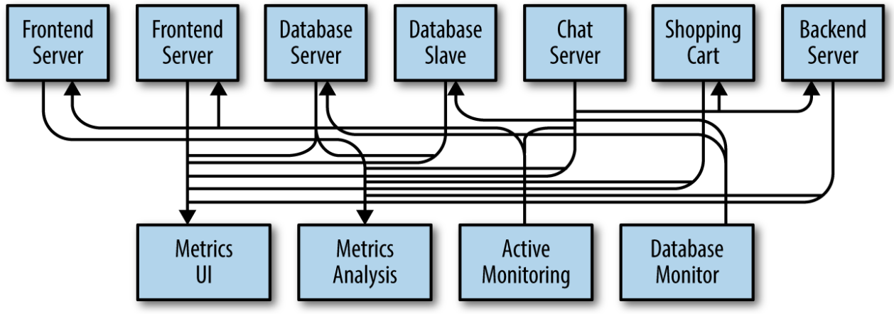

# 카프카 시작하기

- 데이터가 중심이 되는 기업에서, 파이프라인이 핵심적인 요소가 되는 이유
	- 데이터를 이동시키는 작업에 더 적은 노력을 들일수록 핵심 비즈니스에 더 집중할 수 있음
	- 데이터를 어떻게 이동시키느냐의 문제는 데이터 그 자체만큼이나 중요함

---

## 발행 / 구독 메시지 전달

- 전송자는 수신자에게 데이터를 보내지 않음
	- 전송자는 메시지를 분류해서 보낼 뿐이고, 수신자는 분류된 메시지를 구독
	- 발행된 메시지를 전달 받고 중계하는 `브로커`가 있음
	- 

### 초기 발행 / 구독 시스템

- 단일 지표 발행자 (발행자, 구독자 직접 연결)

- 여러 지표 발행자 (발행자, 구독자 직접 연결)

> 모든 애플리케이션으로부터 지표를 받는 `하나의 애플리케이션`을 만들어야 함
>     -> 이 지푯값들에 대해 질의하는 서버 제공

- 개선 결과

### 개별 메시지 큐 시스템

> - 중복이 많음
> - 각각의 데이터 큐 시스템을 유지 관리해야 함
> - 메시지 교환이 필요할 수도 있음
> - ***중앙 집중화된 시스템이 필요함***

---

## 카프카

- 분산 커밋 로그 or 분산 스트리밍 플랫폼이라고도 불림
- 저장된 데이터는 순서를 유치한 채로 지속성 있게 보관됨
- 결정적[deterministic]으로 읽을 수 있음

### 메시지와 배치

- 메시지
	- 카프카에서 데이터의 기본 단위
	- 단순한 바이트의 배열
	- `key`라 불리는 메타데이터 포함 가능
		- 얘도 의미 없는 바이트 배열
		- 메시지를 저장할 파티션 결정을 위해 사용
- 배치
	- 메시지의 저장 단위
	- 같은 토픽의 파티션에 쓰여지는 메시지들의 집합

### 스키마

- 메시지는 단순한 바이트 배열이지만, 내용의 이해를 위해 스키마를 부여하는 것이 권장됨
	- JSON, XML
		- 타입 처리 기능, 스키마 버전 간의 호환성 유지 기능이 떨어짐
	- Apache Avro
		- 조밀한 직렬화 형식 제공
		- 메시지 본체와 스키마 분리
			- 스키마가 변경되어도 코드를 생성할 필요 X
		- 강력한 데이터 타이핑
		- 스키마 변경에 따른 상위 호환성, 하위 호환성 지원
		- 

### 토픽과 파티션

- 토픽
	- 카프카의 저장되는 메시지의 분류 단위
	- *DB의 테이블, 파일시스템의 폴더와 유사*
- 파티션
	- 토픽은 여러 개의 파티션으로 나뉨
	- 커밋 로그의 관점에서, 하나의 로그에 해당
	- append-only
	- 파티션 안에서의 순서는 보장됨
	- 복제 가능

---
## 카프카 장점

- 다중 프로듀서
	- 프로듀서 클라이언트가 몇 개의 토픽을 사용하든 여러 프로듀서 처리 가능
	- 많은 프론트엔드 시스템으로부터의 데이터 수집, 일관성 유지에 용이
- 다중 컨슈머
	- 많은 컨슈머가 상호 간섭 없이 어떠한 메시지 스트림도 읽을 수 있음
	- 다른 큐 시스템과의 차별점
- 디스크 기반 보존
- 확장성
- 고성능
- 플랫폼 기능
	- API, 라이브러리 형태로 사용 가능
	- 카프카 커넥트
		- 소스 데이터 시스템으로부터 카프카로 데이터를 가져오거나, 카프카의 데이터를 싱크 시스템으로 내보내는 작업 도와줌
- 데이터 생태계

### 이용 사례

- 활동 추적
- 메시지 교환
- 지표 및 로그 수집
- 커밋 로그
- 스트림 처리