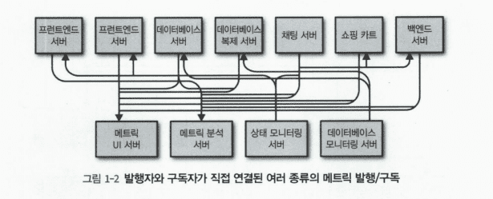
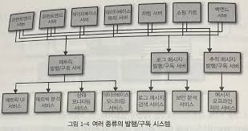
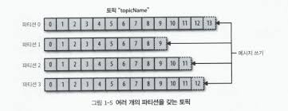
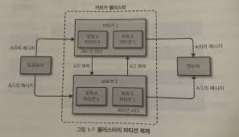
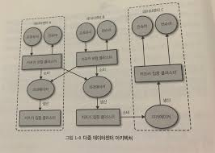

# 1장 카프카 시작하기

## 1.1 발행/구독 메시지 전달
pub/sub 구조로 중간에 메세지를 중계해주는 브로커를 기점으로 브로커에 메시지를 발행하는 publisher와 이를 구독하여 메시지를 수신하는 subscriber로 나뉘어 데이터를 통신하는 구조

### 1.1.1 초기 시스템

중간에 브로커를 두지 않는다면 다음과 같이 각 시스템에서 전부 지표 관련 서버에 연결을 맺어야 한다.

### 1.1.2 개별 메시지 큐 시스템

나아가 각 목적(로그 수집, 메트릭, 추적 메시지 등)에 맞는 브로커를 만들고 필요한 서버들이 해당 브로커를 구독하고 퍼블리싱 하는 구조를 만듦으로써 중앙 집중화된 시스템을 구축할 수 있다.

### 1.2.1 메시지와 배치
카프카에서 데이터의 기본 단위: **메시지**
- 메시지는 단순한 바이트 배열이며, 특정한 형식이나 의미가 없다.
- 메시지는 **키** 라는 메타데이터를 포함할 수 있는데, 이 또한 큰 의미 없는 바이트 배열이다. 키를 이용해 메시지를 저장할 파티션을 나누게 된다.
- 카프카는 메시지를 배치 단위로 저장하는데, **배치란 같은 토픽의 파티션에 쓰여지는 메시지들의 집합**을 말한다.
- 배치로 모아 메시지를 쓰면, 네트워크 오버헤드를 줄일 수 있어 시간당 처리 메시지 수가 늘어나지만, 각각의 메시지가 전달되는데 걸리는 시간은 늘어난다. (trade-off 관계)

### 1.2.2 스키마
메시지가 아무 형식이나 가능하다고 하지만 일정한 스키마를 갖는 것이 좋다. 대표적으로 json, xml 형식을 사용할 수 있겠지만, 카프카에서는 아파치 에이브로를 선호한다고 한다.

> **에이브로란?**  
> 아파치 소프트웨어 재단에서 관리, 개발하는 데이터 직렬화 프레임워크
>- 장점  
> 직렬화 후 바이너리 파일로 저장되어 성능이 좋다.  
> json 형식으로 데이터 스키마를 정의할 수 있어, 유연한 스키마 설계와 확인이 가능하다.  
> 
> - 단점  
> 바이너리 파일로 저장되기 때문에 디버깅이 어렵다.  
> 추가적인 스키마 관리 필요

### 1.2.3 토픽과 파티션
**토픽**: 카프카에 저장되는 메시지 분류 단위  
**파티션**: 토픽 내에서 다시 여려 개로 나뉘는 단위

- 보통 토픽 안에 여러 개의 파티션이 존재하는 만큼, 토픽 내의 메세지 순서는 보장되지 않으며, 단일 파티션 내의 순서만 보장된다.
- 각 파티션은 서로 다른 서버에 저장될 수 있다. 즉 하나의 토픽이 여러 개의 서버로 수평적으로 확장될 수 있기에 데이터 중복과 확장성을 제공하는 방법으로 사용된다.
- 파티션은 복제될 수 있어, 고가용성을 가능케한다.

> **스트림이란?**  
> 하나의 토픽에 저장된 데이터로 간주.  
> 프로듀서 -> 컨슈머로의 하나의 데이터 흐름을 나타냄

### 1.2.4 프로듀서와 컨슈머
**카프카 클라이언트**  
ㄴ 프로듀서  
ㄴ 컨슈머

- **프로듀서**
  - 메세지 발행자. 
  - 토픽에 메세지를 쓰는 역할을 한다. 이 때 토픽 내 파티션에 메세지가 고르게 나눠서 쓰도록 되어 있으나, 파티셔너를 사용해 특정 파티션에 쓰이도록 할 수도 있다.
  
- **컨슈머**
  - 메세지 구독자.

  - 토픽에 저장된 메세지들을 읽어들이는 역할을 한다. 이 때 파티션 별로 고유한 오프셋을 가지고 있어, 마지막으로 읽은 위치를 기록한다.
  - **오프셋은 컨슈머 그룹 별로 다르다.** **컨슈머 그룹 별 오프셋이 파티션 별로 할당되어 있는 형태.
  이러한 오프셋 정보는 예전에는 주키퍼에 저장되었으나, 현재는 카프카 내부에서 쓰는 `__consumer_offsets` 이라는 토픽에 저장한다.**  
  https://firststep-de.tistory.com/41
  - 컨슈머 그룹을 이용해 한 토픽에 대해 각 컨슈머가 하나의 파티션만 담당하여 읽도록 한다.  
  -> 컨슈머 하나 고장 시 다른 컨슈머가 장애 컨슈머 담당 파티션을 읽음으로써 장애 대응

### 1.2.5 브로커와 클러스터
**브로커**: 하나의 카프카 서버  
**클러스터**: 브로커 모임

- **브로커**
  - 프로듀서로부터 메시지를 받아 오프셋 할당 후 디스크 저장소에 저장
  - 컨슈머의 파티션 읽기 요청 처리 및 메시지 전송
- **클러스터**
  - 브로커들의 모임으로 모인 브로커 중 하나가 해당 클러스터의 컨트롤러 역할을 한다. 컨트롤러는 장애 모니터링 등의 관리 기능 담당
  - 파티션 또한 클러스터 내 브로커 중 하나가 담당하며 **파티션 리더**라 칭함 
  - 복제된 파티션이 다른 브로커에 할당될 수도 있는데, 이를 파티션의 팔로워라 부른다.
  

카프카는 토픽 별로 보존 기간을 설정할 수 있다.  

### 1.2.6 다중 클러스터
클러스터를 여러 개 운용 시 다음과 같은 이점이 있다.
- 데이터 유형별 분리
- 보안 요구사항을 충족시키기 위한 격리
- 재해 복구를 대비한 다중 데이터센터

여러 개의 데이터 센터 사용시 데이터 센터 간 데이터를 복제할 필요가 있다. 카프카 클러스터의 복제 메커니즘은 다중 클러스터 사이가 아닌 한 클러스터 내에서만 작동하도록 설계되었다.

다른 클러스터로 데이터를 복제하기 위해서 **미러메이커** 라는 툴을 사용하는데 아래 그림과 같이 근본적으로 미러메이커 또한 클러스터를 대상으로 카프카 컨슈머/프로듀서 일을 수행하는 것이다.

## 1.3 왜 카프카인가?
카프카가 좋은 이유는 다음과 같다.
- 다중 프로듀서
  - 여러 프로듀서들이 발행한 메시지를 단순히 토픽에 쓰기만 하면 된다. 
- 다중 컨슈머
  - 구독한 토픽으로부터 프로듀서가 쓴 메시지를 읽기만 하면 된다.
- 디스크 기반 보존
  - 디스크에 메시지를 저장하기 때문에 실시간으로 읽을 필요가 없다.
- 확장성
  - 뛰어난 확장성을 제공한다.
- 고성능
  - 앞서 설명한 특징들로 인해 고성능을 낼 수 있다.
- 플랫폼 기능
  - 카프카 자체가 플랫폼이 되어 카프카 커넥트, 카프카 스트림즈 등 다양한 기능을 제공한다.

### 1.4.1 이용 사례
- 활동 추적
- 메시지 교환
- 지표 및 로그 수집
- 커밋 로그
- **스트림 처리**

### 1.5 카프카의 기원
- 링크드인에서 내부적으로 쓰던 기술들이 문제가 많아 대안을 찾던 중 적절한 것이 없어 직접 만들었다!
- 2010년 오픈소스로 공개되고 아파치 프로젝트에 등록되었다.
- 현재까지 오픈소스 커뮤니티의 많은 관심을 가지며 계속해서 성장하고 있다. + 카프카를 기점으로 한 다양한 프로젝트 생성
