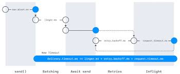
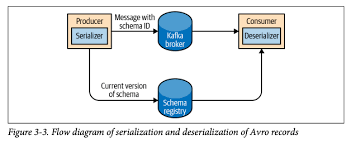

# 3장 카프카 프로듀서: 카프카에 메시지 쓰기


### 카프카에 메세지를 쓰는 과정
1. ProducerRecord 객체 생성 -> 토픽, 밸류 지정 필수 / 키, 파티션 지정 선택
2. 데이터 바이트 배열로 직렬화
3. 파티셔너에게 데이터를 보내 파티션 결정(보통 ProducerRecord 객체의 키 값으로 결정)
4. 같은 토픽 파티션으로 전송될 레코드들을 모은 레코드 배치에 추가
5. 별도의 스레드가 카프카 브로커에 전송
6. 메시지를 받은 브로커에서 성공 정보를 담아 RecordMetadata 객체 리턴
7. 오류 시 에러 리턴

## 3.2 카프카 프로듀서 생성하기
카프카 프로듀서는 다음 3개의 필수 속성값을 가진다.
- **bootstrap.servers**
  - 카프카 클러스터와 첫 연결을 생헝하기 위해 프로듀서가 사용할 브로커의 host:port 목록
  - 최소 2개 이상 지정 권장 -> 브로커 중 하나가 정지하는 경우 대응하기 위해
- **key.serializer**
  - 카프카에 쓸 레코드의 키 값을 직렬화하기 위해 사용하는 Serializer 클래스 이름
  - 카프카 client 패키지에는 ByteArraySerializer, StringSerializer 등 기본 타입에 대한 직렬화 클래스가 있으므로 이를 사용해도 된다.
- **value.serializer**
  - 카프카에 쓸 레코드의 밸류 값을 직렬화하기 위해 사용하는 클래스 이름

```kotlin
val props = Properties()
props[ProducerConfig.BOOTSTRAP_SERVERS_CONFIG] =
    "<브로커 주소 정의>" 

props[ProducerConfig.KEY_SERIALIZER_CLASS_CONFIG] =
    "org.apache.kafka.common.serialization.StringSerializer" 

props[ProducerConfig.VALUE_SERIALIZER_CLASS_CONFIG] = "org.apache.kafka.common.serialization.StringSerializer"

props[ProducerConfig.RETRIES_CONFIG] = Integer.MAX_VALUE

props[ProducerConfig.ACKS_CONFIG] = "all"
```

카프카 2점대 버전에서는 정적 상수를 사용하는 방식으로 바뀌었다고 한다.

## 3.3 카프카로 메시지 전달하기
위의 설정만 해도 메시지를 보낼 수 있다. 메시지를 보내는 방법은 크게 3가지가 존재한다.

- 파이어 앤 포겟
  - 메시지를 서버에 전송만 하고 성공했는지 실패했는지 신경 쓰지 않는다. 웬만하면 성공하지만 전송 재시도가 불가능한 오류나 타임아웃 발생 시 데이터가 유실된다.

- 동기적 전송
  - 카프카 프로듀서는 언제나 비동기적으로 동작한다. 그래서 동기적으로 동작시키려면 Future 객체의 get() 메소드를 이용해 동기화해서 사용한다.

- 비동기적 전송
  - `producer.send(record, {콜백 메서드})` 형태로 호출하면 응답을 받는 시점에 콜백 함수가 호출된다.
> **참고❗️**  
> 콜백은 프로듀서의 메인 스레드에서 실행된다. 따라서 콜백이 빠르게 되어야 전송에 지연이 생기지 않는다. 또한 콜백 함수 내에서 블로킹 작업을 하는 것도 권장하지 않는다.

## 3.4 프로듀서 설정하기

### client.id
프로듀서와 그것을 사용하는 애플리케이션을 구분하기 위한 논리적 식별자.

### acks
프로듀서가 임의의 쓰기 작업이 성공했다고 판별하기 위해 얼마나 많은 파티션 레플리카가 해당 레코드를 받아야 하는지를 결정.

- acks = 0 일 때
  - 메시지가 성공적으로 전달되었다고 간주하고 브로커의 응답을 기다리지 않음.
  - 메시지 유실 가능성이 있으며 높은 처리량이 필요할 때 사용
- acks = 1 일 때
  - 리더 레플리카가 메시지를 받는 순간 브로커로부터 성공했다는 응답을 받음
- acks = all 일 때
  - 모든 인-싱크 레플리카에 메시지가 전달된 뒤에야 브로커로부터 성공했다는 응답을 받음

> **참고**  
> 카프카는 일관성을 위해 모든 인-싱크 레플리카에 복제가 완료된 후에 컨슈머가 레코드를 읽도록 한다. 
> 
> 따라서 레코드가 생성되어 컨슈머가 읽을 때까지의 시간인 종단 지연이 더 고려된다면 어떤 모드이든 다 똑같기 때문에 신뢰성이 높은 설정을 택해도 상관 없다.  

### 3.4.3 메시지 전달 시간

카프카 2점대 버전 이후부터는 ProducerRecord를 보낼 때 걸리는 시간을 두 구간으로 나눈다.
- send()에 대한 비동기 호출이 이뤄진 시각부터 결과 리턴까지의 시간
- 비동기 호출 리턴 이후 콜백이 호출될 때까지의 시간

  
다음은 프로듀서 내부의 메시지 전달 시간을 작업별로 나눈 것이다.
- max.block.ms
  - 프로듀서가 블록되는 시간 send() 호출 이후 해당 시간만큼만 블록되며 더 지체 시 예외 발생
- delivery.timeout.ms
  - 레코드가 배치에 저장된 시점부터 전송 시도 후 브로커의 응답을 받기까지의 시간
- request.timeout.ms
  - 브로커에 쓰기 요청 후 응답을 받기 위해 기다리는 시간
- retries, retry.backoff.ms
  - retries: 메시지 재 전송 시도 횟수 (재전송 안 하고 싶으면 0 대입)
  - retry.backoff.ms: 각 재시도 사이의 텀  

이러한 프로퍼티 값들을 하나하나 설정하기보다는, 테스트를 통해 에러를 복구하는 시간을 고려하여 delivery.timeout.ms 매개 변수 값을 적절히 설정하는 것이 권장된다.

- linger.ms
  - 배치로 전송하기까지 대기하는 시간
- buffer.memory
  - 메시지 전송 전 대기시키는 버퍼의 크기
- compression.type
  - 메시지 압축 방법, snappy(권장), gzip(소모 자원⬆️, 압축 ⬆️), lz4
- batch.size
  - 배치에 사용될 메모리 바이트 크기
- max.in.flight.requests.per.connection  
  - 서버로부터 응답을 받지 못한 상태에서 전송할 수 있는 최대 메시지 수
  - 단일 데이터센터 기준 2일 때 최고 성능, 기본값(5)일 때도 비슷

> **참고**  
> 기본적으로 파티션 내에서는 순서가 보장된다. 그러나 `retries` 값을 0 이상, `max.in.flight.requests.per.connection` 을 1 이상으로 잡을 경우 
>
> 첫 번째 배치가 실패하고 두 번째 배치가 성공한 후 다시 재전송을 시도하여 첫 번째 배치가 쓰여진 경우, 순서 보장이 되지 않는다.
>
> 이를 방지하기 위해 `enable.idempotence=true` 를 설정함으로써 멱등성을 보장하여 해결할 수 있다.

참고자료: https://studyandwrite.tistory.com/550

- max.request.size
  - 프로듀서가 전송하는 쓰기 요청의 크기
  - 브로커에도 받아들일 수 있는 최대 메시지 크기를 결정하는 message.max.bytes 매개 변수가 있어, 이를 동일하게 맞춤으로써 브로커가 받아들이지 못하는 크기의 메시지를 전송하려 하지 않는 것이 좋다.

- receive.buffer.bytes, send.buffer.bytes
  - 소켓이 사용되는 TCP 송수신 버퍼의 크기. 결정 각 값이 -1일 때 운영체제의 기본 값 사용
  - 프로듀서나 컨슈머가 다른 데이터센터에 위치한 브로커와 통신할 경우 대역폭이 낮고 지연이 길어지는 경우가 보통이기에 올려잡는 것이 좋다.
- enable.idempotence
  - 멱등적 프로듀서 기능 활성화 값
  - 활성화 시 레코드를 보낼 때마다 순차적인 번호를 붙여 보내고, 브로커에서 동일한 번호를 2개 이상 받을 시 하나만 저장, 이후 프로듀서는 문제가 발생하지 않는 `DuplicateSequenceException`을 받는다.

  > **참고**  
  멱등적 프로듀서 기능 활성화 시 `max.in.flight.requests.per.connection` 값은 5 이하, `retries`는 1 이상, `acks=all`로 설정해야만 한다.

## 3.5 시리얼라이저

### 3.5.1 커스텀 시리얼라이저.
`Serializer<T>` 인터페이스를 상속받아 오버라이딩하여 커스텀 시리얼라이저를 구현하고, 이를 프로듀서 생성 시 시리얼라이저로 넘겨주면 된다.

이처럼 시리얼라이저를 커스텀 하는 방법의 단점은 다음과 같다.
- 데이터 타입, 필드 추가 등 변동사항 발생 시 계속해서 코드를 수정해야 한다.
- 여러 곳에서 같은 시리얼라이저 사용 시 같은 로직을 사용하기 때문에 동시에 같은 코드를 변경할 상황이 올 수도 있다.

### 3.5.2 아파치 에이브로를 사용해서 직렬화하기
카프카 사용 시 보통 범용 시리얼라이저를 사용하는 것이 권장된다. 그 중 하나인 에이브로에 대해 알아보자  

앞 장에서 간단하게 살펴봤듯이 에이브로는 스키마 정보를 json 형식으로 갖고 있다. 보통 에이브로 파일 자체에 스키마를 내장하는 방법을 쓴다.

스키마 정보를 바꾸는 경우 주의할 점이 있다.
- 데이터를 쓸 때 사용하는 스키마와 읽을 때 기대하는 스키마가 호환되어야 한다.  
  책의 예시에서는 string or null -> string or null로 호환 가능한 타입으로 대체 되었다.

- 역직렬화 시 데이터를 쓸 때 사용했던 스키마에 접근 가능해야 한다.

### 3.5.3 카프카에서 에이브로 레코드 사용하기
기본적으로는 에이브로 파일에 전체 스키마를 저장한다고 했다. 그러나 카프카에서는 레코드 사이즈를 줄이기 위해 **스키마 레지스트리**라는 아키텍처 패턴을 사용한다. 

  
다음은 스키마 레지스트리 아키텍처를 그림으로 표현한 것이다.

패턴을 설명하면,  
- 모든 스키마를 스키마 레지스트리에 저장한다.
- 레코드에는 스키마 전체가 아닌 스키마 식별용 고유 식별자를 집어넣는다.
- 역직렬화 시 고유 식별자를 보고 스키마를 스키마 레지스트리에서 가져와 사용한다.

다음과 같다.

실제 구현 시에는 `KafkaAvroSerializer`를 사용하며 KafkaProducer 객체 생성 시 전달하는 Properties 객체 초기화 시 `schema.registry.url` 값에 스키마 레지스트리 경로를 넣는다.

레코드의 타입으로는 POJO는 사용 불가하며 에이브로의 코드 생성 기능을 통해 생성된 에이브로 객체만 올 수 있다.

또한 제네릭 에이브로 객체(`GenericRecord`)도 사용할 수 있는데, 이 경우 스키마 정보만 넘겨주고 
```java
//중략

GenericRecord customer = new GenericData.Record(schema);
customer.put("id", "nCustomers");
customer.put("name", "name");
customer.put("email", "email");

ProducerRecord<String, GenericRecord> data = new ProducerRecord<>("customerContacts", name, customer)
producer.send(data)
```
다음과 같이 레코드의 값들을 초기화하여 사용할 수 있다.

## 3.6. 파티션
- 키 값은 기본적으로 null 이다.  
- 키 값 지정 시 같은 키는 같은 파티션에 저장된다.  
- 기본 파티셔너 사용 시 키 값이 정해지지 않으면 라운드 로빈 알고리즘을 사용하여 사용 가능한 파티션에 랜덤하게 저장된다.
이 때 접착성 처리를 수행하여, 자원 사용량을 줄인다.

> **접착성 처리란?**
> 키 값이 null인 레코들은 사용 가능한 파티션 아무 곳이나 들어갈 수 있다. 따라서 키 값이 지정된 레코드들 뒤에 붙여서 레코드를 채움으로써 전송 횟수를 줄이는 방법이다.

- RoundRobinPartitioner: 라운드 로빈 파티셔너
- UniformStickyPartitioner: 전체 파티션에 균등하게 레코드 분배되도록 파티션 할당

### 3.6.1 커스텀 파티션 구현하기
Partitioner 인터페이스를 상속받아 구현한다. 필요할 때 찾아보며 사용하면 좋을 것 같다.

## 3.7 헤더
레코드에 키, 벨류 값 외에 헤더를 포함할 수 있다. 이러한 헤더는 추가 메타데이터 역할을 한다.

보통 헤더에 메시지 전달 내역을 기록하여, 헤더만 가지고 메시지를 라우팅하거나 출처를 추적하는 것에 사용한다. 

헤더 또한 순서가 있는 키/밸류 쌍의 집합으로 구현되어 있으며, 키 값은 항상 String이어야 하지만 밸류는 아무 직렬화된 객체라도 상관 없다.

## 3.8 인터셉터
ProducerInterceptor로 다음 메서드를 정의한다.
- ProducerRecord<k, V> **onSend**(ProducerRecord<K, V> record)
  - 프로듀서가 레코드를 브로커로 보내기 전 호출된다. 로직 수행 후 리턴하는 `ProducerRecord` 객체가 전송되게 된다.

- void onAcknowledgement(RecordMetadata metadata, Exception exception)
  - 브로커가 클라이언트로 보낸 응답을 받았을 때 호출되는 메서드, 응답 값을 바꿀 수는 없지만 읽을 수는 있다.

## 3.9 쿼터, 스로틀링
쿼터: 쓰기/읽기 속도 제한 한도  

쓰기 쿼터, 읽기 쿼터는 클라이언트가 데이터를 송/수신 하는 속도를 초당 바이트 수 단위로 제한한다.

요청 쿼터는 브로커가 요청을 처리하는 시간 비율 단위로 제한한다.

스로틀링: 클라이언트가 할당량을 다 채웠을 경우, 요청 속도를 늦춰 할당량을 초과하지 않도록 하는 것
