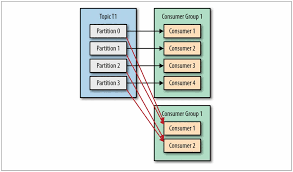

# 4장 카프카 컨슈머: 카프카에서 데이터 읽기

### 4.1.1 컨슈머와 컨슈머 그룹
프로듀서가 하나의 토픽에 메세지를 쓰듯이 컨슈머도 그룹을 지어 토픽 내 파티션을 담당하여 메시지를 읽어들인다.



컨슈머 그룹 별로 한 토픽 전체를 읽어들이게 된다. 따라서 하나의 토픽 전체를 읽어들여야 하는 애플리케이션 단위로 컨슈머 그룹을 생성하여 데이터를 읽어들이면 된다.

## 4.1.2 컨슈머 그룹과 파티션 리밸런스
토픽에 새로운 파티션이 추가되거나 컨슈머가 추가되는 경우 등 변동이 발생했을 경우 **파티션 리밸런스**를 진행한다.  
이는 그룹 코디네이터가 수행하며, 코디네이터는 브로커 중 하나에 위치한다.

### 조급한 리밸런스
모든 컨슈머가 자신이 담당하고 있는 파티션을 포기하고 파티션을 포기한 컨슈머 모두가 다시 그룹에 참여한 뒤 새로운 파티션을 할당받아 읽기 작업을 하는 방식

### 협력적(점진적) 리밸런스
전부 파티션을 포기하지 않고 재할당이 필요한 컨슈머만 파티션 소유권을 포기하여 리밸런싱 하는 방식 

---

컨슈머는 그룹 코디네이터로 지정된 컨슈머에게 주기적으로 하트비트를 전송함으로써 소속 여부와 할당된 파티션에 대한 소유권을 유지한다.

컨슈머가 일정 시간 하트비트를 보내지 않는다면, 코디네이터는 해당 컨슈머가 죽었다고 판단하고 리밸런스를 실행한다. 

> **참고**
> 버전 3.1 이후로는 리밸런스 기본 값이 조급한 리밸런스에서 협력적 리밸런스로 바뀌었다고 한다. 조급한 리밸런스는 추후 삭제될 예정이다.

### 4.1.3 정적 그룹 멤버십
기본적으로 컨슈머의 멤버십은 일시적이다. 그러나 컨슈머에 `group.instance.id` 값을 잡아주면 해당 컨슈머는 정적 멤버가 된다.

정적 멤버가 되면, 컨슈머가 꺼진다고 해서 자동으로 그룹을 떠나지 않는다. (세션 타임아웃이 경과할 때까지) 따라서 다시 컨슈머가 그룹에 조인하면, 리밸런스 발생 없이 기존에 할당된 파티션에서 데이터를 읽어온다.

코디네이터가 정적 멤버에 대한 정보들(할당 파티션, id 등)을 갖고 있어 가능하며, 만약 `group.instance.id` 값이 두 개라면 늦게 오는 컨슈머는 에러가 발생한다.

## 4.2 카프카 컨슈머 생성하기
KafkaProducer 인스턴스 생성 방식과 유사하다.

- bootstrap.servers
  - 카프카 클러스터로의 연결 문자열
- key.deserializer, value.deserializer
  - 역직렬화할 클래스 정보
- group.id
  - 컨슈머 그룹 id

## 4.3 토픽 구독하기
`consumer.subscribe(Collections.singletonList("customerCountries"));`

다음과 같이 subscribe() 메소드를 통해 인자로 구독 리스트를 넘겨주면 된다.

`consumer.subscribe(Pattern.compile("test.*"));`

다음과 같이 정규식을 이용하여 특정 이름 패턴을 만족하는 토픽들을 구독할 수도 있다.

## 4.4 폴링 루프
`ConsumerRecords<String, String> records = consumer.poll(timeout)` 

다음과 같이 poll() 메소드를 호출하여 쌓인 레코드를 가져와 처리한다. 

이 poll() 메소드 안에는 컨슈머 그룹에 참여하여 파티션을 할당 받거나, 리밸런스 연관 콜백 등 많은 부분이 이 메소드 안에서 처리된다.

poll()이 max.poll.interval.ms에 지정된 값 이상으로 호출되지 않는다면 해당 컨슈머는 죽은 것으로 판단되어 그룹에서 퇴출된다.

### 4.4.1 스레드 안정성
컨슈머 하나 당 무조건 스레드 하나이다.

## 4.5 컨슈머 설정하기
여러 매개 변수에 대해 알아보자. 뭐가 많다...

- fetch.min.bytes
  - 브로커로부터 레코드를 읽어올 때 받는 데이터의 최소량(기본 1바이트) 최소량을 넘지 못하면 데이터를 보내지 않고 모아서 보낸다.
- fetch.max.wait.ms
  - 데이터가 모일 때까지 얼마나 기다릴 지 결정하는 값(기본 500ms)
- fetch.max.bytes
- 컨슈머가 브로커를 폴링할 때 카프카가 리턴하는 최대 비이트 수(기본 50MB)
- max.poll.records
  - poll() 호출할 때마다 리턴되는 최대 레코드 개수
- max.partition.fetch.bytes
  - 파티션 별로 리턴하는 최대 바이트 수(기본 1MB)
  - 웬만하면 건들지 말 것

- session.timeout.ms, heartbeat.interval.ms
  - 컨슈머가 그룹 코디네이터에게 하트비트를 보내지 않아도 살 수 있는 최대 시간 -> session.timeout.ms (3.0 버전 이후 기본값 10초 -> 45초)
  - 그룹 코디네이터에게 하트비트 신호를 얼마나 자주 보낼지 값 -> heartbeat.interval.ms
  - 보통 session.timeout.ms / 3 == heartbeat.interval.ms로 잡는다.
- max.poll.interval.ms
  - 컨슈머가 폴링을 하지 않고도 죽은 것을 판정되지 않을 수 있는 최대 시간. (기본 5분)
- default.api.timeout.ms
  - 거의 모든 컨슈머 API 호출에 적용되는 타임 아웃 값 (기본 1분)
  - poll()은 이 값의 적용을 받지 않아 명시적으로 타임 아웃 시간을 인수로 넘겨줘야 한다.
- request.timeout.ms
  - 컨슈머가 브로커로부터의 응답을 기다릴 수 있는 최대 시간 (기본 30초) 시간 초과 시 연결을 닫고 다시 연결을 시도한다.
- auto.offset.reset
  - 예전에 오프셋을 커밋한 적이 없거나, 커밋된 오프셋이 유효하지 않을 때 파티션을 읽기 시작할 때의 작동 정의 (기본 latest)
  - latest -> 가장 최신 레코드부터 읽음
  - earlist -> 파티션의 맨 처음 데이터부터 읽음
- enable.auto.commit
  - 컨슈머가 자동으로 오프셋을 커밋할지 여부(기본 true)
- partition.assignment.strategy
  - 어느 컨슈머에게 어느 파티션을 할당할지 결정
  - Range
    - 각 토픽의 파티션들을 연속된 그룹으로 나누어 할당
    - ex) C1 -> T1, T2의 0번 파티션, C2 -> 1번 파티션
  - RoundRobin
    - 공평하게 번갈아가며 하나씩 할당
  - Sticky
    - 최대한 균등하게, 최대한 리밸런스 발생 시 파티션 할당 이동이 적게 할당하는 방식
  - Cooperative Sticky
    - 협력적 리밸런스 기능 지원하는 할당자.
- client.id
  - 브로커가 요청을 보낸 클라이언트를 식별하는 어떤 문자열
- client.rack 
  - 가장 가까운 레플리카에서 데이터를 읽을 수 있도록 하는 설정
  - 브로커의 replica.selector.class 값을 RackAwareReplicaSelector로 잡아야 한다.
- group.instance.id
  - 정적 그룹 멤버십 기능을 적용하기 위해 사용되는 설정
- receive.buffer.bytes, send.buffer.bytes
  - 데이터 읽기/쓰기 시 소켓이 사용되는 TCP의 수신 및 수신 버퍼의 크기
  - -1로 잡을 시 운영체제 기본 값이 사용됨
- offsets.retention.minutes
  - 컨슈머 그룹의 오프셋 정보들을 유지하는 시간(기본 7일)

## 4.6 오프셋과 커밋
카프카에 특수 토픽인 `__consumer_offsets` 토픽에 각 파티션 별 커밋된 오프셋을 업데이트하도록 하는 메시지를 보냄으로써 오프셋 커밋이 이루어진다. 

> **참고**  
> 커밋은 poll() 메소드가 리턴한 마지막 오프셋 바로 다음 오프셋이 커밋된다.

### 4.6.1 자동 커밋
5초 간격이 기본 값으로 5초마다 컨슈머는 poll() 호출 시 마지막 오프셋 위치를 커밋한다. 그러나 5초 안에 컨슈머가 크래시 나서 리밸런스가 진행되거나 한다면 새로운 컨슈머는 커밋 위치부터 다시 데이터를 처리하기 때문에 데이터 중복 처리가 충분히 일어날 수 있다.

### 4.6.2 현재 오프셋 커밋하기
`enable.auto.commit=false`를 통해 자동 커밋 기능을 끄고, `commitSync()` 메소드를 이용해 명시적으로 오프셋 커밋을 수행할 수 있다.

이 때에도 동일하게 poll()에 의해 리턴된 마지막 오프셋을 저장한다.

### 4.6.3 비동기적 커밋
`commitAsync()` 메소드를 통해 실행할 수 있으며, 위의 `commitSync()`와는 다르게 비동기로 동작한다.

발생할 수 있는 문제는, 비동기기 때문에 요청을 하고 응답을 받은 시점에 이미 다른 커밋이 성공했을 수도 있다. 이때 이전 요청이 실패하여 재시도 후 커밋을 성공한다면 커밋이 다시 뒤로 돌아가는 상황이 벌어질 수도 있다.

### 4.6.4 동기, 비동기 커밋 같이 사용하기
정상적인 상황 -> `commitAsync()` 사용
컨슈머를 닫는 상황 -> `commitSync()` 사용

### 4.6.5 특정 오프셋 커밋하기
`commitSync()`, `commitAsync()` 메소드를 호출할 때 인수로 커밋하고자 하는 파티션과 오프셋의 맵을 전달하여 특정 오프셋을 커밋할 수 있다.

## 4.7 리밸런스 리스너
`ConsumerRebalanceListener`를 상속받아 리밸런스 리스너를 구현할 수 있다.

제공하는 메소드는 다음과 같다.
- `onPartitionsAssigned(Collection<TopicPartition> partitions)`
  - 파티션이 컨슈머에게 재할당된 이후 호출되는 메소드
- `onPartitionsRevoked(Collection<TopicPartition> partitions)`
  - 컨슈머에게 할당받았던 파티션이 할당 해제될 때 호출되는 메소드
  - 조급한 리밸런스 -> 리밸런스 시작 전 호출
  - 협력젹 리밸런스 -> 리밸런스 완료 시 호출
- `onPartitionsLost(Collection<TopicPartition> partitions)`
  - 협력적 리밸런스 사용 경우 할당된 파티션이 리밸런스 알고리즘에 의해 해제되기 전에 다른 컨슈머에 먼저 할당된 예외적인 상황에서만 호출

## 4.8 특정 오프셋의 레코드 읽어오기
`seekToBeginning(Collection<TopicPartition> tp)`와
`seekToEnd(Collection<TopicPartition> tp)`를 이용하여 원하는 오프셋에서 메세지를 읽을 수 있다.

## 4.9 폴링 루프를 벗어나는 방법
컨슈머를 종료하고자 한다면, 다른 스레드에서 consumer.wakeup()을 호출해야 한다. java에서는 ShutdownHook을 등록하여 프로세스가 종료되기 전 훅에 등록한 코드에 consumer.wakeup()을 실행하여 폴링 루프를 탈출할 수 있다.

## 4.10 디시리얼라이저
직렬화된 메시지를 역직렬화하기 위해서는 데이터 타입을 맞춰야 한다.

이에 어차피 같은 데이터 타입의 시리얼라이저들이 쓰이므로 카프카에서는 이를 묶어놓은 Serdes라는 클래스도 제공한다.

```java
Serializer<String> serializer = Serdes.String().serializer();

Deserializer<String> deserializer = Serdes.String().deserializer();
```

### 4.10.1 커스텀 디시리얼라이저
`Deserializer<T>` 인터페이스를 상속받아 디시리얼라이저를 구현하면된다.

오버라이딩할 메소드는 `configure()`, `deserializer()`, `close()` 가 있으며, `deserializer()` 메소드에서 역직렬화를 수행하면 된다.

필요할 때 찾아보며 구현하면 될 것 같다.

### 4.10.2 Avro 디시리얼라이저 사용하기
1. `value.deserializer` 값에 `KafkaAvroDeserializer`를 넣어주고
2. `schema.registry.url` 값에 스키마 저장 위치를 넣는다.
3. `consume.poll(timeout)`와 같이 사용한다~

---

> **참고**
> 
> 기본 데이터 타입 외에, UUID, Void, List<T> 등의 타입에 대해서도 시리얼라이저를 지원하기 시작했다.

## 4.11 독립 실행 컨슈머: 컨슈머 그룹 없이 컨슈머를 사용해야 하는 이유와 방법
굳이 그룹에 속하지 않고 단순히 토픽 내 모든 파티션을 한 컨슈머가 읽고 싶은 경우도 있을 수 있다.

```java
List<PartitionInfo> partitionInfos = consumer.partitonsFor("topic");

for(PartitionInfo partitionInfo : partitionInfos){
  partitions.add(new TopicPartition(partitonInfo.topic(), partition.partition()))
}

consumer.assign(partitions)
```

다음과 같이 토픽에 있는 파티션 정보를 획득하고 이를 직접 컨슈머에 할당해주면 된다.
