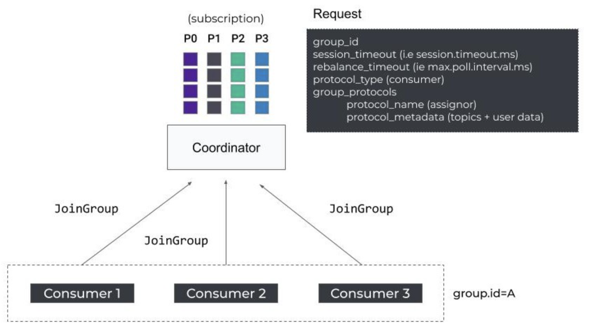
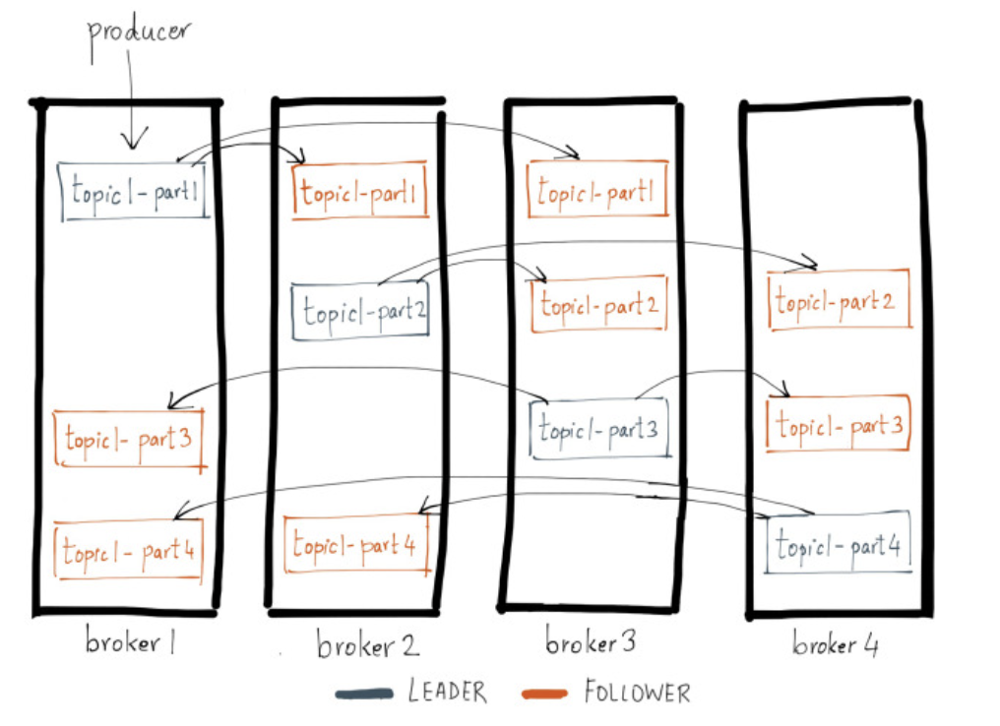

# 정리

# 3장


### 카프카에 메세지를 쓰는 과정
1. ProducerRecord 객체 생성 -> 토픽, 밸류 지정 필수 / 키, 파티션 지정 선택
2. 데이터 바이트 배열로 직렬화
3. 파티셔너에게 데이터를 보내 파티션 결정(보통 ProducerRecord 객체의 키 값으로 결정)
4. 같은 토픽 파티션으로 전송될 레코드들을 모은 레코드 배치에 추가
5. 별도의 스레드가 카프카 브로커에 전송
6. 메시지를 받은 브로커에서 성공 정보를 담아 RecordMetadata 객체 리턴
7. 오류 시 에러 리턴

### 3.5.3 카프카에서 에이브로 레코드 사용하기
기본적으로는 에이브로 파일에 전체 스키마를 저장한다고 했다. 그러나 카프카에서는 레코드 사이즈를 줄이기 위해 **스키마 레지스트리**라는 아키텍처 패턴을 사용한다. 

  
다음은 스키마 레지스트리 아키텍처를 그림으로 표현한 것이다.

패턴을 설명하면,  
- 모든 스키마를 스키마 레지스트리에 저장한다.
- 레코드에는 스키마 전체가 아닌 스키마 식별용 고유 식별자를 집어넣는다.
- 역직렬화 시 고유 식별자를 보고 스키마를 스키마 레지스트리에서 가져와 사용한다.

다음과 같다.

실제 구현 시에는 `KafkaAvroSerializer`를 사용하며 KafkaProducer 객체 생성 시 전달하는 Properties 객체 초기화 시 `schema.registry.url` 값에 스키마 레지스트리 경로를 넣는다.

레코드의 타입으로는 POJO는 사용 불가하며 에이브로의 코드 생성 기능을 통해 생성된 에이브로 객체만 올 수 있다.

또한 제네릭 에이브로 객체(`GenericRecord`)도 사용할 수 있는데, 이 경우 스키마 정보만 넘겨주고 
```java
//중략

GenericRecord customer = new GenericData.Record(schema);
customer.put("id", "nCustomers");
customer.put("name", "name");
customer.put("email", "email");

ProducerRecord<String, GenericRecord> data = new ProducerRecord<>("customerContacts", name, customer)
producer.send(data)
```
다음과 같이 레코드의 값들을 초기화하여 사용할 수 있다.

# 4장

### 카프카 컨슈밍 과정

1. 컨슈머 클라이언트는 bootstrap.brokers 리스트에 있는 브로커에게 초기 커넥션 연결을 위한 요청을 보냄  
2. 요청 받은 브로커는 그룹 코디네이터 프로세스를 생성하고 컨슈머에게 응답  
3. 시작된 그룹 코디네이터는 group.initial.rebalance.delay.ms 설정 값 동안 컨슈머의 요청을 기다림.  
4. 컨슈머는 그룹 코디네이터에 컨슈머 그룹 등록 요청을 보냄. 이때 가장 먼저 요청을 보낸 컨슈머를 그룹 코디네이터는 컨슈머 그룹의 리더로 정함.  
5. 그룹 코디네이터는 해당 컨슈머 그룹이 구독하는 토픽, 파티션 리스트 그리고 4번에서 지정한 리더 컨슈머 정보를 응답으로 보냄  
6. 리더 컨슈머는 정해진 컨슈머 파티션 할당 전략에 따라 그룹 내 컨슈머들에게 파티션 할당한 뒤 해당 결과를 그룹 코디네이터에게 전달.  
7. 그룹 코디네이터는 해당 정보를 로컬 캐시하고 그룹 내 컨슈머들에게 성공을 알림  
8. 각 컨슈머들은 할당된 파티션들을 컨슈밍하기 시작

https://surgach.tistory.com/118

## 4.1.2 컨슈머 그룹과 파티션 리밸런스
토픽에 새로운 파티션이 추가되거나 컨슈머가 추가되는 경우 등 변동이 발생했을 경우 **파티션 리밸런스**를 진행한다.

### 조급한 리밸런스
모든 컨슈머가 자신이 담당하고 있는 파티션을 포기하고 파티션을 포기한 컨슈머 모두가 다시 그룹에 참여한 뒤 새로운 파티션을 할당받아 읽기 작업을 하는 방식

### 협력적(점진적) 리밸런스
전부 파티션을 포기하지 않고 재할당이 필요한 컨슈머만 파티션 소유권을 포기하여 리밸런싱 하는 방식 

---

컨슈머는 그룹 코디네이터로 지정된 컨슈머에게 주기적으로 하트비트를 전송함으로써 소속 여부와 할당된 파티션에 대한 소유권을 유지한다.

컨슈머가 일정 시간 하트비트를 보내지 않는다면, 코디네이터는 해당 컨슈머가 죽었다고 판단하고 리밸런스를 실행한다. 

> **참고**
> 버전 3.1 이후로는 리밸런스 기본 값이 조급한 리밸런스에서 협력적 리밸런스로 바뀌었다고 한다. 조급한 리밸런스는 추후 삭제될 예정이다.

## 4.6 오프셋과 커밋
카프카에 특수 토픽인 `__consumer_offsets` 토픽에 각 파티션 별 커밋된 오프셋을 업데이트하도록 하는 메시지를 보냄으로써 오프셋 커밋이 이루어진다. 

> **참고**  
> 커밋은 poll() 메소드가 리턴한 마지막 오프셋 바로 다음 오프셋이 커밋된다.

### 4.6.1 자동 커밋
기본 값으로 5초마다 컨슈머는 poll() 호출 시 마지막 오프셋 위치를 커밋한다. 그러나 5초 안에 컨슈머가 크래시 나서 리밸런스가 진행되거나 한다면 새로운 컨슈머는 커밋 위치부터 다시 데이터를 처리하기 때문에 데이터 중복 처리가 충분히 일어날 수 있다.

### 4.6.2 현재 오프셋 커밋하기
`enable.auto.commit=false`를 통해 자동 커밋 기능을 끄고, `commitSync()` 메소드를 이용해 명시적으로 오프셋 커밋을 수행할 수 있다.

이 때에도 동일하게 poll()에 의해 리턴된 마지막 오프셋을 저장한다.

### 4.6.3 비동기적 커밋
`commitAsync()` 메소드를 통해 실행할 수 있으며, 위의 `commitSync()`와는 다르게 비동기로 동작한다.

발생할 수 있는 문제는, 비동기기 때문에 요청을 하고 응답을 받은 시점에 이미 다른 커밋이 성공했을 수도 있다. 이 때 이전 요청이 실패하여 재시도 후 커밋을 성공한다면 커밋이 다시 뒤로 돌아가는 상황이 벌어질 수도 있다.

### 4.6.4 동기, 비동기 커밋 같이 사용하기
정상적인 상황 -> `commitAsync()` 사용  
컨슈머를 닫는 상황 -> `commitSync()` 사용

### 4.6.5 특정 오프셋 커밋하기
`commitSync()`, `commitAsync()` 메소드를 호출할 때 인수로 커밋하고자 하는 파티션과 오프셋의 맵을 전달하여 특정 오프셋을 커밋할 수 있다.

### `bootstrap.servers`에 모든 브로커 주소를 넣지 않아도 되는 이유
카프카는 내부적으로 각 브로커에 클러스터의 데이터 일부분들이 산개되어 저장되어 있다.



bootstrap.servers에 등록된 브로커 주소들에 순차적으로 요청을 보내고, 요청이 성공하면 데이터를 송/수신 하고자 하는 토픽과 파티션 정보 메타데이터를 넘겨받아 다시 해당 브로커로 요청을 보낸다.

따라서, 모든 브로커 서버 주소를 등록할 필요는 없지만, 만약 등록된 브로커들이 적을 경우, 해당 브로커들이 다운된 상황이라면 문제가 될 수 있기에 주어진 환경에 따라 적절한 개수의 브로커 주소를 등록하는 것이 좋다.

https://always-kimkim.tistory.com/entry/kafka101-configuration-bootstrap-servers

### 그 외 참고 자료
https://velog.io/@jwpark06/Kafka-%EC%8B%9C%EC%8A%A4%ED%85%9C-%EA%B5%AC%EC%A1%B0-%EC%95%8C%EC%95%84%EB%B3%B4%EA%B8%B0
https://taaewoo.tistory.com/59  
https://medium.com/mo-zza/kafka-kraft-%EB%AA%A8%EB%93%9C-with-docker-%EB%8F%99%EB%AC%BC%EC%9B%90%EC%9D%84-%ED%83%88%EC%B6%9C%ED%95%9C-kafka-8b5e7c7632fa