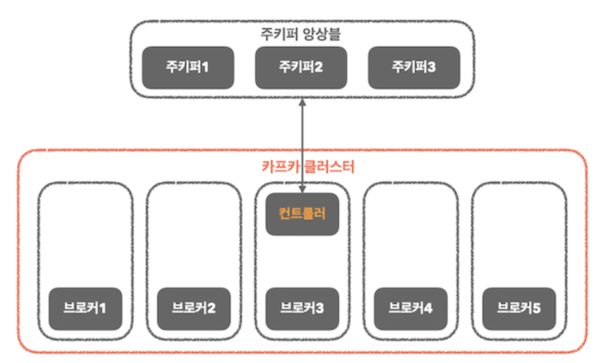
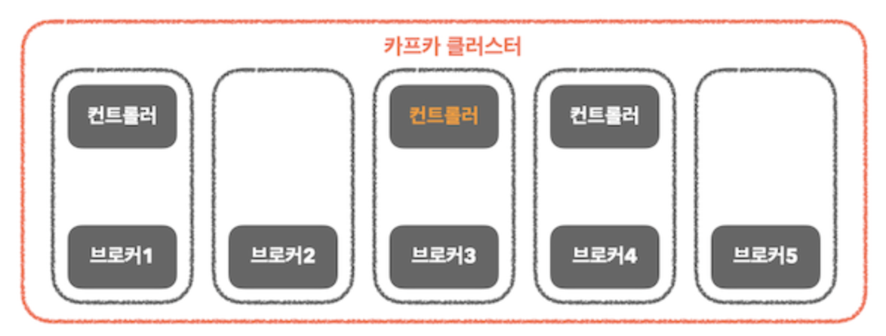
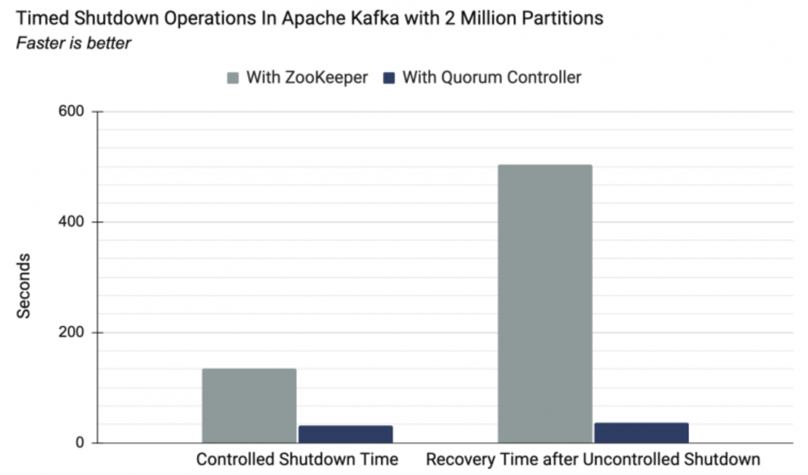

## 클러스터 멤버십

- 카프카는 클러스터의 멤버인 브로커들의 목록을 유지하기 위해 `아파치 주키퍼`를 사용.
- 브로커 프로세스는 시작될 때마다 주키퍼에 `Ephemeral 노드`의 형태로 ID 등록
	- 동일한 ID를 가진 다른 브로커를 시작하면 에러 발생
- 브로커와 주키퍼 간의 연결이 끊어지면, `Ephemeral 노드`는 자동으로 주키퍼에서 삭제됨
	- 브로커 목록을 지켜보고 있던 카프카 컴포넌트들은 브로커가 내려갔음을 알아차림
	- 브로커를 나타내는 `ZNode`도 삭제됨
		- 브로커의 ID는 다른 자료구조에 남음

---
## 컨트롤러

- 일반적인 카프카 브로커의 기능에 더해서 추가적으로 파티션 리더 선출
- 클러스터에서 가장 먼저 시작되는 브로커는 주키퍼의 `/controller`에 `Ephemeral 노드`를 생성함으로써 컨트롤러가 됨

## 복제

- 개별적인 노드에는 필연적으로 장애가 발생할 수밖에 없기 때문에, 카프카의 신뢰성과 지속성을 보장하기 위한 핵심적인 요소

### 레플리카 종류

- 리더 레플리카
	- 리더 역할
	- 모든 쓰기 요청은 리더 레플리카로 주어짐
	- 클라이언트는 리더 레플리카 또는 팔로워로부터 레코드 읽어올 수 있음
- 팔로워 레플리카
	- 모든 레플리카 중에서 리더 레플리카를 제외한 나머지
	- 팔로워는 클라이언트의 요청을 처리할 수 없음	
	- 리더 레플리카로 들어온 최근 메시지들을 복제하여 최신 상태 유지

## 요청 처리

- 카프카는 언제나 클라이언트가 연결을 시작하고 요청을 전송, 브로커는 요청을 처리하고 클라이언트로 응답을 보냄
	- 특정 클라이언트가 브로커로 전송한 모든 요청은 브로커가 받은 순서대로 처리
		- 카프카가 저장하는 메시지는 순서가 보장되며, 메시지 큐로도 활용될 수 있음

---
## 신뢰성 관련 브로커 설정

- 메시지 저장 신뢰성 관련된 카프카의 작동을 변경시키는 브로커의 설정 매개변수
	- **복제 팩터**
		- 복제 팩터가 N이면, 각 브로커가 N대의 서로 다른 브로커에 N개 복제된다는 것
		- 복제 팩터가 N이면 N-1개의 브로커가 중단되더라도 토픽의 데이터를 읽거나 쓸 수 있음
		- 복제 팩터가 클수록 `가용성`과 `신뢰성`은 늘어나고, 장애가 발생할 가능성은 줄어듦
			- N배의 디스크 공간이 더 필요하다는 의미이기도 함 (*trade-off*)
			- 저장소와 네트워크에 필요한 비용 또한 증가함
	- **언클린 리더 선출**
		- 브로커 단위에서만 가능
		- 리더가 작동 불능인데 인-싱크 레플리카가 없는 경우
			- 아웃-오브-싱크 레플리카가 새 리더가 될 수 없도록 하면, 예전 리더가 복구될 때까지 해당 파티션은 오프라인 상태가 됨 [**가용성 줄어듦**]
			- 아웃-오브-싱크 레플리카가 새 리더가 될 수 있도록 한다면, 새 리더가 동기화를 못 한 사이 이전 리더에 쓰여졌던 모든 메시지들이 유실, 컨슈머 입장에서의 일관성 역시 깨짐 [**일관성 줄어듦**]
	- **최소 인-싱크 레플리카**
		- 커밋된 데이터를 N개 이상의 레플리카에 쓰고자 한다면, 인-싱크 레플리카의 최소값을 더 높게 잡아야 함

## 신뢰성 있는 시스템에서 프로듀서 사용하기

- 신뢰성 요구 조건에 맞는 올바른 `acks` 설정을 사용해야 함
	- acks
		- *0*
			- 프로듀서는 브로커로부터 아무런 응답을 기다리지 않음
			- 메시지를 전송하자마자 전송이 완료된 것으로 간주
		- *1*
			- 리더 레플리카가 메시지를 성공적으로 기록했을 때, 브로커가 프로듀서에게 응답 보냄
		- *all*
			- 리더 레플리카를 포함하여 모든 인-싱크 레플리카에 성공적으로 기록될 때까지 프로듀서가 응답을 기다림 
- 설정과 코드 모두에서 에러를 올바르게 처리해야 함

## 신뢰성 있는 시스템에서 컨슈머 사용하기

- 메시지 처리 먼저, 오프셋 커밋은 나중에
- 커밋 빈도는 성능과 크래시 발생시 중복 개수 사이의 trade-off
- 정확한 시점에 정확한 오프셋 커밋하기
- 리밸런스
- 컨슈머는 재시도를 해야 할 수도 있음
- 컨슈머가 상태를 유지해야 할 수도 있음

---

## 멱등적 프로듀서

> **멱등적 [idempotent]** : 동일한 작업을 여러 번 실행해도 한 번 실행한 것과 결과가 같은 서비스

> 파티션 리더가 프로듀서로부터 레코드를 받아 팔로워들에게 성공적으로 복제했지만, 프로듀서에게 응답을 보내기 전에 파티션 리더가 있는 브로커에 충돌이 발생한 경우, 프로듀서는 메시지를 재전송하게 됨
> -> 재전송된 메시지가 새 리더에 도착하여, 중복이 발생

카프카의 멱등적 프로듀서 기능은 자동으로 이러한 중복을 탐지하고 처리함

### 멱등적 프로듀서 작동 원리

- 멱등적 프로듀서 기능을 켜면 모든 메시지는 고유한 `프로듀서 ID`와 `시퀀스 넘버`를 가짐
	- 대상 토픽 및 파티션과 이 두 값을 합치면 각 메시지의 고유한 식별자
	- 각 브로커는 해당 브로커에 할당된모든 파티션들에 쓰여진 마지막 5개 메시지들을 추적하기 위해 이 교유 식별자 사용
- 브로커가 받은 적이 있는 메시지를 받게 될 경우, 적절한 에러를 발생시킴으로써 중복 메시지를 거부

### 멱등적 프로듀서의 한계

- 카프카의 멱등적 프로듀서는 프로듀서의 내부 로직으로 인한 재시도가 발생할 경우 생기는 중복만을 방지
	- 재시도 할 때 중복을 피할 수 있는 가장 쉬운 방법
- 여러 개의 인스턴스를 띄우거나 하나의 인스턴스에서 여러 개의 프로듀서를 띄우는 애플리케이션들에서, 프로듀서들 중 두 개가 동일한 메시지를 전송하려 시도할 경우, 멱등적 프로듀서는 중복을 잡아내지 못함

## 트랜잭션

### 트랜잭션이 해결하는 문제

- 애플리케이션 충돌으로 인한 재처리
- 좀비 애플리케이션에 의해 발생하는 재처리

### 트랜잭션은 어떻게 '정확히 한 번'을 보장하는가

- 읽어 온 원본 메시지의 오프셋이 커밋되고 결과가 성공적으로 쓰여지거나, 둘 다 안 일어나거나 하는 부분적인 결과가 발생하지 않을 것이라는 보장이 필요
	- 카프카 트랜잭션은 `원자적 다수 파티션 쓰기`기능을 도입
		- 결과는 출력 토픽에, 오프셋은 `_consumer_offsets` 토픽에 쓰여짐
		- 트랜잭션을 시작해서 양쪽에 메시지를 쓰고, 둘 다 성공해서 커밋하거나 재시도를 위해 중단할 수 있다면, '정확히 한 번'의미 구조가 알아서 해주게 됨

#### 트랜잭션적 프로듀서

- 트랜잭션을 사용해서 원자적 다수 파티션 쓰기를 수행하기 위해서는 사용해야 함
- 일반 프로듀서와의 차이
	- `transactional.id` 설정이 잡혀 있고 `initTransactions()`를 호출해서 초기화해주는 것

---
## KRaft

> - 카프카의 새로운 래프트 기반 컨트롤러 [주피터 기반 컨트롤러로부터 탈피]
> - 3.3 버전부터 프로덕션 환경에서 사용 가능한 기능이 됨
> - 4.0 버전부터 `KRaft only`

 - KRaft로의 교체 이유
	- 컨트롤러가 주키퍼에 메타데이터를 쓰는 작업은 동기적
	 - 브로커 메시지를 보내는 작업은 비동기적
	 - 주키퍼로부터 업데이트를 받는 과정은 비동기적
	 	 ***브로커, 컨트롤러, 주키퍼 간에 메타데이터 불일치가 발생할 수도 있음***
	 - 컨트롤러가 재시작될 때마다 주키퍼로부터 모든 브로커와 파티션에 대한 메타데이터를 읽어와야 함
		 ***병목. 파티션과 브로커의 수가 증가함에 따라 컨트롤러 재시작은 더더욱 느려짐***	 
	 - 두 개의 분산 시스템 (주키퍼, 카프카)에 대한 학습 부담

### 주키퍼 모드

- 주키퍼 앙상블과 카프카 클러스터가 존재
- 카프카 클러스터 중 하나의 브로커가 컨트롤러 역할
	- 컨트롤러 선출은 주키퍼의 임시 노드를 통해 이루어짐
		- 가장 먼저 연결에 성공한 브로커가 컨트롤러
	- 파티션의 리더 선출
	- 리더 선출 정보를 브로커에게 전파, 주키퍼에 리더 정보 기록

### KRaft 모드

- 주키퍼와의 의존성 제거, 카프카 단일 애플리케이션 내에서 메타데이터 관리 기능 수행
	- 독립적인 구조
- 컨트롤러가 3개로 늘어나고, 하나의 컨트롤러가 액티브 컨트롤러 (리더 역할)
	- Write 역할 수행
- 주키퍼가 하던 메타 데이터 관리는 카프카 내부의 별도 토픽을 이용해 관리

### 성능 개선

- 파티션 리더 선출의 최적화
	- KRaft 모드의 컨트롤러는 메모리 내에 메타데이터 캐시를 유지
		- 액티브 컨트롤러 장애 시, 메타데이터 복제에 소요되는 시간이 줄어 효율적
	- 주키퍼와의 의존성을 제거해 내부적으로 메타데이터의 동기화와 관리과정을 개선

> 주키퍼 모드와 KRaft 모드 간 복구 소요시간

