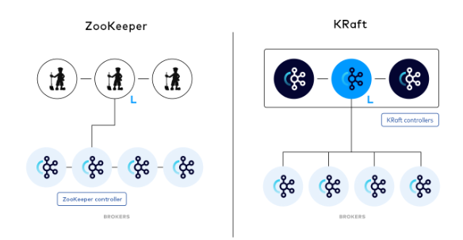

# 6장 카프카 내부 매커니즘

## 6.1 클러스터 멤버십
각 브로커는 고유한 ID 값을 가진다. 브로커 프로세스는 시작될 때마다 주키퍼에 Ephemeral 노드의 형태로 ID를 등록한다.

따라서 동일한 ID를 가지는 브로커가 클러스터에 등록을 요청할 시 중복으로 인해 에러가 발생한다. 브로커가 다운되면 자동으로 Ephemeral 노드는 삭제되며 이를 지켜보고 있던 카프카 컴포넌트들이 브로커가 내려갔음을 알게된다.

## 6.2 컨트롤러
컨트롤러 브로커는 클러스터에서 가장 먼저 시작되는 브로커가 맡게 되며, 파티션 리더를 선출하는 일을 추가로 담당하게 된다.

컨트롤러 브로커가 죽을 경우, 주키퍼의 /controller에 저장된 Ephemeral 노드를 삭제하고, 이를 와치하고 있는 다른 브로커들이 컨트롤러가 죽었음을 알게된다.

이후, 컨트롤러 노드를 생성하기 위해 다른 브로커들이 요청하고 가장 먼저 요청한 브로커가 다음 컨트롤러가 된다. 컨트롤러가 새로 선출될 때마다 epoch 값이 증가하여 세대를 구분한다.

### 6.2.1 Kraft: 카프카의 새로운 래프트 기반 컨트롤러
카프카 진영에서는 다음과 같은 이유로 주키퍼에서 벗어나 Kraft 모드를 지원하기 시작했다.
- 컨트롤러가 주키퍼에 메타데이터를 쓰는 작업은 동기적으로 이루어지지만, 다른 작업들이 비동기적으로 이루어지는 것이 있어 메타데이터간 불일치가 발생할 수 있다.
- 컨트롤러가 재시작될 때마다 모든 브로커와 파티션에 대한 메타데이터를 읽어와야 한다. 이는 파티션, 브로커 수 증가에 따라 병목 현상을 일으킬 수 있다.
- 메타데이터 소유권 관련된 내부 아키텍처가 좋지 못하다. 책임 분리가 명확하지 않다.
- 주키퍼 자체가 분산 시스템이기 때문에 카프카를 쓰려면 주키퍼까지 추가적인 지식이 필요하다.

바뀐 구조를 보면 다음과 같다.

## 6.3 복제
- 리더 레플리카
  - 쓰기 요청을 받는 레플리카
- 팔로워 레플리카
  - 읽기만 가능한 레플리카

> **참고**  
> 기본 값은 리더 파티션에서 읽는 것이다. 그러나 설정을 통해 가장 가까이 있는 인-싱크 레플리카로부터 읽게 함으로써 네트워크 비용을 줄일 수 있다.

레플리카의 경우 동기화를 잘 유지하고 있는 인-싱크 레플리카만 리더 레플리카로 선출될 수 있다.

각 파티션은 **선호 리더**를 갖는데, 선호리더란 토픽이 처음 생성되었을 때 리더 레플리카였던 레플리카를 가리킨다. 이러한 선호 리더를 실제 리더로 만듦으로써 부하를 균등하게 배분할 수 있다.

## 6.4 요청
1. 브로커는 연결을 받는 각 포트별로 억셉터 스레드를 하나씩 실행시킨다.
2. 이를 프로세서 스레드로 넘겨 요청 큐에 넣고, 응답 큐에서는 응답을 가져다 클라에 전달한다.
3. 요청 큐에 있는 요청은 I/O 스레드가 가져다 실행하여 응답 큐에 집어 넣는다.

### 어드민 요청
토픽 생성, 삭제 등의 메타데이터 작업을 수행중인 어드민 클라이언트가 보내는 요청.

이러한 요청은 아무 브로커에나 보내면 되는데, 이유는 각 브로커들이 메타데이터에 대한 정보들을 모두 캐시하고 있어, 어떤 브로커에 파티션 리더가 존재하는지 등의 정보를 내려줄 수 있다.

이러한 메타데이터 정보는 카프카 클라이언트 측에서도 캐시하고 있어, 기본적으로 요청을 보낼 때 캐시된 데이터를 이용하여 리더역할을 하는 브로커에 직접 요청을 보낸다.

주기적으로 메타데이터 요청을 보내 최신 메타데이터 정보를 캐시한다.

### 6.4.2 읽기 요청
컨슈머가 읽을 수 있는 메시지는 파티션 리더에 존재하는 모든 메세지가 아닌, 인-싱크 레플리카에 복제된 메시지들이다. 

### 6.5.1 계층 저장소
카프카에서는 저장소를 두 가지로 나눈다. 로컬/ 원격 저장소
로컬 저장소는 브로커의 로컬 디스크를 말하며 지연이 짧지만, 비싸다.

### 6.5.2 파티션 할당
라운드 로빈으로 돌아가며 각 브로커들에게 공평하게 할당되도록 노력한다.

랙이 지정돼있을 경우 랙 하나에 같은 레플리카가 들어가지 않도록 한다.

### 6.5.3 파일 관리
하나의 파티션을 여러 개의 세그먼트로 분할한다. 현재 쓰고 있는 세그먼트를 액티브 세그먼트라고 하며, 기본적으로 각 세그먼트는 1GB의 데이터 혹은 최근 1주일치의 데이터 중 적은 쪽만큼을 저장한다.

### 6.5.4 파일 형식
카프카 메시지는 **사용자 페이로드와 시스템 헤더** 두 부분으로 이루어진다. 사용자 페이로드에 키밸류값, 헤더 모음이 포함된다.

메시지 배치 헤더에는 배치에 관한 다양한 데이터들이 포함되며, 각각의 레코드 또한, 레코드 크기, 속성, 타임스탬프 등 다양한 데이터들이 포함되어 있다.

### 6.5.5 인덱스
오프셋이 주어지면 브로커가 세그먼트에 접근하여 메시지를 읽어와야 하기 때문에 이 오프셋과 세그먼트 파일 및 그 안에서의 위치를 매핑한 정보가 인덱스이다.

이와 유사하게 타임스탬프와 메시지 오프셋을 매핑하는 인덱스도 있다.
인덱스 또한 세그먼트 단위로 분할된다.

