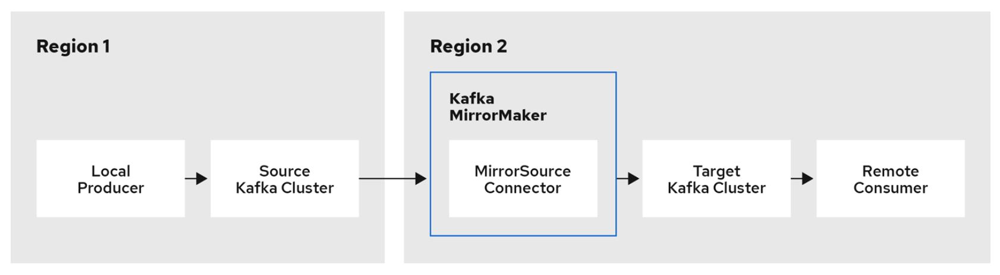

# 9. 데이터 파이프라인 구축하기

카프카의 주 목적 중 하나는 데이터 파이프라인의 구축이 있다. 그 예로는 MongoDB의 데이터를 카프카로 전송하거나 엘라스틱 서치에 넣는 일련의 과정이 있다.

## 데이터 파이프라인 구축 시 고려사항

### 적시성

실시간성, 배치성 등을 고려할 수 있다.

### 신뢰성

다양한 형태의 신뢰성을 고려해야 한다. **무조건 한번**을 제공하거나, 데이터 유실이 허용할 수도 있는 다양한 형태의 파이프라인을 구축할 수 있다.

### 처리율

갑작스레 증가하는 트래픽에 적응할 수 있는 처리율을 가져야 한다.

### 데이터 형식

데이터 파이프라인에서 데이터의 형식 및 자료형에 따라 요구 사항이 ㅏ르기에 이를 고려해야 한다.

### 데이터 형식의 변환

> ETL 방식 : 추출 - 변환 - 적재
> ELT 방식 : 추출 - 적재 - 변환

위와 가튼 방식의 데이터 파이프라인이 존재할 수 있는데 이런 다른 상황에서는 데이터 형식의 변환이 필수적으로 필요하다.

### 보안

메시지 암호화, 파이프라인 수정 권한, 카프카 접근 권한 등에 대한 여러 보안 문제가 존재할 수 있따.

### 장애 처리

카프카에서 장애가 발생하는 경우를 고려해 에러를 복구할 수 있어야 한다.

## 카프카 커낵트 VS 프로듀서/컨슈머

카프카에 데이터를 쓰거나 읽을 때는 전통적인 프로듀서/컨슈머를 사용할 수 있지만 커넥트 API와 커넥터를 사용하는 방법 또한 존재한다.

### 프로듀서/컨슈머

카프카 클라이언트를 활용하며 어플리케이션의 코드를 직접 커스텀하여 사용할 수 있다는 장점이 존재한다.

## 카프카 커넥트

카프카를 직접 코드나 API를 작성하지 않고, 변경할 수 없는 데이터 저장소에 연결시킬 때 사용한다. 이를 활용하여 외부 데이터 저장소의 데이터를 카프카로 가져오기도 하고 저장된 데이터를 외부 저장소로 내보낼 수도 있다.

이러한 카프카 커넥트는 다른 데이터 저장소와 카프카간의 확장성과 신뢰성을 가지면서 데이터를 주고받을 수 있는 수단을 제공한다.

> 직접 커넥트 API를 통해 제작하는 방법 또한 p.249에 존재한다.

# 10. 클러스터간 데이터 미러링하기

실제 운영 계층에서는 단일이 아닌 하나 이상의 클러스터들로 구성되어 있는 카프카 아키텍처를 사용할 수 있어야 한다.

#### 미러링

카프카 내부 노드간의 데이터 교환을 **복제**라고 부르며 카프카 클러스터간의 복제를 **미러링**이라고 한다.

## 클러스터간 미러링 활용 에제

- 지역 및 중앙 클러스터
- 고가용성과 재해 복구
- 규제 : 나라별 다른 규제가 존재할 수 있기에 사용
- 클라우드 마이그레이션
- IOT(엣지 클러스터)로부터의 데이터 집적

## 다중 클러스터 아키텍처

### 데이터센터간 통신의 현실적인 문제
- 높은 지연
- 제한된 대역폭
- 비용

위의 무넺들을 해결하기 위해 논의할 아키텍처 대부분은 다음의 원칙이 존쟇나다.

- 하나의 데이터센터당 한 개 이상의 킅러스터를 설치한다.
- 각각의 데이터센터 간에 각각의 이벤트를 정확히 한 번씩 보게한다.
- 원격 데이터 센터에 쓰는 것보다 원격 데이터센터에서 읽어오는 것이 낫다.

또한, 다음의 아키텍처들이 존재한다.

### 허브-앤-스포크 아니텍처

여러개의 로컬 카프카 클러스터와 한 개의 중앙 카프카 클러스터가 있는 상황을 상정한 것이다.

이 아키텍처의 주된 장점은 다음과 같다.
- 항상 로컬 데이터센터에서 데이터가 생성되고, 각각의 데이터센터에 저장된 이벤트가 중앙 데이터센터로 단 한 번만 미러링된다.

주된 단점은 다음과 같다.
- 위의 장점인 단순성은 지역 데이터센터에 있는 애플리케이션이 다른 데이터센터에 있는 데이터를 사용할 수 없다는 것이다.

### 액티브-액티브 아키텍처

2개 이상의 데이터센터가 전체 데이터의 일부 혹은 전체를 공유하면서, 모두 읽기와 쓰기를 수행할 수 있어야할 경우 사용된다.

주된 장점은 다음과 같다.
- 인근 데이터센터에서 사용자들의 요청을 처리할수 있따.
- 데이터 중복, 회복탄력성 : 장애가 발생하여도 다른 데이터 센터에서 사용자들의 요청을 처리할 수 있따.

주된 단점은 다음과 같다.
- 여러 위치에서 데이터를 비동기적으로 읽거나 변경하는 경우 충돌의 존재
- 두 데이터 센터의 일관성 유지의 어려움

### 액티브- 스탠바이 아키텍처

다중 클러스터에 대한 유일한 요구 조건이 재해 대비인 경우 사용한다.. 하나는 프로덕션으로 하나는 장애 복구용으로 배치하는 것이다. 비즈니스적 의도 보다는 법적 요구 조건에 가깝다.

장점은 다음과 같다.
- 간단한 설치의 가능
- 대부분의 활용 사례에 사용 가능
- 데이터 접근, 충돌 처리, 기타 복잡한 아키텍처 문제 부담 감소

### 스트레치 클러스터

데이터센터 전체에 문제가 발생했을 경우 카프카 클러스터에 ㅂ장애 발생을 방지하기 위한 것이다.

## 아파치 카프카의 미러메이커

두 데이터센터 간의 데이터 미러링을 위한 툴

# 11. 보안

카프카는 의료 기록 관리, 온라인 결제 등 많은 사례에 사용될 수 있는데 이러한 사례에서 보안적인 요소는 필수적이다.

## 보안 설정 적용

카프카는 데이터의 기밀성, 진실설, 가용성을 보장하기 위한 보안 절차를 사용한다.

- 인증 : 사용자가 누구인지 식별
- 인가 : 누가 무엇을 사용할지 결정
- 암호화 : 위조로부터의 데이터 보호
- 감사 : 사용자가 무엇을 했고 조절하려하는지 추적
- 쿼터 : 자원을 얼마나 사용할지 조절

### 안전한 카프카 클러스터의 특징

- 클라이언트 진정성 : 클라이언트가 카프카 브로커와 연결을 맺을 때, 인증 기능과 함께 SSL을 사용하는 리스너는 해당 연결이 클라이언트와의 연결인지를 검증할 수 있어야 한다.
- 서버 진정성 
- 기밀성
- 무결성
- 접근 제어
- 가용성
- 감사 가능성

## 보안 프로토콜

인증과 전송되는 데이터의 암호화 수준을 결정하는 보안 프로토콜은 카프카에서 총 4개의 보안 프로토콜을 지원한다.

- PLAINTEXT
- SSL
- SASL_PLAINTEXT
- SASL_SSL

위의 프로토콜들은 TLS, SASL라는 2개의 표준기술을 이용한 것이다.

