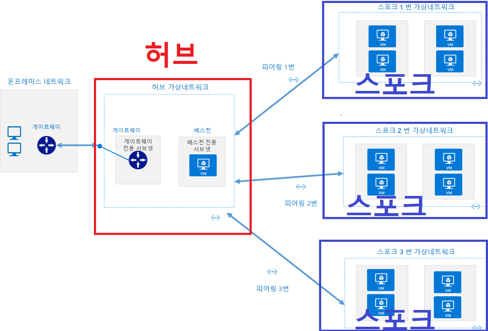
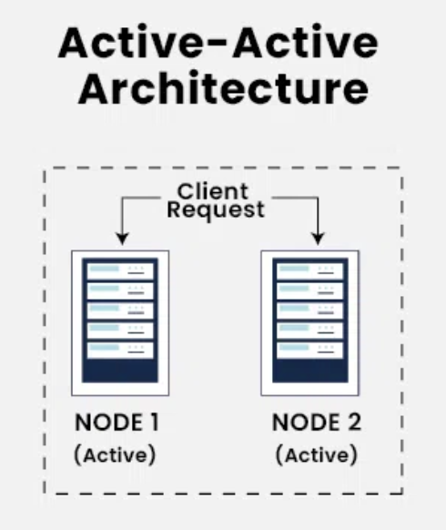
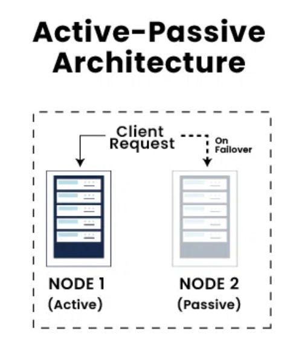

# 10장 클러스터간 데이터 미러링하기

## 10.1 클러스터간 미러링 활용 사례
- 지역 및 중앙 클러스터
- 고가용성과 재해복구
- 규제
- 클라우드 마이그레이션
- 엣지 클러스터로부터의 데이터 집적

클러스터간 미러링이 필요한 예시로는 다음이 있을 수 있다.

### 10.2.1 데이터센터간 통신의 현실적 문제들
- 높은 지연
- 제한된 대역폭
- 더 높은 비용

### 10.2.2 허브-앤-스포크 아키텍처
여러 개의 로컬 카프카 클러스터와 한 개의 중앙 카프카 클러스터가 있는 상황

이 아키텍처는 여러 개의 데이터센터에서 데이터가 생성되지만, 일부 컨슈머는 전체 데이터를 사용해야 하는 경우에 유리하다.

이 경우 지역적인 데이터만 필요하다면 해당 지역의 데이터 센터에 애플리케이션을 두고 전체 데이터가 필요하다면 허브에 애플리케이션을 두면 된다. 따라서 배포, 설정, 모니터링이 간편하다는 장점이 있다.

### 10.2.3 액티브-액티브 아키텍처

2개 이상의 데이터센터가 전체 데이터의 일부 혹은 전체를 공유하면서, 각 데이터센터가 모두 읽기와 쓰기를 수행할 수 있어야 할 경우 사용

이 아키텍처는 데이터 사용에 대한 제한이 없기 때문에 성능적인 이점을 얻을 수 있으며, 데이터 중복과 회복 탄력성 또한 높다. 모든 데이터 센터가 모든 기능을 동일하게 가지기 때문이다.

단점은, 데이터를 여러 위치에서 비동기적으로 읽거나 변경할 경우 발생하는 충돌을 피하는 것이 어렵다는 점이다. 즉 데이터 일관성을 유지하기 어렵다.

### 10.2.4 액티브-스탠바이 아키텍처

액티브-액티브와 비슷하지만, 하나는 재해 상황에 대비하여 비활성화된 데이터 센터로 주로 사용하는 데이터 센터 마비 시 비활성화된 데이터센터를 활성화 시켜 대응하는 구조

### 장애 복구 이후 애플리케이션의 시작 오프셋
장애 이후 다시 컨슈머에서 메시지를 읽기 시작할 오프셋을 결정하는 것은 어려운 일이다. 그 방법에 대해 하나씩 알아보자.
#### 자동 오프셋 재설정
카프카 컨슈머에 설정된 값에 따라 파티션 맨 앞부터 읽을 지 맨 끝부터 읽을 지 정하여 읽는 방식

#### 오프셋 토픽 복제
다양한 원인으로 인해 오프셋 토픽을 복제한다고 해서 중복 없이 완벽하게 돌아갈 수는 없다.

1. 주 클러스터의 오프셋과 DR 클러스터의 오프셋이 일치한다는 보장이 없다.
2. 중간에 프로듀서 재시도로 인해 오프셋이 달라질 수 있다.
3. 주 클러스터와 DR 클러스터 사이에 랙이 존재한다는 것 그리고 현재 미러링 솔루션이 트랜잭션 기능을 지원하지 않는다는 사실 때문에, 커밋한 오프셋이 해당 레코드보다 늦게 도착할 수 있다.

#### 시간 기반 장애 복구
카프카 0.10.0 버전 이후부터는 메시지에 타임스탬프가 표시된다. 따라서 해당 타임스탬프를 이용하여 장애가 난 시간을 알 수 있다면 해당 시간과 근접한 시간에 커밋된 오프셋을 기준으로 할 수도 있다.

#### 장애 복구가 끝난 후
장애 복구가 끝난 후에도 고려해야할 문제가 있다.
- 어디서부터 미러링을 다시 시작해야 하는가?
- 이전 주 클러스터가 DR 클러스터가 가지고 있지 않은 이벤트를 갖고 있을 가능성도 있다.

따라서 일관성과 순서 보장이 극도로 중요한 상황에서는 주 클러스터에 저장된 데이터와 커밋된 오프셋을 완전히 삭제한 뒤 새것이 된 DR 클러스터로 미러링을 시작하는 것도 방법이다.

### 10.2.5 스트레치 클러스터
기존의 다중 클러스터와는 다르게 하나의 클러스터를 여러 개의 데이터 센터에 나누어 배치하는 방식

## 10.3 아파치 카프카의 미러메이커
카프카의 미러메이커는 카프카 커넥트 프레임워크를 사용한다.
