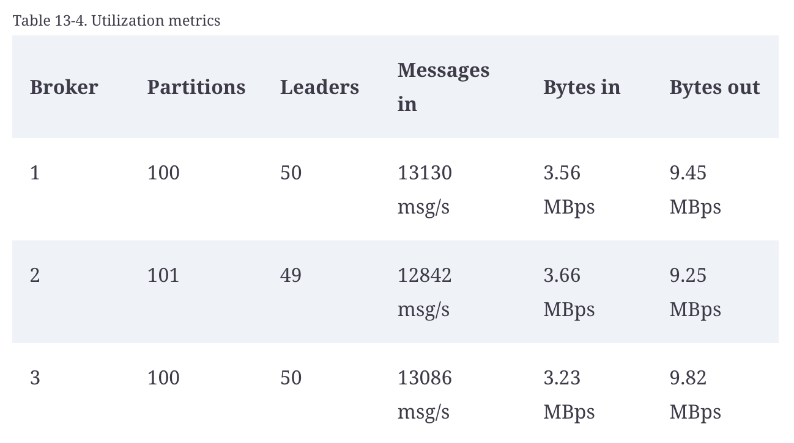
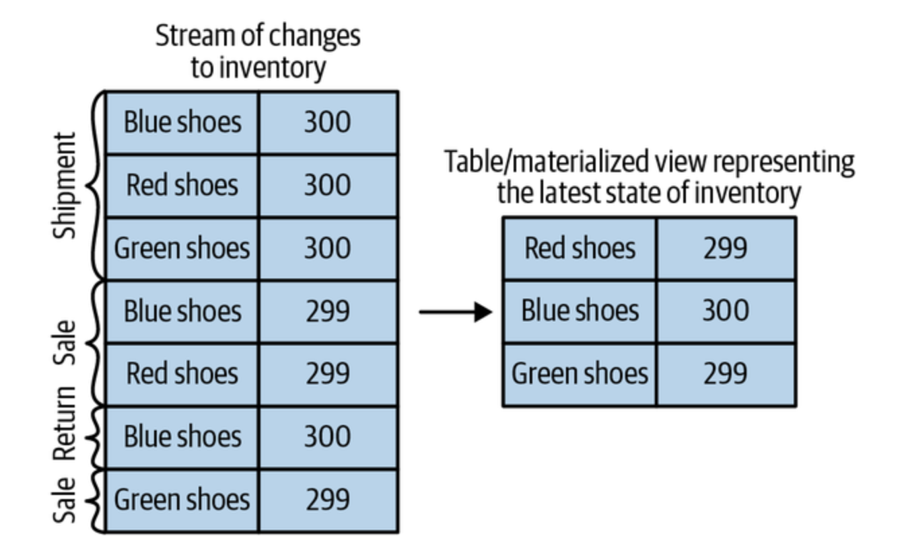
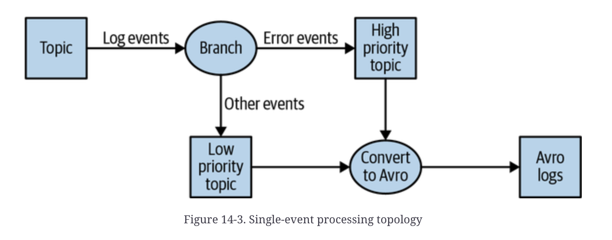
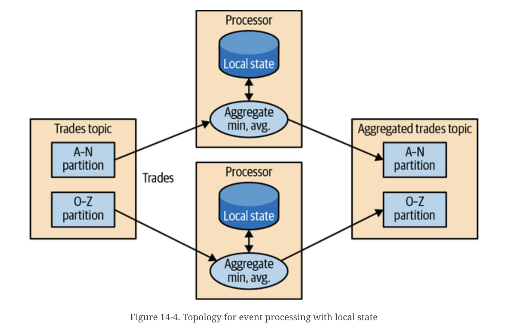
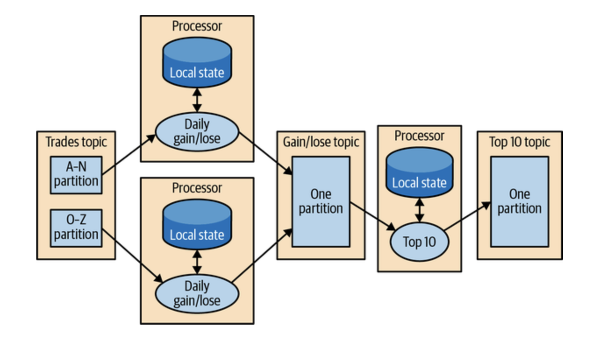
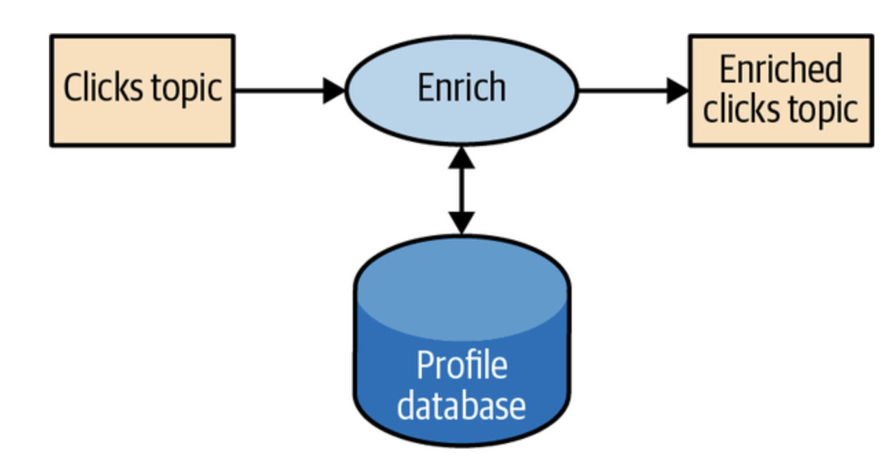
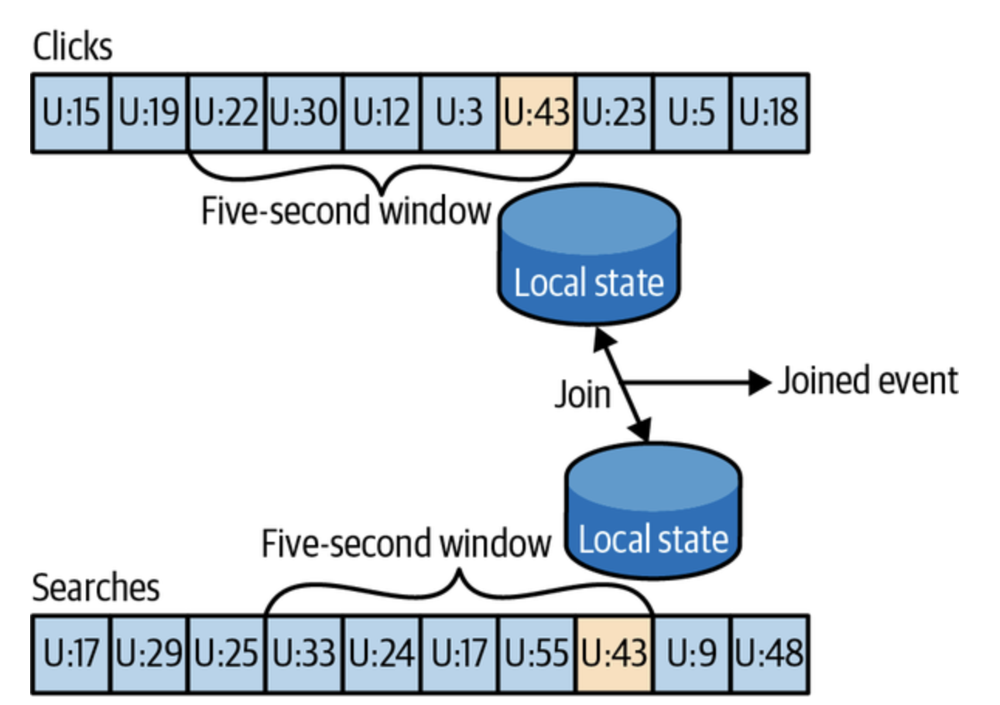
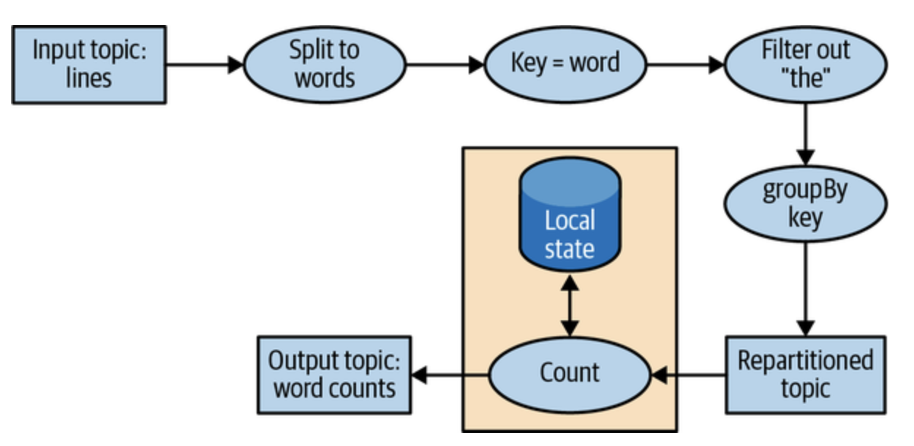
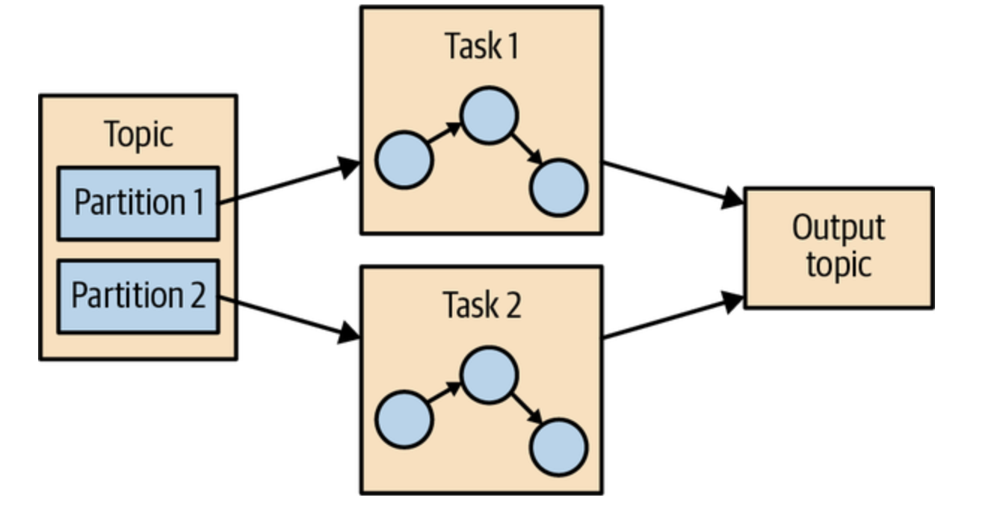
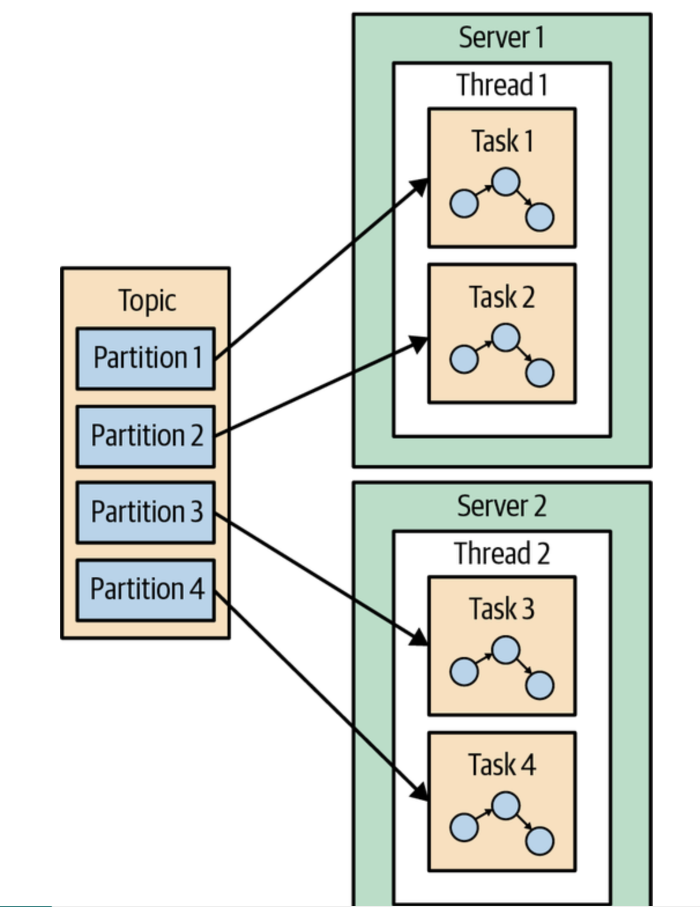

# 카프카 운영하기

카프카를 운영하기 위해서는 토픽이나 설정 등을 변경하기 위한 추가적인 툴들이 필요하다. 기본적인 툴들은 자바 클래스로 제공되며 이 외에도 코어 프로젝트 바깥에 개발된 고급 툴들 또한 존재한다.

## 토픽 작업

사용가능한 툴은 다음이 존재한다.
- `kafka-topics.sh` : 토픽 생성, 변경, 삭제 등의 기능
- `kafka-configs.sh` : 설정에 대한 변경

### 새 토픽 생성

`--create` 명령어를 통해 생성

#### 인수
- `--topic` : 생성하려는 토픽의 이름
- `--replications-factor` : 클러스ㅓ 내부에서 유지되어야 할 레플리카의 개수
- `partitions` : 토픽에서 생성할 파티션의 수

파티션 각각이 2개의 레플리카를 가지는 8개의 파티션으로 이루어진 my-topic 생성 코드
<pre><code>
bin/kafka-topics.sh --bootstrap-server localhost:9002 -- create \
--topic my-topic --replication-factor 2 --partitions 8
</code></pre>

### 토픽 목록 조회

`--list` 명령어를 통해 모든 토픽을 조회한다.

<pre><code>
bin/kafka-topics.sh --bootstrap-server localhost:9002 --list

__consumer_offsets
my-topic
other-topic
</code></pre>

> 내부 토픽인 __consumer_offsets를 보지 않으러면 --exclude-internal을 통해 __로 시작하는 토픽들을 제외한다.

### 토픽 상세 조회

토픽의 상세 정보를 조회하는 것으로 파티션 수, 재정의된 토픽 설정, 파티션별 레플리카 할당 등을 출력한다.

`--describe` 명령어를 통해 출력한다.

자주 쓰일 옵션은 다음과 같다.
- `--topcis-with-overrides` : 기본값을 재정의한 것이 있는 토픽들을 보여준다.
- `--exclude-internal` : __로 시작하는 내부 토픽들을 결과에서 제외한다.

### 파티션 추가

토픽의 파티션 수를 증가시켜야하는 경우가 존재한다. 실제로 단일 파티션에 쏟아지는 처리량을 줄여 토픽을 더 많은 브로커에 대해 수평적으로 확장시키는 경우 추가한다.

`--alter` 명령어를 통해 파티션의 수를 증가시킨다.

<pre><code>
--alter --topic my-topic --partitions 16
</code></pre>

### 파티션 삭제

토픽에서 파티션을 삭제하는 것은 저장된 데이터의 일부를 삭제한다는 의미인데 이는 일관적이지 않기에 파티션 개수를 줄일 수 없다.

줄여야한다면 토픽을 삭제하고 다시 만들거나 새로운 버전의 토픽을 생성하여 write 트래픽을 새 토픽으로 몰아주어야 한다.

### 토픽 삭제

- 클러스터 브로커의 delete.topic.enable 옵션이 true인 경우만 가능하다.
- 비동기 작업으로 즉시 일어나지 않는다.

`--delete`를 통해 토픽을 삭제한다.

<pre><code>
bin/kafka-topics.sh --bootstrap-server localhost:9002 --delete --topic my-topic
</code></pre>

## 컨슈머 그룹

서로 협업해서 여러 토픽 혹은 하나의 토픽에 속한 여러 파티션에서 데이터를 읽어오는 컨슈머의 집단으로 `kafka-consumer-groups.sh`툴을 통해 관리, 운영이 가능하다.

주로 컨슈머 그룹 목록 조회, 상세 내역 조회, 그룹 삭제, 오프섹 정보 초기화 등에 사용된다.

### 컨슈머 그룹 목록 및 상세 내역 조회

`--list`를 통해 컨슈머 목록들을 조회할 수 있다.
<pre><code>
bin/kafka-consuemer-groups.sh --bootstrap-server localhost:9092 --list

// result
console-consumer-95554
console-consumer-9581
my-consumer
</code></pre>

`--describe`를 통해 상세 내역을 조회할 수 있다.

<pre><code>
bin/kafka-consuemer-groups.sh --bootstrap-server localhost:9092 --describe --group my-consumer
</code></pre>

### 컨슈머 그룹 삭제

`--delete`를 통해 삭제한다. 단, 컨슈머 그룹에 활동중인 멤버가 하나도 없어야 한다.

### 오프셋 관리

저장된 오프셋을 가져오거나 새로운 오프셋을 저장하는 것 또한 가능하다. 해당 경우는 메시지를 다시 읽어와야 하는 경우 혹은 문제가 있는 메시지를 건너뛰기 위해 오프셋을 리셋하는 경우 유용하다.

## 동적 설정 변경

클러스터를 끄거나 재설치할 필요 없이 동적으로 바꾸기 위한 설정은 `kafka-configs.sh` 툴을 통해 주로 사용된다.

실제 동적으로 변경이 가능한 설정의 범주는 다음이 존재한다.
- 토픽
- 브로커
- 사용자
- 클라이언트

## 쓰기작업과 읽기 작업

카프카 사용 시 애플리케이션이 제대로 돌아가는지 확인하기 위해 수동으로 메시지 write 및 샘플 메시지 read의 과정이 필요히다.

이를 위한 유틸리티로 `kafka-console-consumer.sh`, `kafka-console-producer.sh`가 제공된다.

### 콘솔 프로듀서

해당 툴을 통해 카프카 토픽에 메시지를 써넣을 수 있다.

다음 두가지 방식을 이용할 수 있다.

- 프로듀서 설정 옵션
- 읽기 옵션

### 콘솔 컨슈머

해당 툴을 통해 카프카 클러스터 안의 1개 이상의 토픽에 대해 메시지를 읽어올 수 있다.

- 컨슈머 설정 옵션 사용
- 메시지 포매터 옵션
- 오프셋 토픽 읽기 : 특정 그룹이 오프셋을 커밋하는지의 여부

## 파티션 관리

기본적으로 탑재되는 유틸리티로 두 가지가 존재한다.
- 리더 레플리카를 다시 선출하기 위한 툴
- 파티션을 브로커에 할당해주는 툴

해당 두 툴을 통해 카프카 클러스터 안의 브로커 간 메시지 트래픽 균형을 직접 맞춰 주는 경우 사용한다.

- 리더 레플리카의 선출 : 전체 브로커에 걸쳐 균형있게 분산
- 파티션 레플리카 변경
- 로그 세그먼트 덤프 뜨기 : 토픽 내 특정 메시지가 오염되어 컨슈머가 처리할 수 없는 경우 메시지 내용물을 확인하기 위해 사용
- 레플리카 검증

## 안전하지 않은 작업

- 클러스터 컨트롤러의 이전
- 삭제될 토픽 제거
- 수동으로 토픽 제거

# 카프카 모니터링하기

아파치 카프카 애플리케이션은 실제로 다양한 측정값을 제공한다.

- 전체 트래픽
- 각 요청 타입별, 토픽별, 파티션별 상세 지표

## 기초적인 지표

- 애플리케이션 지표
- 로그
- 인프라스트럭처 지표
- 특수 클라이언트 지표
- 일반 클라이언트 지표

### 지표 수집시 고려사항

#### 경보 vs 디버깅

경보를 보내기 위한 지표는 문제에 대응하는 데 걸리는 시간이 길지 않은 경우에 유용하다. 해당 데이터는 운영자, 자동화 시스템에 사용될 수 있으므로 **모니터링**에 올바른 데이터라고 할 수 있다.

디버깅을 위한 지표는 시간 범위가 긴 경향(복잡한 문제)이 있어 몇 주가 지나도 사용이 가능한 경우에 유용하다. 해당 경우에는 꼭 모니터링 시스템에서 사용될 필요가 없다.

#### 자동화 vs 사람

누가 지표를 사용하느냐에 대한 고민

**자동화**를 목적으로 하는 경우
- 명확한 정보 : 컴퓨터가 사용하기에 명확해야 한다.
- 대량의 데이터 수집 : 대량의 메트릭을 사용하기에 세세한 부분까지 수집해야한다.

**사람**이 볼 목적으로 하는 경우
- 경보 목적 : 경보 피로감을 고려해 적절한 threshold를 정의해야 한다.

### 애플리케이션 상태 검사

애플리케이션 프로세스가 살아있는지 여부를 모니터링하기 위함이다.

- 외부 프로세스의 사용
- 카프카 브로커에서 들어와야 하는 지표가 들어오지 않는 경우 경보를 보낸다.

> 두 번재 방법은 브로커의 장애인지 모니터링 시스템 자체의 장애인지 확인하기 어렵다.

## 서비스 수준 목표

**서비스 수준 목표(SLO)**는 카프카와 같은 인프라스트럭처 서비스가 모니터링에 있어서 다루어야 할 중요한 부분이다.

### 용어

사용되는 용어로 다음이 존재한다.

- 서비스 수준 지표(SLI) : 서비스 신뢰성을 나타내는 지표로 HTTP STATUS CODE 요청 비율이 있다.
  - ex) 7일간 웹 서버에 대한 요청 중 99%가 2xx, 3xx 혹은 4xx의 응답을 받아야 한다.
- 서비스 수준 협약(SLA) : 서비스 제공자와 클라이언트 사이의 계약으로 측정 방식, 보고 방식, 지원 방식 등이 존재한다. 이는 여러 개의 SLO를 포함한다.
  - ex) 서비스 제공자가 SLO 수준의 자동을 제공하지 못할 경우 해당 기간에 모든 비용을 환불해준다.

### 좋은 서비스 위한 지표값

SLI 관련 지표 : 카프카 브로커 외부에서 수집되어야 한다. 인프라스트럭처 지표, 특수 클라이언트 지표, 일반 클라이언트 지표가 사용된다.
SLO 관한 지표 : 사용자의 만족 여부를 가리키는 것으로 주관적이다. 사용자 입장에서의 전체적인 경험이 중요하다.

> **SLI 관련 지표**
> - 지연
> - 질
> - 보안
> - 처리량

### 경보에 사용되는 SLO

SLO는 사용자 관점에서 문제를 기술한 것이기에 운영자 입장에서 가장 먼저 고려되어야한다. 그렇기에 SLO는 주된 경보로 설정되어야 한다.

## 카프카 브로커 지표

클러스터에서 발생하는 문제는 다음 세 가지로 나뉜다.

#### 단일 브로커에서 발생하는 문제
해당 문제는 다음 두 가지로 나뉜다.
- 고장난 저장 장치나 시스템 내의 다른 애플리케이션으로 인한 자원 제한으로 발생 : 서버에 대한 가용성 뿐만 아닌 저장 장치, 운영체제 사용률 등에 대한 모니터링이 핆요
- 카프카 클러스터 안에서 요청이 몰려 발생 : 해당 경우 크루즈 컨트롤과 같은 외부 툴을 이용해 클러스터의 균형을 유지하도록 권장

#### 과적재된 클러스터엥서 발생하는 문제
요청 핸들러 풀의 유휴 비율이 높다면, 브로커가 처리할 수 있는 트래픽의 한계의 문제로 볼 수 있다. 해당 경우 부하를 줄이든, 브로커 수를 늘리든지 해야한다.
#### 컨트롤러 문제
진단하기 어려운 문제 중 하나로 카프카 그 자체의 버그인 경우 또한 존재한다.

다음의 방식으로 나타나기도 한다.
- 브로커 메타데이터 동기화가 끊어지는 방향
- 레플리카가 오프라인
- 토픽 생성 같은 기능의 오작동

즉, 발생한 문제의 원인을 열심히 찾다가 이상한 일이라고 생각이 드는 경우 대부분 컨트롤러 문제에 해당한다.

해당하는 경우에는 활 성 컨트롤러 수나 컨트롤러 큐 크기와 같은 지표를 모니터링하여 파악한다.

### 불완전 복제 파티션

카프카 모니터링에 있어 가장 자주 쓰이는 지표 중 하나로 리더 레플리카를 잡고 있는 파티션 중 팔로워 레플리카가 따라오지 못하고 있는 파티션의 수를 의미한다.

#### 클러스터 수준의 문제

한두개의 브로커가 아닌 전체에서 나타나는 경우이다.

**문제 유형**
1. 파티션이 불균형하게 분포되어 있는 부하 불균형
2. 자원 고갈

1의 문제는 다음의 메트릭을 잘 확인해 보아야 한다.

- 파티션의 개수
- 리더 파티션 수
- 전 토픽에 있어서의 초당 들어오는 메시지
- 전 토픽에 있어서의 초당 들어오는 바이트
- 전 토픽에 있어서의 초당 나가는 바이트

실제로 균형이 잡힌 클러스터에서는 다음과 같이 브로커 전체에 고르게 나타나는 활용률을 볼 수 있다.

2의 문제는 주로 요청이 처리 가능한 용량을 넘어가는 경우로 CPU, 디스크 입출력, 네트워크 처리량 등의 병목 현상에서 발생할 수 있다. 이런 경우 다음과 같은 운영체제 수준 지표들을 모니터링하는 것이 좋다.

- CPU 사용률
- 인바운드 네트워크 속도
- 아웃바운드 네트워크 속도
- 평균 디스크 대기 시간
- 디스크 평균 활용률

위의 자원 중 하나라도 고갈되는 경우 불완전 복제 파티션이 발생한다.

#### 호스트 수준 문제

카프카 성능 문제가 클러스터 전체가 아닌 한두 개의 브로커에 국한 되어 있는 경우이다.

**문제 유형**
1. 하드웨어 장애
2. 네트워킹
3. 다른 프로세스와의 충돌
4. 로컬 구성의 차이

1번의 하드웨어 문제의 경우 가장 흔한 경우가 디스크 장애이다. 카프카는 메시지를 저장하기 위한 용도로 디스크를 사용하는데 이러한 프로듀서의 성능은 디스크에 쓴 내용을 커밋하는 속도에 직결된다. 즉, 디스크에서의 상태를 제대로 추적하지 못하고 느려진다면 이는 성능 저하의 큰 원인이 되는 것이다. 해당 경우 하드웨어에서 제공하는 인터페이스 또는 IPMI를 통해 하트웨어의 모니터링을 권장한다.

2번의 네트워크의 경우 하드웨어, 연결속도 및 듀플렉서 설정과 같은 설정의 문제로 인해 발생할 수 있다. 설정 문제의 경우 네트워크 버퍼 크기가 지나치게 작게 잡혀있거나 메모리 사용량이 큰 네트워크 연결이 많은 것 처럼 운영체제의 문제일 수도 있다. 이를 파악하기 위한 핵심 지표 중 하나는 **네트워크 인터페이스 에러 수**이다. 

3번의 경우 시스템에서 돌아가고 있는 다른 애플리케이션이 자원을 많이 사용하여 카프카에 부담을 가는지 확인해야한다. top과 같은 시스템 툴을 통해 어떤 프로세스가 CPU, Memory를 더 잡고 있는지 확인하는 것이 좋다.

이외의 경우에서 성능 저하의 문제 원인을 찾지 못하는 경우 시스템 설정의 문제일 수 있기에 이를 점검하는 것이 좋다. 이러한 설정을 일관적으로 유지하기 위해서 _Chef_, _Puppet_과 같은 설정 관리 시스템을 권장한다.

### 브로커 지표

클러스터에 속한 브로커에 대해 가치 있는 정보를 제공하는 것으로 모니터링 대시보드를 생성 시에 이 지표들을 포함해야한다.

- 활성 컨트롤러 수
- 컨트롤러 큐 크기
- 요청 핸들러 유휴 비율
- 전 토픽 바이트 인입
- 전 토픽 바이트 유출
- 전 토픽 메시지 인입
- 파티션 수
- 리더 수
- 오프라인 파티션
- 요청 지표

#### 활성 컨트롤러 수
특정 브로커가 현재 클러스터의 컨트롤러 역할을 맡고 있는지를 나타내는 것이다.

0 또는 1로 표현되며 1의 경우 현재 브로커가 컨트롤러인 것이다.

**컨트롤러 역할을 하는 브로커가 두 개인 경우**
- 파티션 이동과 같은 관리 작업이 제대로 수행되지 않는다.
- 종료되어야 할 컨트롤러의 스레드에서 문제가 생긴 것으로 1을 나타내는 모든 브로커를 재시작해야 한다.

**컨트롤러 브로커가 없는 경우**
- 토픽이나 파티션 생성 혹은 브로커 장애 발생과 같은 상태 변경에 제대로 대응할 수 없다.
- 컨트롤러 스레드 상태를 초기화하기 위해 모든 브로커를 재시작하는 것이 좋다.

#### 컨트롤러 큐 크기

현재 컨트롤러에서 브로커의 처리를 기다리고 있는 요청의 수를 의미한다.

순간적을 튈 수 있는 지표지만 높은 상태를 유지하는 것은 컨트롤러의 문제를 암시한다. 해당하는 경우 컨트롤러 브로커를 끔으로써 컨트롤러의 역할을 다른 브로커로 옮겨야 한다.

#### 요청 핸들러 유휴 비율

I/O 스레드로 불리며 이러한 스레드 푸은 디스크에 쓰거나 읽어 오는 클라이언트 요청 그 자체의 처리를 담당한다. 해당 부분에 부하가 걸릴수록 이 스레드 풀에는 막대한 영향을 미친다. 이를 나타내는 **요청 핸들러 유휴 비율**은 요청 핸들러가 작동 중이지 않은 시간 비율(%)을 가리킨다.

20%이하인 경우 잠재적인 문제가 있는 것이고 10%이하로 내려가는 경우 대개 성능 문제가 현재 진행되고 있음을 가리킨다.해당 경우 스레드 수가 충분하지 않기에 요청 핸들러 스레드의 수를 시스템 프로세서 수와 동일하게 설정해야한다.

또한, 카프카 0.10 이전에는 메시지 배치의 압축 해제, 유효성 검사, 오프셋 할당 등의 요청 별 쓸데 없는 작업을 수행하기에 스레드 사용률이 치솟기도 하였는데 이는 카프카 0.10이후부터 상대적인 오프셋 할당을 통해 어느정도 해소를 이루었다. 

즉, 이러한 문제를 해결하는 방법으로 **요청 핸들러 스레드의 수와 프로세서 수의 일치**, **카프카 0.10으로의 메시지 형식 변환**이 존재한다.

#### 전 토픽 바이트 인입

브로커가 프로듀서 클라이언트로부터 메시지 트래픽을 받는 수준에 대한 측정값으로 유용하다. 이는 주로 초당 바이트의 단위로 나타난다.

이 값을 통해 클러스터의 확장 시기, 트래픽의 증가에 따른 필요작업 결정, 파티션 재할당의 결정 등에 유용하다.

#### 전 토픽 바이트 유출

트래픽의 전체적인 성장세를 보여주는 지표로 컨슈머가 메시지를 읽는 속도를 의미한다. 카프카의 경우 다수의 컨슈머를 쉽게 처리하깅에 유출 속도는 쉽게 오를 수 있다. (실제 인입속도의 6배인 경우도 허다하다.)

#### 전 토픽 메시지 인입

메시지 크기와 무관하게 초당 들어오는 메시지 수를 보여준다. 이는 프로듀서 트래픽의 성장의 지표로 유용하고 이를 통해 브로커 간의 불균형을 볼 수 있다.

#### 파티션 수

파티션 전체의 수로 주로 변하지 앟는 값이다. 자동 토픽 생성 기능이 켜진 클러스터의 경우 해당 지표를 모니터링할 필요가 있다.

#### 리더 수
현재 리더를 맡고 있는 파티션의 개수를 보여주는 지표이다. 클러스터 안의 모든 브로커에 걸쳐 균등해야하고 정기적으로 확인해야하기에 경보를 걸어두는 것이 좋다.

#### 오프라인 파티션

클러스터 컨트롤러 역할을 맡고 있는 브로커에게만 제공되는 값으로 리더가 없는 파티션의 개수를 보여준다.
프로덕션 환경에서의 오프라인 파티션은 클라이언트에 메시지 유실의 문제를 야기하기에 즉시 해결해야 하는 문제이다.

> **리더가 없는 파티션의 이유**
> - 레플리카를 보유하고 있는 모든 브로커가 다운된 경우
> - 저장된 메시지 개수가 모자라 리더 역할을 맡을 수 있는 인-싱크 레플리카가 없는 경우

#### 요청 지표

실제 요청에 대해 다음의 지표들이 제공 된다.

- 전체 시간 : 요청이 수신되어 응답이 전송될 때까지 걸린 시간
- 요청 큐 시간 : 요청이 수신되어 처리가 시작되기 전 큐에서의 대기 시간
- 로컬 시간 : 파티션 리더가 요청을 처리하는데 걸리는 시간
- 스로틀 시간 : 클라이언트 쿼터 설정을 만족시키기 위해 응답을 내보내지 않고 붙잡은 시간
- 원격 시간 : 요청 처리가 완전히 끝나기 전 팔로워를 기다리는 시간
- 응답 큐 시간 : 요청자에게 응답이 리턴되기 전 큐에서 대기하는 시간
- 응답 전송 시간 : 응답을 보내는 데 소요된 시간

### 토픽과 파티션별 지표

모든 지표값을 수집하는 것은 불가능할 수 있지만 이러한 지표값을 통해 클라이언트에 연관된 특정한 문제를 디버깅하는 데에 크게 유용하다.

#### 토픽별 지표

사용자로 하여금 카프카 사용량을 확인하고 디버깅할 수 있어 유용하다.

다음의 지표들이 존재한다.

- 초당 바이트 인입
- 초당 바이트 유출
- 초당 실패한 읽기 요청 개수
- 초당 실패한 쓰기 요청 개수
- 초당 인입 메시지 개수
- 초당 읽기 요청 개수
- 초당 쓰기 요청 개수

#### 파티션별 지표

카프카를 각각의 클라이언트에 할당할 때 들어갈 자원의 양을 계산하는데 유용하다

다음의 지표들이 존재한다.
- 파티션 크기
- 로그 세그먼트 개수
- 로그 끝 오프셋
- 로그 시작 오프섹

### JVM 모니터링

브로커의 성능을 발목잡을 수 있깅 이를 확인해야 한다.

- 가비지 수집
- 자바 운영체제 모니터링

### 운영체제 모니터링

브로커뿐만 아닌 운영체제 자체의 지표 또한 수집할 필요가 있따.

- CPU 사용
- 메모리 사용
- 디스크 사용
- 디스크 I/O

## 클라이언트 모니터링

인스턴스를 생성하는 애플리케이션은 클라이언트에 국한된 지표를 같기에 다음 지표들을 잘 파악할 필요가 있다.

### 프로듀서 지표

- 프로듀서 종합지표 : 메시지 배치 크기에서 메모리 버퍼 활용까지의 모든 것을 제공
- 브로커별, 토픽별 지표 : 각 카프카 브로커로의 연결, 토픽에 대한 정보 제공

### 컨슈머 지표

- 읽기 매니저 지표 : 바이트, 요청, 레코드에 대한 지표를 가지며 경보설정에도 유용한 값을 가진다.
- 브로커별, 토픽별 지표 : 브로커 연결, 읽는 토픽에 대해 지표 제공
- 코디네이터 지표 : 컨슈머 그룹 관련된 작업, 자체적인 지표를 유지 관리하며 중요한 부분만 정기적으로 모니터링할 필요가 있다.

### 쿼터

카프카는 하나의 클라가 클러스터를 독차지하는 것을 방지하기 위한 스로틀링 기능이 존재한다. 이러한 스로틀링의 여부를 추적하는 것은 중요하다.

> 카프카 브로커에는 쿼터 기능이 기본적으로 활성화 되어 있지 않지만 지속적인 모니터링을 추천한다.

## 랙 모니터링

컨슈머 랙은 메시지의 수로 측정된다. 정확한 저의로는 프로듀서가 특정 파티션에 마지막으로 쓴 메시지와 컨슈머가 마지막으로 ㅇ릭고 처리한 메시지의 차이이다.

주로 외부 모니터링을 사용하는것을 추천한다.

> 컨슈머 랙 모니터링시 선호 방법
> 브로커의 파티션 상태와 컨슈머 상태를 둘 다 지켜봄으로 마지막으로 쓰여진 메시지 오프셋과 컨슈머 그룹이 파티션에 대해 맞지막으로 커밋한 오프셋을 추적하는 외부 프로세스를 둔다.

## 종단 모니터링

카프카 클러스터의 작동 상태에 대한 클라이언트의 관점을 제공하는 종단 모니터링 시스템으로 외부 모니터링을 추천한다.

해당 부분에서 정말로 알아야할 것은 다음과 같다.
- 카프카 클러스터에 메시지를 쓸 수 있는가?
- 카프카 클러스터에서 메시지를 읽을 수 있는가?

# 스트림 처리

## 스트림? 

**데이터 스트림** : _무한_이 늘어나는 데이터세트를 추상화한 것이다.

**이벤트 스트림** : 하나의 단순한 모델로 분석하고자 하는 모든 비즈니스 활동을 나타내는 것이다.

ex) 신용카드 결제, 주식 거래, 택배 배송 등

### 이벤트 스트림의 특성

- 무한
- 순서의 존재
- 데이터의 불변
- 재생의 가능 : 몇 년 전에 바랭한 스트림을 그대로 재생 가능
- 요청-응답
- 배치처리 : 설정된 시각에 시작되는 시스템 처리 방식
- 스트림 처리 : 연속적이고 논블로킹하게 작동하는 시스템 처리 방식

## 스트림 처리

결국 데이터를 읽고 처리한 뒤 결과물을 쓰는 식의 코드이다.

그 중 고유희 핵심개념은 다음과 같다.

### 토폴로지 

스트림처리 애플리케이션은 하나 잉상의 source stream, stream processor, sink stream이 연결된 것이며 이러한 것은 하나의 처리 토폴로지가 포함된 형식이다.

즉, 스트림 처리 애플리케이션은 하나의 처리 토폴로지를 포함한 형태인 것이다.

### 시간

ㅅ트림 처리의 맥락에서, 시간에 대해 작업을 수행하는 만큼 시간에 대한 공통저깅ㄴ 개념을 가지고 처리하는 것이 중요하다.

스트림 처리에서는 다음의 시간 개념들이 존재한다.

- 이벤트 시간
- 로그 추가 시간
- 처리 시간

카프카 스트림즈의 경우 `TimestampExtractor` 인터페이스를 통해 각각의 이벤트에 시간을 부여한다.

### 상태

스트림 처리는 다수의 이벤트가 포함되는 작업을 할 때 타입별 이벤트 수, 조인, 합계, 평균을 계산해야하는데 이러한 정보를  **상태**라고 한다.

스트림 처리에는 다음 유형의 상태가 존재한다.

- 로컬 혹은 내부 상태 : 특정 인스턴스에서만 사용할 수 있는 상태로 대게 애플리케이션에 포함된 내장형 인메모리 DB에 저장된다.
- 외부 상태 : 외부 데이터 저장소에서 유지되는 상태로 카산드라, MongoDB같은 NOSQL에 저장

### 스트림-테이블 이원성

스트림은 변경을 유발하는 이벤트의 연속으로 테이블과 달리 변경 내역을 저장한다.

테이블 -> 스트림 : 테이블을 수정한 변경 내역을 잡아야 한다.
스트림 -> 테이블 : 스트림에 포함된 모든 변경 사항을 테이블에 저장

### 시간 윈도우

대부분의 스트림 작업이 처리되는 단위이다.

### 처리 보장

애플리케이션에 있어 핵심 요구 조건인 장애 발생 상황에서의 처리 보장이다. 

아파치 카프카는 트랜잭션적이고 멱등적 프로듀서 기능을 제공하여 **정확히 한 번**의 의미 구조를 지원하여 이러한 속성을 띈다.

## 스트림 처리 디자인 패턴

### 단일 이벤트 처리

가장 단순한 스트림 처리 패턴으로 각 이벤트를 개별적으로 처리하는 것이다.

1. 스트림의 이벤트를 읽는다.
2. 각 이벤트를 수정한다.
3. 수정된 이벤트를 다른 스트림에 쓴다.

그림과 같이 프로듀서와 컨슈머를 사용하여 쉽게 처리가 가능하다.

### 로컬 상태와 스트림 처리

윈도우 집계와 같은 정보의 집계에 초점을 맞춘 것이다.

여기서 중시할 점은 상태 유지이다. 다음 그림과 같이 로컬 상태를 보유하게 되어 복잡하게 되는데 이러한 상황에서 고려할 사항은 다음과 같다.

- 메모리 사용
- 영속성
- 리밸런싱

### 다단계 처리/리파티셔닝

사용 가능한 모든 정보를 사용해 내야하는 결과가 필요한 경우에 사용한다.

각 애플리케이션 인스턴스 혹은 워커가 수행할 단계를 지정하고 처리하도록 하는 것이다.

### 외부 검색을 사용하는 처리:스트림-테이블 조인

스트림 처리 시 외부 데이터를 스트림과 조인하여 처리할 수 있따. 

### 스트리밍 조인

스트림과 테이블이 아닌 두 개의 실제 이벤트  스트림을 조인하는 경우에 사용한다. 

### 비순차 이벤트

잘못된 시간에 도착한 이벤트를 처리하는 것으로 이러한 것들을 처리하는 것을 의미한다.

실제 구글 Dataflow, 카프카 스트림과 같은 스트림 처리 프레임워크는 처리 시간과 독립적인 이벤트 시간의 개념을 자체적으로 지원하여 이러한 상황에 대비할 수 있도록 한다. 

### 재처리

해당 패턴에는 두 가지가 존재한다.

1. 구 버전의 스트림 처리 애플리케이션에서 사용하던 이벤트 스트림을 신 버전 애플리케이션에서 읽어 산출도니 새로운 결과 스트림을 쓴다.
2. 기존의 스트림 처리 애플리케이션에 버그가 많아 버그를 고친 후 이벤트 스트림을 재처리하여 결과를 산출한다.

1의 경우 다음 사항들을 유의하면 된다.

- 신버전 애플리케이션을 새 컨슈머 크룹으로 실행시킨다.
- 신버전 애플리케이션이 입력 토픽의 첫 번째 오프셋부터 처리를 시작하도록 설정하여 입력 스트림의 모든 이벤트에 대한 복사본을 가지도록 한다.
- 신버전 애플리케이션이 처리를 계속하도록 하고, 신버전 처리 작업이 따라잡았을 때 클라이언트 애플리케이션을 새로운 결과 스트림으로 전환한다.

2의 경우 좀 더 복잡하다.

- 이미 존재하는 앱을 초기화하여 입력 스트림의 맨 처음부터 다시 처리하도롣 한다.
- 로컬 상태를 초기화하고 기존 출력 스트림 내용물 역시 지워야 한다.

## 카프카 스트림즈 : 아키텍처 개요

실제 카프카 스트림즈 라이브러리가 동작하는 방식에 대해 이해할 필요성은 존재

###  토폴로지 생성

모든 스트림즈 애플리케이션은 하나의 토폴로지를 구현하고 실행하게 되어 있다. 아무리 단순하다고 해도나름 복잡한 토폴로지로 구성되어 있따.

실제 토폴로지는 여러 프로세서들로 구성되어 있고 대부분의 프로세서는 필터, 맵, 집계 연산과 같은 데이터에 대한 처리 작업을 구현한다.

- 소스 프로세서 : 토픽으로부터 데이터를 일거와 넘겨주는 역할
- 싱크 프로세서 : 앞 프로세서로부터 데이터를 넘겨받아 토픽에 작성하는 역할

### 토폴로지 최적화

카프카 스트림즈의 경우 DSL API를 사용해 각 DSL 메서드를 저수준 API로 변환하여 실행한다.

실제 카프카 스트림즈 애플리케이션의 실행은 다음 3단계로 이루어진다.

1. Kstream, KTable 객체를 생성하고 DSL작업을 수행하여 논리적 토폴로지 정의
2. `StreamsBuilder.build()`메서드를 통해 물리적 토폴로지 생성
3. `KafkaStreams.start()`메서드를 통해 토폴로지 실행

해당 부분에서 2를 통해 최적화가 진행도니다.

> 실제 StreamsConfig.TOPOLOGY_OPTIMIZATION의 설정값을 잡아주지 않으면 build하여도 최적화가 진행되지 않는다.

### 토폴로지 테스트

카프카 스트림즈 애플리케이션에서의 주된테스트 툴은 `TopologyTestDRiver`로 해당 클래스를 사용해 개발된 테스트는 일반적인 단위 테스트와 비슷하게 작동한다.

1. MockUp 입력 토픽에 데이터 작성
2. 테스트 드라이버를 통해 토폴로지 실행
3. MockUp 출력 토픽에서 결과를 읽음
4. 예상 결과와 비교 검증

통합테스트의 경우 `EmbeddedKafkaCluster`, `TesetContaines`라는 두 통합 테스트 프레임워크를 통해 사용된다.

### 토폴로지 규모 확장

한 이스턴스 안에 다수의 스레드가 실행되게 하여 규모 확장과 부하 분산이 이루어지도록 한다.

실제 카프카 스트림즈 엔진은 토폴로지의 실행을 다수의 태스크로 분할하여 다음 그림과 같이 병렬처리를 진행한다.

애플리케이션 개발자는 인스턴스가 실행시킬 스레드의 수를 결정할 수 있어 이를 잘 활용하는 것이 중요하다.

다음 그림가 같이 다수의 애플리케이션 인스턴스가 다수의 서버에서 실행되는 경우도 고려할 수 있다.

### 장애 처리

## 스트림 처리 활용 사례

- 고객 서비스 : 각 호텔 지점, 확인 이메일 전송 시스템 등에 대한 실시간 변경 사항 전달
- 사물 인터넷 : 네트워크 스위치의 누락된 패킷, 제조업의 덜 조여진 나사
- 이상 탐지 : 신용카드 부정 사용 적발, 주식 거래 부정 적발 

## 스트림 처리 프레임워크 선택시 고려 사항

- 데이터 수집
- 밀리초 단위 작업
- 비동기 마이크로서비스
- 준 실시간 데이터 분석
- 시스템 운용성
- 사용 및 디버깅 용이성
- 커뮤니티
- 어려운 일의 대행
